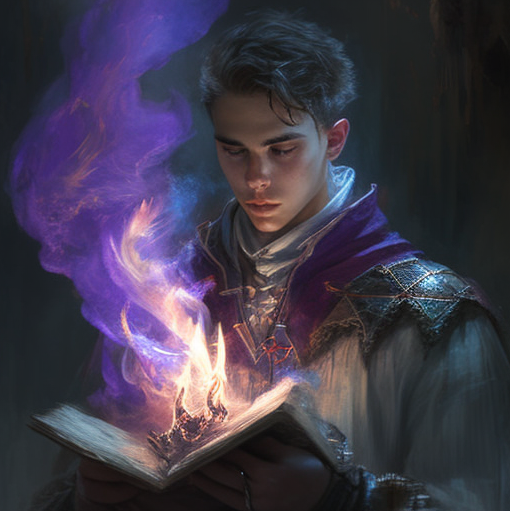
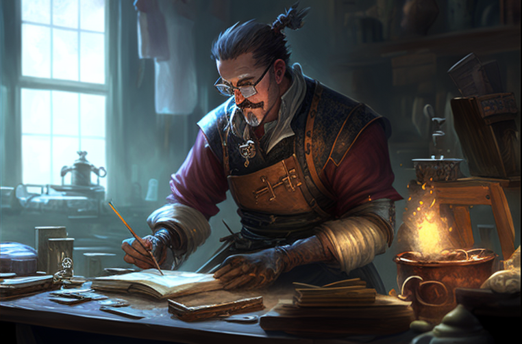
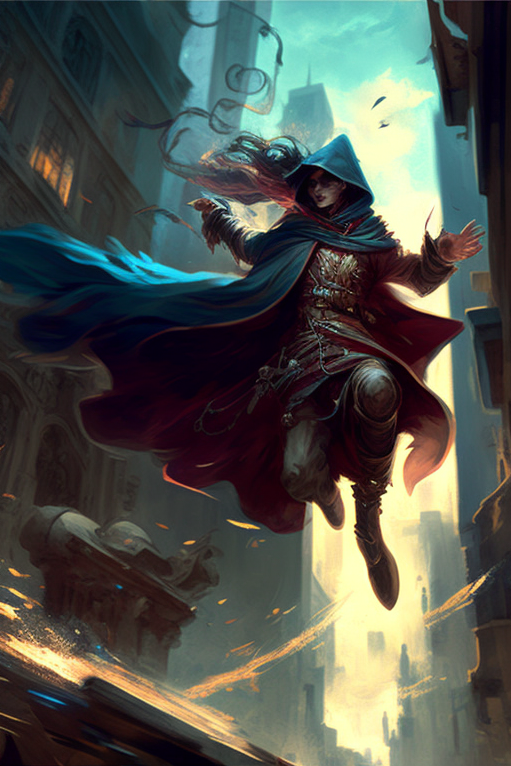

Acronists are trained wielders of [[Luminous Magic]]. As it takes a great deal of talent and dedication to develop strong [[Conviction|Convictions]], many Acronists studied for many years to become proficient at Magic.

## Pure Acronist
Incredibly rare, Pure Acronists manifest [[Conviction|Convictions]] purely from their self-belief, without the aid of any [[Primal Spirits|Primal Spirit]].

## Primal Acronist
More common bar far, especially in the Eastern lands of [[Selar]] and [[Edelun]], Acronists bind themselves to a [[Primal Spirits|Primal Spirit]], leveraging the Spirit's connection to [[The Luminary]] to more easily manifest Convictions and prevent the worst [[Backlash]].

### The Exchange
To bind a [[Primal Spirits|Primal Spirit]], an Acronist must perform [[The Exchange]], a ritual that varies wildly in difficulty and implementation depending on the Spirit and Acronist involved. This Exchange is sometimes permanent, but not always, and some bindings even need to be maintained through consistent ritual by the Acronist.

### The Aspects

Each [[Primal Spirits|Primal Spirit]] is tied to three [[Primal Aspects]], and each Spirit shares two of their Aspects with an adjacent spirit.

### Types of Primal Acronists

#### Furybearers

**Furybearers** are Acronists who have bonded with the Primal Spirit of Fire. They are granted access to the Aspects of _Energy_, _Emotion_, and _Memory_.

#### Stonesingers

**Stonesingers** are Acronists who have bonded with the Primal Spirit of Earth. They are granted access to the Aspects of _Memory_, _Material_, and _Gravity_.

#### Farseeker

**Farseeker**s are Acronists who have bonded with the Primal Spirit of Air. They are granted access to the Aspects of _Gravity_, _Space_, and _Illusion_.

#### Vastcaller

**Vastcaller** are Acronists who have bonded with the Primal Spirit of Water. They are granted access to the Aspects of _Illusion_, _Force_, and _Life_.

#### Boneforger

**Boneforger** are Acronists who have bonded with the Primal Spirit of Bone. They are granted access to the Aspects of _Life_, _Growth_, and _Shape_.

#### Soulrender

**Soulrender** are Acronists who have bonded with the Primal Spirit of Soul. They are granted access to the Aspects of _Shape_, _Will_, and _Emotion_.