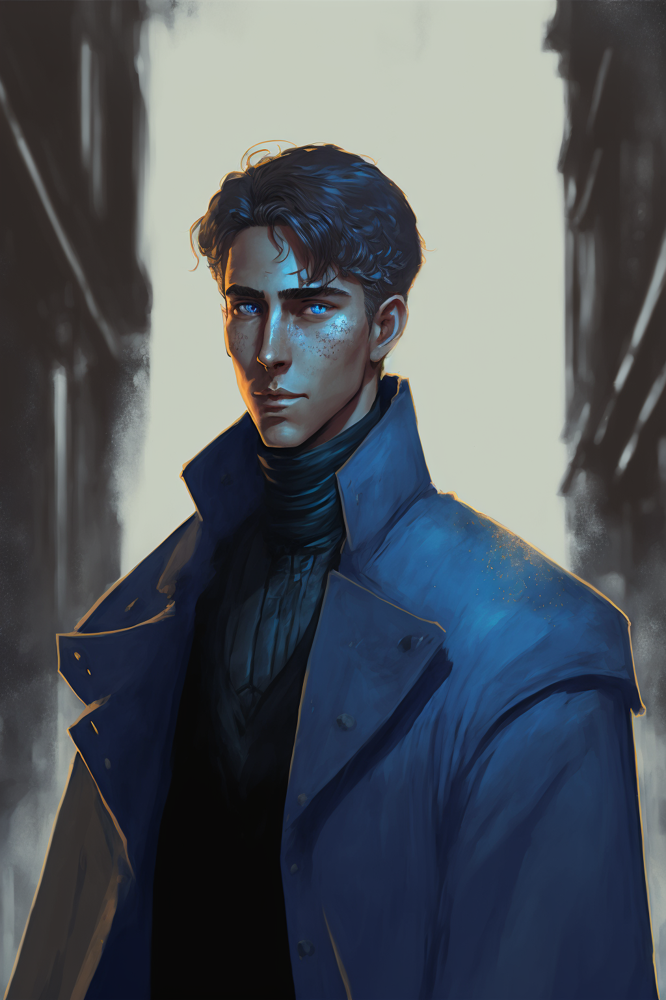

Arlo Livingston is a student at [[The Basentia Omnia|The Basentia]] studying to be an [[Acronist#Farseeker|Farseeker]]. He seems to have connections to a man named [[Jax]] that has ties to the criminal underground, and has done jobs for the man. 

Arlo has also recently started working for [[Corrin Fane]] at the [[Saetorim Institute]], and has become involved with the missing person's case of [[Enzo Quint]], along with [[Sulazar Stillwater]], [[Lucian Cullpepper]], and [[Eileen Quint]].

## Background

It is unclear at this time how Arlo came to be a student at The Basentia, but it seems clear that he is paying his tuition through the jobs he receives from [[Jax]], and now through his job at the Saetorim Institute.

## Events of Enzo Quint's Dissapearance

Arlo, through the [[Saetorim Institute]], has been involved in the case of Enzo Quint's dissapearance and suspected kidnapping. 

Using his connection with [[Jax]], Arlo was able to obtain a copy of [[The Second Tinwheel]] that [[Enzo Quint]] created, revealing further evidence into his dissapearance. In return, Arlo infiltrated a [[Sonxai|Sonxai]] warehouse containing [[Lotus]] to attempt to figure out how the drug is made. He encountered a [[Deep Dwellers|Msanti]] there guarding the warehouse, and while unable to obtain a recipe for the drug, did escape with a bathymetric map of the bay outside of [[Meripol]], with a mysterious location marked on it.

Arlo was also a part of the investigation into the [[Lauten Family]] and their relation to Enzo's dissapearance. He, along with [[Eileen Quint]], and [[Sulazar Stillwater]], acted as hired staff for one of the galas that the Lauten's regularly host. During the party, Arlo discovered a [[Shifter]] named [[Elijah]] posing as [[Rikkart Lauten]], and learned that Elijah had been hired by the family to pose as Rikkart for the past fifteen years, after Rikkart's [[Thread]] was severed in [[Mehnateruna]].

!hidden

## Early Life
Arlo Livingston was an heir to the founder of the Prisma Travel Corporation, one of several transportation corporations in Aljieudum. His parents Eleanor and Alexander Livingston gave him a fairly pampered life growing up where everything was handed to him, from the top schooling opportunities to positions on any sports teams he wanted to join. He had one younger brother Cyril who he fought with constantly. 

## The Basentia
When Arlo became of age, he was admitted to the Bastentia (completely on his parent’s dime) as an Acronist of the Primal Spirit of Air, following in his parents footsteps as Farseekers and training to hone his connection to the Luminary to perform luminous magic by way of taking up the family trade of transportation.

## Accident
As Arlo was entering his Sophomore year and through some unknown circumstance his parents, using the very transportation they had pioneered over their lifetime, had an accident that would leave them Faded and separated entirely from the Luminary and the Primal Spirit of Air. 

## Leaving the Basentia
After this tragic event, Eleanor and Alexander would come to Arlo who was only a single year into his training at the Bastentia and ask him to leave his studies and come back into the fold with their family and begin the process of taking his mother’s place as chairwoman of their board of executives which would involve a lot of shadowing and boring bureaucracy and paperwork. Arlo ultimately decided he would not forego his studies and that he didn’t want to become a businessman at all, he wanted to explore the unknown reaches of the world of Naos and live a life of adventure not of business.

  
## Disownment
While Arlo thought he had a choice, his parents ultimately decided if he wouldn’t do what they asked of him then he was of no use as an heir or a family member and he would ultimately be disowned by his parents and everything that would have gone to him now would go to his brother Cyril whom Arlo had many differences with, particularly his religious fanaticism and extensive participation with the Argent.

  
## Return to the Basentia
Over the course of his sophomore year, Arlo would make connections with shady, underground organizations to ultimately pay for the rest of his schooling by taking on tasks as a smuggler and on occasion times a thief from a man named Jax. Arlo isn’t sure who Jax represents or what his real name even is but he needed the money and couldn’t be very picky as the Bastentia is exorbitantly expensive and no other job would pay him the money he needed. At first he was very hesitant, as the year came to a close he became fairly comfortable and even enjoyed the work to an extent, allowing him to use his training at the Bastentia to circumnavigate wards and avoid the authorities while also covering his own footsteps. 

Arlo is now entering his third year at the Bastentia.

## Criminal Ties
Jax is point of contact. Contracted out by Jax for the company that he works for. Alro doesn’t really know him all that much. Jax is mostly all business. 