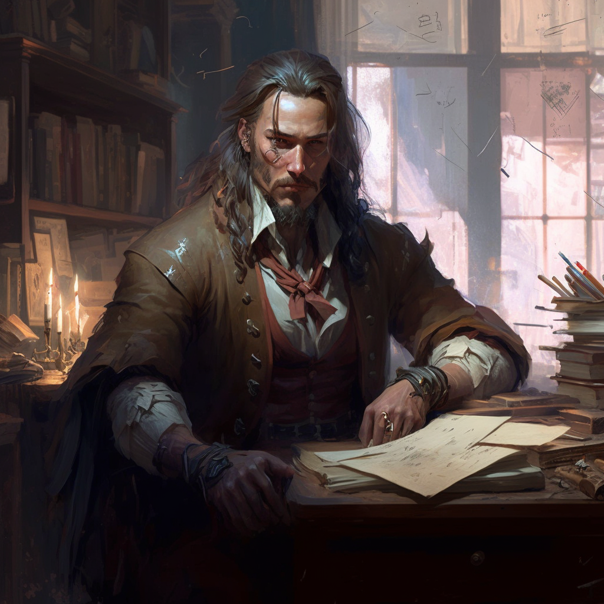

**Corrin Fane** is the founder and director of the [[Saetorim Institute]]. He is a middle-aged man with shoulder-length hair, peppered with gray, copper skin, and a cropped gray beard.

!hidden

Originally, Corrin sailed aboard the [[Grand Fortuna]] as her Bosun, but when the ship sank in [[Gris]], he stayed in the town for two years, growing evermore curious about the town’s oddities and “strange occurrences.”

Eventually, he came to [[Meripol]] and founded the Institute, which became a novel attraction to the populace.

TODO: How did he make his fortune?

To him, however, the institute has become a vehicle for uncovering the preternatural mysteries of the world. As a way of researching any and all strange occurences in and outside the city, he began to offer investigative services to any who took his business even half-seriously.