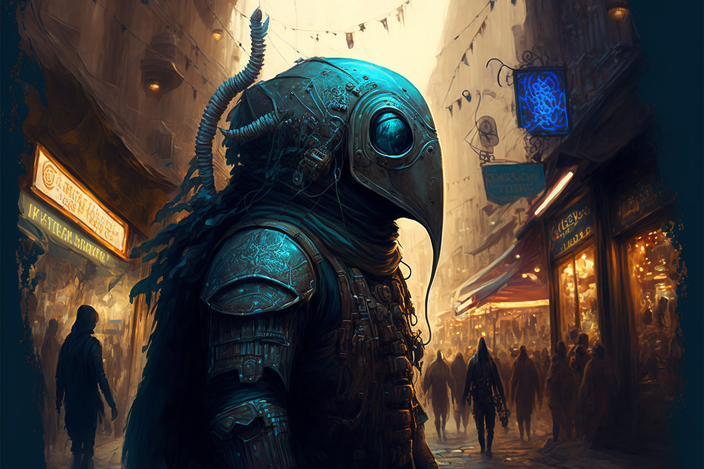

*The figure in the tarnished metal suit loomed over Gael. It was impossible to discern any features through the scratched and dirty glass of the viewport in the helmet, but he could only imagine a contorted mass of tentacles, eyes, and mottled grey flesh beneath the placid mask. Without warning it turned and launched it's impossible mass over the side of the ship and into the depths below.*

—Gael Cairright, Of The Sea and Below

The Msanti, or the Dwellers in the Deep, as they are otherwise known, are humanoid creatures that live in the depths of the ocean. It is said that long ago, they were banished to the sea after an indiscretion with the [[Primal Spirit of Water]].

## Immense Pressure
The Msanti live in the darkest depths of the ocean, where the pressure of water would crush land lopers. While they rarely leave their solitary existence, the more adventurous Deep Dwellers don pressurized suits that allow them to ascend to the surface and explore the overworld. These suits are made to be self-sustaining, keeping the Deep Dwellers that use them in water and under enough pressure to retain their form that would otherwise collapse while on the surface. The suits are fitted with mirror-like visors—most Deep Dwellers have extraordinarily sensitive eyes to live in the near-dark of the fathoms.

## Life at the Bottom
Although Deep Dwellers live where very little light exists, natural geothermal vents along the ocean floor provide a natural source of energy to allow their civilization to thrive. Deep Dweller civilizations are wide and varied, from vast cultivated fields of seaweed, to small villages and large cities glowing with bioluminescent light. They have harnessed the geothermal power available to them to achieve technological prowess, creating mechanical feats that can operate even at the bottom of the ocean. With the use of hydrothermal vents and magic, the Msanti are known for their excellent metallurgy. Land dwellers often travel to Msanti trading bazaars found in shallower water in order to trade.

The Deep Dwellers themselves represent a wide array of life. Some are nearly humanoid, the only differences being larger eyes to take in more light, and a lack of pigment to their skin. Others, however, can be more otherworldly, featuring an array of tentacles, teeth, bioluminescent fins, exoskeletons, and more. Nearly all Deep Dwellers have retained their bipedal form, though, as it allows them to walk along the sea floor and travel on land.

### Communication is Key
Although many Deep Dwellers tend to prefer solitary life, their societal advancement necessitated collaboration. Verbal speech an impossibility underwater, they have a means to communicate telepathically between themselves and other sentient creatures.

### Cursed Past
While the exact origins of the Deep Dwellers is unclear, it is mostly agreed upon that they were once human, long ago. Their ancestors vied for more power and tried to capture and enslave the primal spirit of water. In their failure, they were banished from land by the spirit, cursing them to live at the bottom of the sea. At first, the deep dwellers lived alone in darkness. Eventually, though, they developed into a flourishing society beneath the waves.

While many Deep Dwellers are contented with their new existence, some Deep Dwellers long to return to the surface permanently, in an event known as [[The Ascension]]. They believe that if the [[Primal Spirit of Water|Primal Spirit]] was the one to banish them, it has the power to return them to human form and allow them to rejoin the surface lopers. Some Deep Dwellers go on great pilgrimages across the land and sea in search of a way to appease the spirit and begin [[The Ascension]].

## Msanti Names

Names are usually a feeling, or alike specific sensation or thought or idea.

The naming schemes of the Msanti have evolved greatly over time. In their early days, they used simple sounds to identify each other. As their society became more complex, they began to incorporate feelings and sensations into their names. For example, a Deep Dweller might be named "Echolight," which represents the way light reflects off the walls of their underwater habitat.

As their civilization advanced, so did the complexity of their names. With the advent of telepathic communication, they began incorporating mental images and emotions into their names as well. A Deep Dweller might be named "Sorrowful Tide," representing a feeling of sadness and loss that they experienced in their past.

In recent times, Msanti naming schemes have become even more intricate. With advances in technology and magic, some Deep Dwellers have begun incorporating sound waves and bioluminescence into their names. These complex names often require a deep understanding of Msanti culture and history to fully appreciate.

Despite these changes, one thing remains constant in Msanti naming: each name carries great weight and significance for its bearer. A name is not just a label, but a representation of who that individual is and what they stand for within Msanti society.