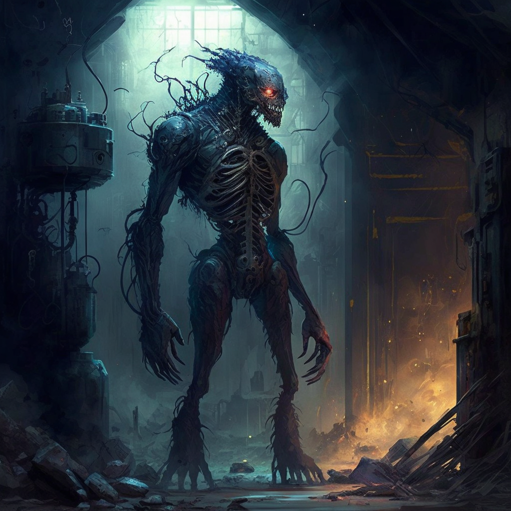

*Hmm... a Worldsphere...  strange I did not feel it before.... so the Dominion has touched this place. Make a deal with me, mortals. Swear to me an oath such that I might be bound to this place. I can show you things far beyond your current understanding. The Edicts, Vestiges, The First Principles,  The very Axioms themselves. Do not bind yourselves to such Euclidean Prescripts.  Align with Etnu, we will help you transcend this reality.*

—Etnu

**Etnu** is an entity that comes from [[Altrement|The Dark Between]], although it calls it the Altrement.

### The Bathyslab

Etnu appears to [[Sulazar Stillwater|Sully]], [[Arlo Livingston|Arlo]], [[Eileen Quint|Eileen]], and [[Lucian Cullpepper|Lucian]] in the [[Bathyslab]], where [[Jurrin Tuls]] had his [[Thread]] severed in one of [[Enzo Quint|Enzo's]] experiments (the events of the [[Fourth Tinwheel]]). It offers the [[Third Tinwheel]] and a great many other promises, even alluding that it could return Sully's [[Thread]] to him in an attempt to bind him to [[Naos]].

Remaining unconvinced, Lucian uses [[Primal Aspects#Gravity|Gravity]] to take the Tinwheel from Etnu, and they manage to escape unscathed, leaving the entity in the remnants of the Bathyslab at the bottom of the sea.