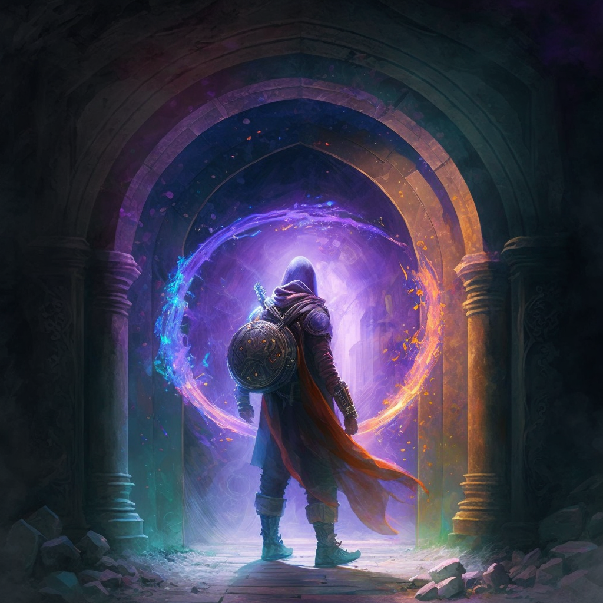

A **Junction** is a type of manifestation of [[Luminous Magic]] created by a [[Conviction]] that links two points in space. One example of Junctions is the use of [[Prismagates]]. Typically Junctions are created and maintained by [[Acronist#Vastcaller|Vastcallers]].

When a Junction is activated, a mirror-like appearance along the interior of the archway appears, reflecting different wavelengths of light in slightly different ways, giving a prismatic effect.