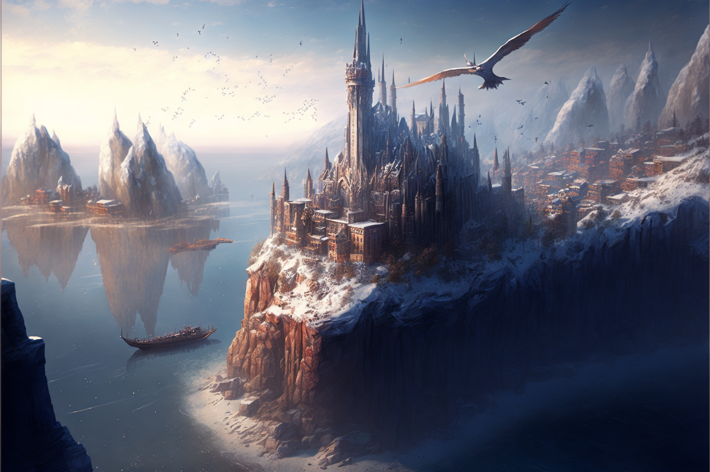
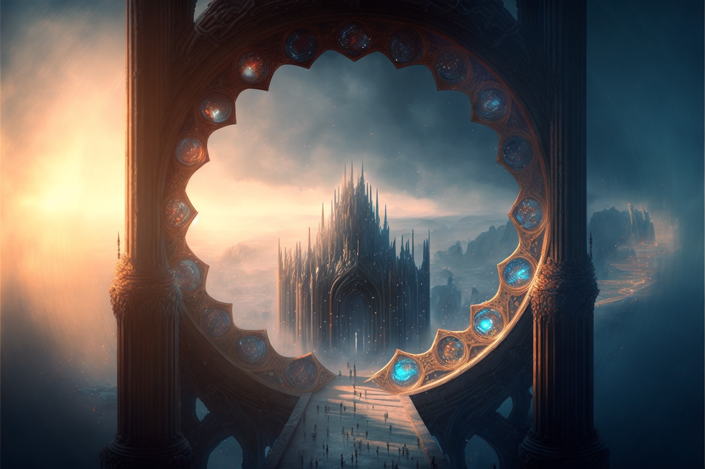
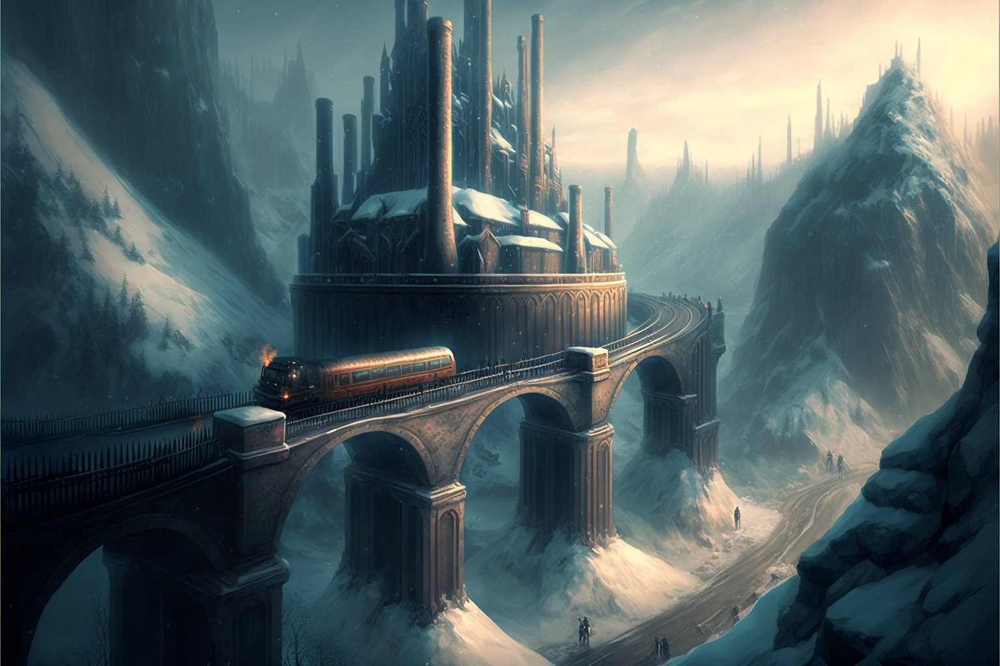

Meripol is the largest city in [[Aljieudum]], as well as its capitol. The city is built onto a series of plateaus along the southern coast of Aljieudum, each of the city’s districts being housed on a different shelf. Inside the canyons between the plateau’s there are a number of villages and towns. There is also an elevator on the southern plateau that leads to a [[Deep Dwellers|Msanti]] outpost attached to Meripol, a sort of trading center, embassy, and welcome center for relations between the overlanders and the Msanti.

## Geography

Meripol's layout is largely driven by its geography. The entirety of the city proper is built atop a series of plateaus along the coastline, with a number of interconnected bridges, both for walking and for [[Grav-rail]]. For those that can afford it, some citizens of Meripol also make use of [[Aerostat|Aerostats]].

## The Prismagate

As Aljieudum's capitol city, Meripol has a highly trafficked [[Prismagates|Prismagate]] that is used by travelers to visit the city from all over the world, though primarily nations in [[Edelun]] and [[Selar]]. This is the primary method of transportation for commercial trade and government officials from [[Tharsis]] and other countries along the northwestern coast of [[Selar]].

## Economy

Meripol is a thriving economic hub in the country of [[Aljieudum]], with a diverse range of industries driving its prosperity. The city's strategic location on the southern coast of the kingdom has long made it a hub for trade and commerce, with merchant ships docking in its bustling port to unload their goods and take on new cargo.

One of the city's main industries is fishing, with the waters off the southern coast being home to a rich array of sea life. Meripol's fish markets are known throughout Aljiuedum for their fresh, high-quality catches, and the city's seafood restaurants are a popular destination for tourists and locals alike.

In addition to its maritime industries, Meripol is also home to a number of artisans and craftsmen who produce a variety of goods, from pottery and jewelry to furniture and clothing. The city's many markets and shopping districts are a treasure trove of unique, locally-made products, and its artisanal traditions are an important part of its cultural identity.

Another major contributor to the city's economy is tourism, with Meripol's beautiful coastal setting and rich cultural heritage attracting visitors from all over the kingdom and beyond. The city's many hotels, inns, and bed and breakfasts are always busy, and its many attractions, such as its historic landmarks, museums, and cultural festivals, such as ones celebrating [[Illuminaris]], draw large crowds of tourists.

Being the location of [[The Basentia Omnia]], Meripol also thrives with its constant influx of [[Acronist|Acronists]] graduating from the university and entering various industries, such as travel ([[Grav-rail]], Aerostats, [[Prismagates]]), Energy ([[Acronist#Furybearers|Furybearers]] powering the cities electrical systems), and more.

Finally, the Msanti outpost located on the southern plateau plays a significant role in the city's economy, serving as a hub for trade and diplomacy between the overlanders and the [[Deep Dwellers|Msanti]]. The outpost is home to a number of merchants who specialize in the unique goods produced by the Msanti, such as their advanced technological devices, and it serves as a gateway for cultural exchange between the two groups.

Overall, the economy of Meripol is diverse and dynamic, with a wide range of industries contributing to its prosperity and growth.

## Government

Meripol is the capitol city of [[Aljieudum]] and as such, plays a central role in the nation's political landscape. The city's government is made up of two main bodies: the [[Chamber of Nobles]] and the [[Assembly of Vassals]]. The Chamber of Nobles is made up of various noble families and aristocrats from across the kingdom, who hold hereditary positions and wield significant political influence. The Assembly of Vassals, on the other hand, is made up of elected officials who represent the city's various districts and neighborhoods.

Both the Chamber of Nobles and the Assembly of Vassals play important roles in the city's decision-making process, and they often work together to pass legislation and set policies. However, there are also times when they are at odds, with the Chamber of Nobles representing the interests of the aristocracy and the Assembly of Vassals representing the interests of the common people.

In addition to these two main bodies, there is also  [[The Argent]], a powerful religious organization that wields significant political influence in Meripol and throughout Aljiuedum. The Argent is made up of a council of high-ranking clergy who advise the city's leaders on matters of faith and morals regarding [[The Luminary]], and they also play a role in enforcing the city's laws and maintaining order.

Other important positions in the city's government include the Mayor of Meripol, who is responsible for overseeing the day-to-day operations of the city and implementing the policies set by the Chamber of Nobles and the Assembly of Vassals, and the Chief Justice, who presides over the city's courts and the city's law enforcement, [[The Vigil]], and is responsible for interpreting and enforcing the law. There are also a number of other officials and departments responsible for various aspects of the city's administration, such as finance, public works, and security.

Overall, the politics of Meripol are complex and multifaceted, with a variety of actors and interests at play. The city's leaders must navigate the competing demands of its various constituents in order to govern effectively and ensure the well-being of its citizens.