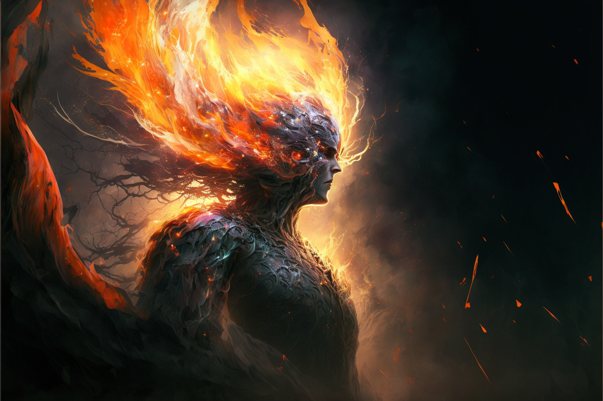
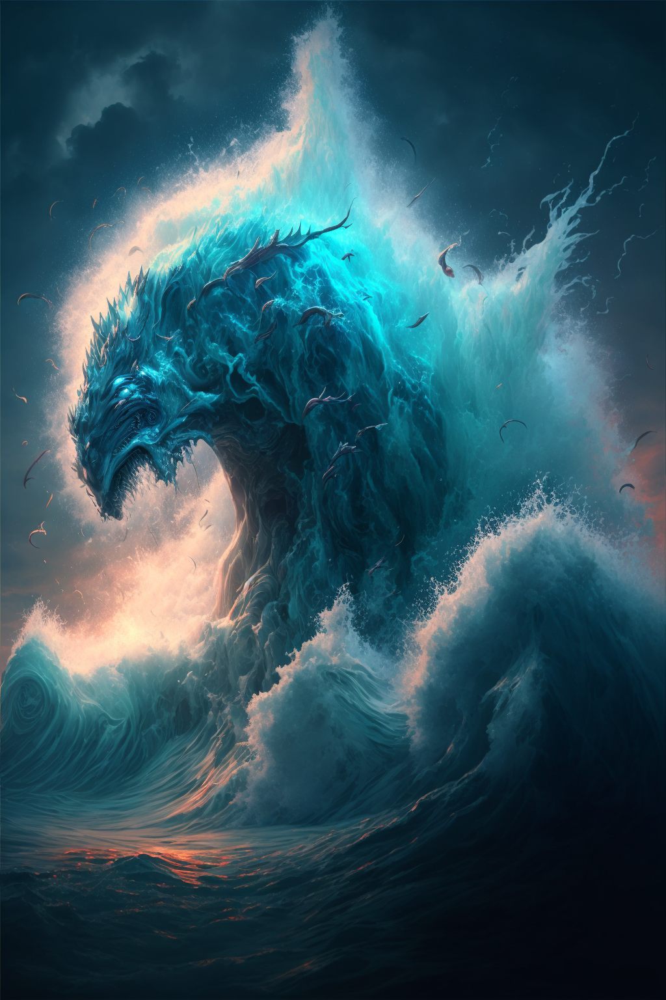

# Primal Spirits

The Primal Spirits are comprised of six powerful beings, created from the [[The Luminary]]. The six primal spirits are [[Primal Spirit of Air|Air]], [[Primal Spirit of Water|Water]], [[Primal Spirit of Earth|Earth]], [[Primal Spirit of Fire|Fire]], [[Primal Spirit of Bone|Bone]], and [[Primal Spirit of Soul|Soul]].

## Origins
In the beginnings of the world, when humans huddled around fires and struggled to survive, they often looked to beings beyond, dieties with power outside of normal comprehension, either to worship or fear or to simply explain how the world around them worked.

In a sense, early humans saw these divine concepts as *Universal Movers*, beings that encompassed various aspects of their lives. In their belief and worship, humanity as a whole catalyzed a collective [[Conviction]] so strong that it these beings were *willed* into existence. Overtime, primordial beings were formed from the faith that existed within humanity. The Convictions that created these beings was so strong that it became a [[Fixed Truth]] in reality, allowing the spirits to continue to exist even as humanity evolved.

## Sentience
It is unknown to the denizens of [[Naos]] whether the Primal Spirits are sentient, or simply forces of nature. In truth, the answer is more complex than that. The Primal Spirits themselves are far more complex constructs, both incomprehensible forces and, for lack of a better term, minds. They work as parts of a whole, and there are many instances of physical manifestations of the Primal Spirits coming into existence in the physical world, either pulled by a mortal that lives in it, or simply bubbled into existence by random chance. These manifestations can take many forms, both benign and dangerous. Many have been worshiped and feared as minor gods or monsters in their own right.

In some ways, the Primal Spirits have a “will” of their own, trying to shape the world in their image however they see fit. But they are also vastly incomprehensible, and often their influence on the world is met with fear and awe.

### Intrinsic Values
Since the Primal Spirits were created by and for Humans, each of the spirits is also intrisically tied to certain *values*.  These values influence how the Primal Spirits manifest in the world and their influence on it.

The Primal Earth is tied to the values of *Balance*, *Strength*, and *Neutrality*.

The Primal Air is tied to the values of *Freedom*, *Self*, and *Honesty*.

The Primal Water is tied to the values of *Change*, *Adaptation*, and *Fear*.

The Primal Fire is tied to the values of *Passion*, *Life*, and *Fury*.

The Primal Bone is tied to the values of *Substance*, *Pain*, and *Death*.

The Primal Soul, prior to corruption, was tied to the values of *Thought*, *Morality*, and *Virtue*. In the present, the Primal Soul is tied to the values of *Corruption*, *Manipulation*, and *Ego*.

### Facsimiles of Reality
It is important to note that while the Spirits embody aspects of humanity, they are not true embodiments of what they represent. When they were created, that may of been true, but the Spirits, as semi-conscious immortal beings, have the potential to grow and shift over time of their own accord, and how the world indirectly influences them. The Elemental Spirits are most resistant to change—Rivers will always change the land, and the ocean will always strike fear into those who witness its vastness, but Bone and Soul are more subject to interpretation and change. Soul especially.

### Corruption of the Primal Soul
Of the spirits, Soul was always the most *concious* and aware. While the other Spirits were more animalistic in nature, Soul often manifests with more sentience. Over time, however, as humanity and civilization became more complex, and the understanding of what it means to be good or evil did as well, the Primal Soul becamed twisted, warping into a representation of the darkest corners of the human soul. While the Primal Soul is merely a reflection, in a way, and cannot be truly evil, this shift led many in the world of [[Naos]] to fear the Primal Soul, and treat it as such. For [[The Argent]], The Primal Soul is seen as the personifcation of Evil, the wickedness of the heart should [[The Luminary]] not be followed.

## In the Modern Age
In the modern age of Naos, most civilizations treat the Spirits as they are, powerful and primal beings that are vast and potentially dangerous, but not gods. Some civilations, however, still worship one or more of the spirits as dieites. Some [[Shifter|Shifters]] worship the [[Primal Spirit of Bone]] as a sort of god-like figure. Pockets of Msanti culture worship [[Primal Spirit of Water|Primal Water]]. There are various human cultures that worship the different elemental spirits in more ways than one.

## Creation of New Spirits
While it is technically feasible for new spirits to be created, the largely varying cultures and beliefs that make up Naos in the modern age make in very unlikely that new spirits would come about. The rise of logic, reason, and science too make such a *mass* Conviction possible, at least without a deliberate and coordinated effort. The Primal Spirits were a certainly a unique occurance, and their creation the result of a perfect storm.

## Scions
While extremely rare, it is possible for human-spirit hybrids to be born into the world, known as [[Elemental Scion]]s, or, in even rarer cases, [[Shifter|Shifters]]. Scions are always born from a normal human parentage, and appear mostly human with some unique characteristics. Scions are simply born with an innate connection link to one of the Spirits, and are generally granted abilities based on their Spirit. The only Spirit that does not produce Scions is the [[Primal Spirit of Soul|Primal Soul]].