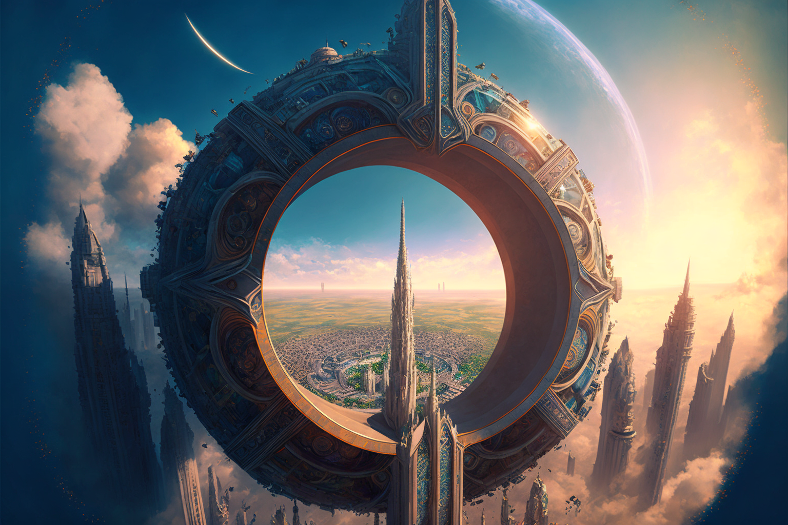

**Prismagates** are massive [[Junction|Junctions]] maintained by [[Acronist#Vastcaller|Vastcallers]] meant to transport Aerostats between cities. These require significant coordination between governments, as Junctions this large must be meticulously preserved to remain functional.

## Naming

The name Prismagate comes from the mirror-like appearance along the interior of the archway, reflecting different wavelengths of light in slightly different ways, giving a prismatic effect.

## Cost of Maintaining

These gateways are difficult and expensive to both build and maintain. It requires a large number of [[Acronist|Acronists]] to be available and willing to work to build the [[Conviction]], cooperation between the two nations (if the gates are to be linking across national borders), and skilled engineers and laborers to construct the gate with exacting precision in multiple locations as well as maintain the structural integrity of the gate overtime to ensure the Junction remains stable.

## Notable Prismagates

- The Prismagate in [[Meripol]] is maintained by the [[Prisma Travel Corporation]].
  
## Creation of Prismagates

The creation of Prismagates requires the following in two stages:

1. Creation of the physical gates in two separate locations. The gates must be as identical as possible—usually the addition of runes along the structure in the same place helps with this.

2. Multiple Acronists at either gate forming the [[Conviction]]. The Acronists must work simultaneously at both ends of the junction, building up a Conviction strong enough to form a [[Fixed Truth]]. The number of Acronists required for this varies due to a number of factors, but is generally between 10 and 20 on either side.