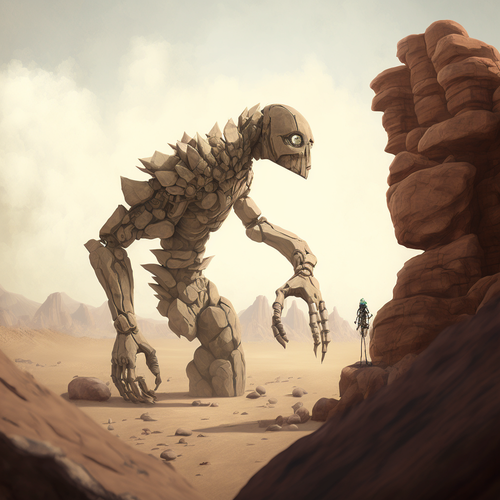

# Luminous Magic
Luminous Magic is Magic that is created or performed through [[The Luminary]]. This feat is accomplished through the [[Thread]]. Utilizing the direct connection with the Luminary allows one to bend reality to their will through a [[Conviction]]. Creating anything meaningful with Luminous Magic is no small feat, and although all living creatures on [[Naos]] have a Thread, few can utilize it to distort the fabric of reality to their will. Wielders of Luminous Magic are called [[Acronist|Acronists]].

## Permanent Magic
It is possible for [[Conviction|Convictions]] to become [[Fixed Truth|Fixed Truths]] if the manifestation is strong enough. [[Luminous Magic#Runes|Runes]] can help retain the efficacy of Fixed Truths, though almost all Fixed Truths degrade over time unless regularly maintained or are upheld by a [[Collective Conviction]]. 

## Training
For most denizens of [[Naos]], Luminous Magic requires years of training to form a strong enough [[Conviction]] to manifest any one of the Aspects, usually with the aid of a [[Primal Spirits|Primal Spirit]]. 

## The Law of Diametric Truth
When manifesting [[Conviction|Convictions]], it is the Acronist's *belief*, or *will*, that convinces the Luminary that reality behaves in a certain way. The greater the discripancy between the Acronist's Conviction and the [[Cornerstone]], the greater the potential [[Backlash]].

## Runes
Some cultures on [[Naos]] believe that certain symbols or runes are tied to the different aspects of Primal Spirits and Luminous Magic. The reality is that while these symbols don't intrisincally have any power over certain aspects, it has been found that using runes can aid in the strength of the Conviction formed while casting luminous magic. Runes can also provide a convenient way for Acronists to read and understand certain Fixed Truths that have been laid upon a particular place or item, so are usedemdash as a form of common communication.

## The Primal Spirits
While a particularly talented and rare [[Acronist]] may be able to manifest [[Conviction|Convictions]] with a direct link to [[The Luminary]], *most* do so with the aid of a [[Primal Spirits|Primal Spirit]]. Not only do Primal Spirits allow an Acronist to manifest Convictions of greater magnitude, they also rebuff potential [[Backlash]].

## Approaches
[[Conviction|Convictions]] are manifested using different approaches depending on the desired end result.

### 1st Heirarch | Abecar

**Novus** - Perception, knowing, revealing

**Regus** - Control, Manipulation

### 2nd Heirarch | Gnostis

**Vertus** - Transformation, alters the natural state of being

**Armus** - Resistance, bolsters defences against a specific aspect

### 3rd Heirarch | Kyros

**Parus** - Creation from nothing

**Demus** - Destruction, decay, disintegrate, or diminish

## Loss of Magic

Individuals who have had their [[Thread]] severed are called [[Fade|Fades]], and can no longer manifest Luminous Magic or be directly affected by it.

# Acronists

Acronists are trained wielders of [[Luminous Magic]]. As it takes a great deal of talent and dedication to develop strong [[Conviction|Convictions]], many Acronists studied for many years to become proficient at Magic.

## Pure Acronist
Incredibly rare, Pure Acronists manifest [[Conviction|Convictions]] purely from their self-belief, without the aid of any [[Primal Spirits|Primal Spirit]].

## Primal Acronist
More common bar far, especially in the Eastern lands of [[Selar]] and [[Edelun]], Acronists bind themselves to a [[Primal Spirits|Primal Spirit]], leveraging the Spirit's connection to [[The Luminary]] to more easily manifest Convictions and prevent the worst [[Backlash]].

### The Exchange
To bind a [[Primal Spirits|Primal Spirit]], an Acronist must perform [[The Exchange]], a ritual that varies wildly in difficulty and implementation depending on the Spirit and Acronist involved. This Exchange is sometimes permanent, but not always, and some bindings even need to be maintained through consistent ritual by the Acronist.

### The Aspects

Each [[Primal Spirits|Primal Spirit]] is tied to three [[Primal Aspects]], and each Spirit shares two of their Aspects with an adjacent spirit.

### Types of Primal Acronists

The types of Primal Acronists are:

- Furybearer
- Stonesinger
- Farseeker
- Vastcaller
- Boneforger
- Soulrender

#### Furybearers

**Furybearers** are Acronists who have bonded with the Primal Spirit of Fire. They are granted access to the Aspects of _Energy_, _Emotion_, and _Memory_.

#### Stonesingers

**Stonesingers** are Acronists who have bonded with the Primal Spirit of Earth. They are granted access to the Aspects of _Memory_, _Material_, and _Gravity_.

#### Farseeker

**Farseeker**s are Acronists who have bonded with the Primal Spirit of Air. They are granted access to the Aspects of _Gravity_, _Space_, and _Illusion_.

#### Vastcaller

**Vastcaller** are Acronists who have bonded with the Primal Spirit of Water. They are granted access to the Aspects of _Illusion_, _Force_, and _Life_.

#### Boneforger

**Boneforger** are Acronists who have bonded with the Primal Spirit of Bone. They are granted access to the Aspects of _Life_, _Growth_, and _Shape_.

#### Soulrender

**Soulrender** are Acronists who have bonded with the Primal Spirit of Soul. They are granted access to the Aspects of _Shape_, _Will_, and _Emotion_.

# Primal Spirits

The Primal Spirits are comprised of six powerful beings, created from the [[The Luminary]]. The six primal spirits are [[Primal Spirit of Air|Air]], [[Primal Spirit of Water|Water]], [[Primal Spirit of Earth|Earth]], [[Primal Spirit of Fire|Fire]], [[Primal Spirit of Bone|Bone]], and [[Primal Spirit of Soul|Soul]].

## Origins
In the beginnings of the world, when humans huddled around fires and struggled to survive, they often looked to beings beyond, dieties with power outside of normal comprehension, either to worship or fear or to simply explain how the world around them worked.

In a sense, early humans saw these divine concepts as *Universal Movers*, beings that encompassed various aspects of their lives. In their belief and worship, humanity as a whole catalyzed a collective [[Conviction]] so strong that it these beings were *willed* into existence. Overtime, primordial beings were formed from the faith that existed within humanity. The Convictions that created these beings was so strong that it became a [[Fixed Truth]] in reality, allowing the spirits to continue to exist even as humanity evolved.

## Sentience

It is unknown to the denizens of [[Naos]] whether the Primal Spirits are sentient, or simply forces of nature. In truth, the answer is more complex than that. The Primal Spirits themselves are far more complex constructs, both incomprehensible forces and, for lack of a better term, minds. They work as parts of a whole, and there are many instances of physical manifestations of the Primal Spirits coming into existence in the physical world, either pulled by a mortal that lives in it, or simply bubbled into existence by random chance. These manifestations can take many forms, both benign and dangerous. Many have been worshiped and feared as minor gods or monsters in their own right.

In some ways, the Primal Spirits have a “will” of their own, trying to shape the world in their image however they see fit. But they are also vastly incomprehensible, and often their influence on the world is met with fear and awe.

### Intrinsic Values

Since the Primal Spirits were created by and for Humans, each of the spirits is also intrisically tied to certain *values*.  These values influence how the Primal Spirits manifest in the world and their influence on it.

The Primal Earth is tied to the values of *Balance*, *Strength*, and *Neutrality*.

The Primal Air is tied to the values of *Freedom*, *Self*, and *Honesty*.

The Primal Water is tied to the values of *Change*, *Adaptation*, and *Fear*.

The Primal Fire is tied to the values of *Passion*, *Life*, and *Fury*.

The Primal Bone is tied to the values of *Substance*, *Pain*, and *Death*.

The Primal Soul, prior to corruption, was tied to the values of *Thought*, *Morality*, and *Virtue*. In the present, the Primal Soul is tied to the values of *Corruption*, *Manipulation*, and *Ego*.

### Facsimiles of Reality
It is important to note that while the Spirits embody aspects of humanity, they are not true embodiments of what they represent. When they were created, that may of been true, but the Spirits, as semi-conscious immortal beings, have the potential to grow and shift over time of their own accord, and how the world indirectly influences them. The Elemental Spirits are most resistant to change—Rivers will always change the land, and the ocean will always strike fear into those who witness its vastness, but Bone and Soul are more subject to interpretation and change. Soul especially.

### Corruption of the Primal Soul

Of the spirits, Soul was always the most *concious* and aware. While the other Spirits were more animalistic in nature, Soul often manifests with more sentience. Over time, however, as humanity and civilization became more complex, and the understanding of what it means to be good or evil did as well, the Primal Soul became twisted, warping into a representation of the darkest corners of the human soul. While the Primal Soul is merely a reflection, in a way, and cannot be truly evil, this shift led many in the world of [[Naos]] to fear the Primal Soul, and treat it as such. For [[The Argent]], The Primal Soul is seen as the personification of Evil, the wickedness of the heart should [[The Luminary]] not be followed.

## In the Modern Age
In the modern age of Naos, most civilizations treat the Spirits as they are, powerful and primal beings that are vast and potentially dangerous, but not gods. Some civilizations, however, still worship one or more of the spirits as dieties. Some [[Shifter|Shifters]] worship the [[Primal Spirit of Bone]] as a sort of god-like figure. Pockets of Msanti culture worship [[Primal Spirit of Water|Primal Water]]. There are various human cultures that worship the different elemental spirits in more ways than one.

## Creation of New Spirits
While it is technically feasible for new spirits to be created, the largely varying cultures and beliefs that make up Naos in the modern age make in very unlikely that new spirits would come about. The rise of logic, reason, and science too make such a *mass* Conviction possible, at least without a deliberate and coordinated effort. The Primal Spirits were a certainly a unique occurrence, and their creation the result of a perfect storm.

## Scions
While extremely rare, it is possible for human-spirit hybrids to be born into the world, known as [[Elemental Scion]]s, or, in even rarer cases, [[Shifter|Shifters]]. Scions are always born from a normal human parentage, and appear mostly human with some unique characteristics. Scions are simply born with an innate connection link to one of the Spirits, and are generally granted abilities based on their Spirit. The only Spirit that does not produce Scions, theoretically, is the [[Primal Spirit of Soul|Primal Soul]].

# The Primal Aspects

The **Primal Aspects** are twelve distinct domains that the six [[Primal Spirits]] are tied to, each Primal Spirit sharing two of its Aspects with other Spirits.

## Energy

The Aspect of **Energy** gives one the ability to create, shape, and manipulate various forms of energy, and are able to transform or convert it into a number of different manifestations. Some common forms of energy that Acronists use are kinetic, radiant, and thermal. This aspect has ties to the power industry and the military, due to it's applications in combat and energy production. _Furybearers_ are some of the most sought after Acronists.

## Memory

The Aspect of **Memory** gives one the domain over the _concept_ of Memory: fabrication, suppression, influence, detection, erasure, and more. Due to the _Law of Aversion_, this aspect is tricky to use on other living creatures without consent, but this Aspect is often used to provide memory restoration and preservation. In rare cases of extraordinarily talented Acronists, _Memory_ is also used to create artificial constructs with sentience.

## Material

The Aspect of **Material** gives one the ability to shape and manipulate _matter_, alter it's physical properties or phase state. Most often, this Aspect is uses by Engineers to aid in the construction of infrastructure or manufacturing.

## Gravity

The Aspect of **Gravity** gives one the domain over the fundamental force of Gravity. Primarily, Convictions of this Aspect relate to increasing or decreasing the Gravitational pull of the environment, individual objects, or in rare cases, living creatures. The Aspect of Gravity is used by the Conveyance Authority to operate gravity-powered trains.

## Space

The Aspect of **Space** gives one the ability to manipulate spatial reality, the boundless three-dimensional extent of the Universe in which objects have relative position and direction. Most commonly, this includes increasing and decreasing the _amount_ of space between points or objects. Most notably, Acronists that use _Space_ create **Junctions**, which are links between two points in the world, allowing for instantaneous travel between places. The most notable of these are **Prismagates**.

## Illusion

The Aspect of **Illusion** gives one the ability to create, shape, and manipulate illusory mirages or simulated reality. These effects are unable to affect reality itself, merely the perceptions of living creatures with Threads.

## Force

The Aspect of **Force** gives one the domain over fundamental forces. Force is a more loosely intepreted Aspect, and it's exact nature is somewehat dependant on the personal beliefs of the Acronist. Most commonly, Force relates to the raw power of Nature, manifesting in the form of wind, storms, and other weather phenomenon.

## Life

The Aspect of **Life** gives one the domain over biological life. Most commonly, this Aspect takes the form of an affinity with plants and animals. Due to the Law of Aversion, this Aspect is typically infeasible to be used for the outright manipulation, creation, or destruction of Life.

## Growth

The Aspect of **Growth** gives one the ability to manipulate the _progression_ of things. In a sense, Growth is the domain over chronology. Applications of Growth are most often applied to medicine, in order to expedite the healing process.

## Shape

The Aspect of **Shape** gives one the domain over the _shapes_ of living creatures. Due to the Law of Aversion, applying to this Aspect is nearly impossible, except on the willing, or on oneself.

## Will

The Aspect of **Will** gives one the domain over the _volition_ of living creatures. This aspect, at a most fundamental level, manipulates the willpower of living creatures, bending them to the Acronist's wishes. In most regions of Naos, this Aspect is highly frowned upon, as it is attached to the Primal Soul.

## Emotion

The Aspect of **Emotion** gives the domain over the _emotions_ of living creatures, controlling their amplitude and shape.

# The Dread

The **Dread** are the manifestations of [[Altrement|The Dark Between]]. They are seven entities that each represent an aspect of humans' fear of the end of all things, which is what the Dark is. They were manifested from [[The End of All Things]], when the [[Dominion]] created the [[Worldsphere|Worldspheres]] to defy the end of the Universe. They are the embodiment of the existential dread that all humans fear—of the non-existence that lies at the end of life, and furthermore at the end of the Universe, when all energy and matter has returned to nothing.

## The Dark

The Dread, for most of their existence, are amorphous, completely residing in the formless void of the Dark Between. It is only when they are pulled into a physical universe through an [[Entanglement]] that they take form, thought, and sentience.

## The Dreads

### The Terror
[[The Terror]] is the first of the Dread, representing the human emotion of despair and overwhelming sense of futility felt when realizing the end of all things.

### The Empty
[[The Empty]] is the representation of the void, the nothingness that awaits the end of all things.

### The Patient
[[The Patient]] is the representation that the end will come no matter what, it is inevitable, and all one must do is wait for it.

### The Unravelled
[[Etnu|The Unravelled]], also known as *Etnu*, is the embodiment of *entropy* and equilibrium. The End will bring about a void with no gradient or change.

### The Spiral
[[The Spiral]] is the chaos. It is the disorder and the endless breaking down of patterns into smaller and smaller pieces, the fractal nature of the universe dissolving until nothing whole is left.

### The Darkness
[[The Darkness]], also known as *Videnis*, is the literal representation of the absence of light and the shroud of eternal darkness that comes with the End.

### Oblivion
[[Oblivion]] is the last and final Dread, the representation of the erasure of everything from existence: thought, knowledge, life, matter, light, everything. The existential simulacrum of everything the Dread as a whole embody. 

# Vera Lauten

Vera Lauten was the youngest daughter of the [[Lauten Family]]. The **Lauten Family** is one of the most prominent of the [[Aljiedum Noble Houses]]. While they do not oversee any of Aljieudum’s [[Aljiuedum District|Districts]], many members of the family, including the Family’s current patriarch, [[Halver Lauten]], have high-rankings positions in Aljiuedum’s [[Chamber of Nobles]]. She had two older brothers, [[Rikkart Lauten]] and [[Alrik Lauten]]. Her father and mother were [[Halver Lauten]] and [[Elske Lauten]].

Vera applied and joined [[The Basentia Omnia|The Basentia]] as an [[Acronist]] on mostly name alone, and she mostly only did it to follow in her brother Rikkart’s footsteps.

Throughout her time at the Basentia, she lived in Rikkart’s shadow. She was average at the majority of her studies, only showing a true aptitude for politics. Her skill as an Acronist was middling, although most professors expected great things from her.

Rikkart Lauten was the middle child of the [[Lauten Family]], and was seen by many as the greatest [[Acronist]] ever seen at the [[The Basentia Omnia|The Basentia]]. He had an older brother, [[Alrik Lauten]] and a younger sister, [[Vera Lauten]]. His Father and Mother were [[Halver Lauten]] and [[Elske Lauten]]. At the age of eighteen, he became a [[Fade|Fade]] due to an accident that occured while attending [[The Basentia Omnia|The Basentia]]. In recent years, Rikkart has not been seen in public often.

When Rikkart's life was ruined, Vera tried for many years to change the Basentia from the inside, but she could do nothing for the arrogance and hubris that the top Acronists in the world showed in their meddling of the Luminary and magic. When the opportunity arose to use Enzo Quint's research into the Dark Between for her own use, she formulated a plan to destroy the Basentia and cause as much damage to Acronists as she could during the process. 

# Etnu - The Unravelled

Etnu is a towering, skeletal creature made of black metal and swirling black smoke. Its form is constantly shifting and changing, as if it is in a perpetual state of flux. Red eyes gleam in the darkness, giving off an ominous glow. The smoke that surrounds Etnu seems to be alive, twisting and writhing as if searching for prey. It emits an aura of raw force, drawing anyone near it close to the edge of a bottomless pit.

Etnu's presence is both awe-inspiring and terrifying, instilling a sense of dread in those who encounter it. Its origins are shrouded in mystery, but it claims to have once been called Etnu by some.

# Sessions

## Session 1

We begin with [[Eileen Quint]]. She has brought [[The Sixth Tinwheel]], a [[Tinwheel]] that her father, [[Enzo Quint]] created just before his sudden disappearance, to the [[Saetorim Institute]]. She has hired the founder of the Institute, [[Corrin Fane]] to find her father and shed light on the mystery of his supposed kidnapping.

[[Corrin Fane]] enlists the help of [[Arlo Livingston]], a new hire to the Institute, [[Lucian Cullpepper]], a professor at [[The Basentia Omnia|The Basentia]] who was a close colleague of Enzo's, and [[Sulazar Stillwater]], an old partner of Corrin's who has familiarity with the [[Deep Dwellers|Msanti]] down in the [[Bathysward]].

This intrepid and equally unlikely crew decide to head to [[Ari Vochard|Ari Vochard's]] house, Eileen's other father. There, as they discuss their plan, a [[Protoxy]] from the [[The Argent|Argentia]] showed up. [[Emere Renguard]] brought Eileen's brother, [[Vytas Quint]], back from the steps of the [[Pal Tenach]], higher than the Luminary on none other than [[Lotus]], a new drug that has been circulating the streets of [[Meripol]]. Emere warns them that Vytas is on his last straw, and will be disavowed of his position in the Argentia if he does not get it together. He also notifies the crew that the [[Vigil]] are currently on their way to Enzo's house to begin their investigation into his disappearance (clearly Vytas must have slipped the lid, as Eileen and Ari were trying to go through the Institute to prevent the "official" authorities from getting involved).

Vytas, in his stupor, also talks to Eileen about getting more money from their father, specifically talking about Enzo. This sparks the idea that perhaps Enzo had left some clues as to what he was doing in his safety deposit box at the bank.

The crew decides to head to the [[Central Bank of Meripol]] to check it out, as Vytas is able to give Eileen a key. On the way, they stop by Enzo's house, hoping to beat the Vigil there. Unfortunately, a group of detectives has already set up a crime scene and has begun going through all of Enzo's things, looking for clues.

[[Estelle Sartere]] notices [[Arlo Livingston|Arlo]] walking past, and stalks over to him, loosely accusing him of scoping out his own crime scene, insinuating towards his criminal endeavors. The conversation does not go well, but Eileen is able to talk to her instead, and gleans that the Vigil have in fact discovered and taken possession of [[The Second Tinwheel]] (though it is not known which it is at the time).

With nothing to do about it in the moment, they decide to head to towards the bank. Arlo tells the group he may have a way of getting the Tinwheel from the Vigil, and separates from the group to meet with his contact in the criminal underworld, [[Jax]]. [[Sulazar Stillwater|Sully]] heads to a food vendor while [[Lucian Cullpepper|Lucian]] and [[Eileen Quint|Eileen]] head into the bank. While waiting in line, [[Roz Daras]] enters the bank and begins a bank robbery.

While waiting for food, [[Sulazar Stillwater|Sully]] receives a call from [[Henry Wulverstone]] that he has a job waiting for him back in the [[Bathysward]].

## Session 2

Arlo meets with [[Jax]], and asks if he can procure evidence from lockups at the [[Vigil]]. [[Jax]] says he can do it, but in return Arlo must go to a [[Sonxai|Sonxai]] warehouse and attempt to steal any information they have on how [[Lotus]] is produced. Arlo agrees, and the two part ways.

Meanwhile, Eileen and Lucian deal with a hostage situation. [[Roz Daras]] takes [[Gerod Farrault]], the Bank's manager, hostage, and orders him down into the vaults. [[Sulazar Stillwater|Sully]] sneaks into the Bank from an alleyway, grabbing a piece of Rebar (that's narratively significant Rebar!). Inside, he meets up with Lucian and Eileen, and the three of them decide to go down into the vaults and attempt to stop the robbery.

The discover that the robbers are after Enzo's vault as well, though it is unclear whether that is of Roz's own accord, or if he was hired by someone. Sully manages to knock Roz unconscious with the Rebar, saving the day. The three of them convince Gerod to let them open Enzo's box and flee with the contents before the [[Vigil]] could arrive.

They make their way back to the institute and reconvene with [[Corrin Fane|Corrin]].

## Session 3

The contents of Enzo's safe included [[The First Tinwheel]] and a number of purchase documents.

The crew listens to the Tinwheel with Corrin, and learn that [[Enzo Quint|Enzo]] was looking in to some historical records detailing the [[The Church of Aphothis]], a cult that operated in the ruin city of [[Mehnateruna]] many centuries ago. The cult supposedly enacted sacrifices that involved severing the [[Thread]] of their victims. Enzo postulates that perhaps the cult was somehow utilizing some power generated by the severing process.

The documents show that [[Enzo Quint|Enzo]] was receiving money from [[Rikkart Lauten]] of the [[Lauten Family]], one of [[Aljieudum|Aljieudum's]] greatest [[Aljiedum Noble Houses|Noble Houses]]. [[Rikkart Lauten|Rikkart]] himself, however, has been somewhat of a recluse for the last twenty years, as noted by [[Corrin Fane|Corrin]]. Enzo was also *making* purchases to a corporation called Crimson, which Sully recognizes as a different name used for the [[Sonxai]]. Enzo also had purchase orders for goods transported from the town of [[Gris]] by the [[Prisma Travel Corporation]].

The team decides to go home for the day, and [[Sulazar Stillwater|Sully]] heads back to the [[Bathysward]] to take care of his job. He meets up with his assistant, [[Henry Wulverstone]], who informs him that one of a few bathysphere's that had gone missing in the Ward a few months ago was discovered as wreckage a few miles offshore, and that Sully has been tasked with investigating.

Sully goes alone, taking a small single-personnel bathysphere out to the wreckage and investigates. He finds... nothing at first. Nothing in Engineering seems out of place, but there also seem to be no crew about. He heads to the bridge, needing to break out his welding equipment to do so. Inside, he discovers a shadowy figure, wearing an engineer's uniform standing atop a pile of bodies, all of their eyes removed, including the figure's. The figure calls out to Sully, who runs. The figure gives chase, but Sully manages to escape in his bathysphere and abandon the wreckage.

When he returns, he tells [[Henry Wulverstone|Henry]] to call [[Vigil]], then leaves, heading to [[Corrin Fane|Corrin's]].

## Session 4

Arlo meets with [[Jax]] for a second time, retrieving the [[The Second Tinwheel]]. Jax tells Arlo that he must complete the job regarding the [[Sonxai]] warehouse and [[Lotus]] today, because they got wind of something and are currently in the process of going dark.

Arlo heads to the warehouse and sneaks in through the roof, discovering a warehouse full of row upon row of Lotus flowers, along with a [[Deep Dwellers|Msanti]] tasked with guarding the warehouse. Arlo manages to give the Deep Dweller the slip using his [[Primal Aspects#Space|Space]] magic, locking himself in a small office-like room in the back of the warehouse. There, he discovers a bathymetric map of the ocean outside of [[Meripol]], a spot far out into the ocean conspicuously marked, though there is no indication as to what it is. Arlo again uses the Aspect of Space to escape the warehouse.

The crew reconvenes at the [[Saetorim Institute]], and [[Corrin Fane|Corrin]] tells them that he has found a way to get them into one of the [[Lauten Family|Lauten Family's]] galas as serving staff, which would allow them to snoop around the place.

A few days later, the crew head to the Gala. [[Sulazar Stillwater|Sully]], [[Eileen Quint|Eileen]], and [[Arlo Livingston|Arlo]] attend posing as waitstaff, but [[Lucian Cullpepper|Luci]] managed to get his own invitation through [[The Basentia Omnia|The Basentia]].

During the commotion of the party, Arlo sneaks off and discovers a small courtyard with numerous plants. A man is in the middle of the courtyard, painting on the canvas. As Arlo approaches, he notices what the man is painting. A hollowed out eye in the clutches of black tendrils. The man notices Arlo, and turns to run.

## Session 5

Arlo runs after the man, and catches up to him. When the man turns, Arlo notices that he is now a different person. Realization dawns that the man must be a [[Shifter]]. He befriends the man, whose name is [[Elijah]]. Elijah admits that he has been hired by the [[Lauten Family]] for the last fifteen years to pose as [[Rikkart Lauten]].

Back at the party, Eileen meets [[Vera Lauten]]. Shortly after, Speaker of the [[High Authority]], [[Rysha Tan Mei]] shows up unexpectedly. She finds a place for her and her entourage and begins questioning anyone who ventures close. Lucian approaches and she beckons him over. They chat, and he learns that she is also investigating the [[Lauten Family]]. She says that she met [[Enzo Quint|Enzo]] briefly when he came to [[Mehnateruna]] (during [[The Second Tinwheel]]) and that she wants to get to the bottom of what's going on. She tells Luci that she was there twenty years ago when [[Adam La Cour]] took students, including her and [[Rikkart Lauten]], to the city, where they accidentally enacted a ritual in the [[Spirit Sanctum]] which caused Rikkart to lose his [[Thread]].

She tells Luci that she will be in touch, and wants to help in whatever way she can.

[[Elijah]] shows [[Arlo Livingston|Arlo]] Rikkart's old room. Elijah notes that the room has been untouched since he started posing as Rikkart, none of the staff will go into the room, claiming that it is haunted. Inside the room, [[Arlo Livingston|Arlo]] discovers a journal, supposedly written by the real [[Rikkart Lauten|Rikkart]]. The journal seems to document Rikkart's descent into madness after having his thread severed in [[Mehnateruna]]. The last words of the journal are "There is no light that I can see, down in the Dark Between."

The party wraps up, and the crew regroups on the way back to the train station to the city. They get on the train, discussing everything that they had learned, when further up in the train car a mysterious woman wearing a cloak attacks a man, placing a device on his chest. The device causes him to collapse to the ground. From it, a pool of black dripping smoke emerges, coalescing into the form of a large slug-like creature with spikes.

## Session 6

The mysterious women disappears through the front of the train car. The crew is attacked by the slug monster and is overwhelmed. [[Arlo Livingston|Arlo]] attempts to escape towards the back of the train, but one of the creature's tendrils grasps on to him before he gets a chance. The creature's thrashing threatens to disrupt the train and send it careening a hundred feet from the tracks to the icy ravine below.

The team is overwhelmed by the creature's attacks, and [[Sulazar Stillwater|Sully]] is knocked unconscious by the creature, until [[Lucian Cullpepper|Lucian]] creates a barricade using [[Primal Aspects#Material|Material]], and uses [[Primal Aspects#Gravity|Gravity]] to launch the creature at the ceiling. [[Eileen Quint|Eileen]] uses [[Primal Aspects#Shape|Shape]] to shift into a [[Firehawk]], and she launches flames at the creature, causing its sludge-like body to catch fire. Together, the crew defeats the creature, and its body begins to dissolve into a black ichor, evaporating into the air. Before it completely disappears, [[Lucian Cullpepper|Lucian]] manages to bottle a small bit of the ichor. [[Arlo Livingston|Arlo]] takes the strange brass device from the victim's chest.

The train slows to a stop, and [[Beron]], the conductor of the [[Grav-rail]], bursts into the rear car, demanding to know what is going on. The crew explain, and after seeing the dead body, Beron is understandably upset at the prospect of filling out a report for this incident. He ushers the crew towards the front of the train, asking them to stick around once they return to the station to be questioned by the [[Vigil]]. They do, except [[Sulazar Stillwater|Sully]] hides the device and the ichor away and steals from the train before the [[Vigil]] arrive.

None other than [[Estelle Sartere]] shows up with two other members of the [[Vigil]]. She is surprised, and notes that she was actually on the way to the [[Saetorim Institute]] to speak with them when she got the call to investigate an incident at the train station. 

She escorts the crew back to the institute, and questions [[Sulazar Stillwater|Sully]] on the events that took place in the bathyscaphe wreckage. She tells them that they should stop meddling in the investigation, and to let the [[Vigil]] handle it. The crew deduces that there is more than she is letting on, and after some convincing it is revealed that her niece, a scion of the [[Primal Spirit of Soul]], along with many other [[Acronist|Acronists]] in the city, have gone missing over the last few weeks. She believes it to be related to what the Institute has been investigating. They convince Estelle to trust them to continue their investigation so long as they keep her up-to-date, and a mutual partnership is opened between the crew and the [[Vigil]].

After the [[Vigil]] leave, the crew discuss with [[Corrin Fane|Corrin]] their discoveries. It is decided that the next course of action is to investigate the location out in the [[Sejun Sea]], marked on the map retrieved from the [[Sonxai]] [[Lotus]] warehouse.

## Session 7

Sully leads Eileen, Arlo, and Lucian down into the Bathysward to prepare for their journey down underneath the sea. Sully asks around, and some of the [[Deep Dwellers|Msanti]] tell him that there have been rumors that some of their kind have been acting strange lately.

The crew suits up and heads into the depths of the Sejun Sea in a submersible. It takes some time, but eventually they make their way to the location marked on the map found in the warehouse.

They uncover a sink-trap tunnel that leads them to an underwater cave system at the bottom of the ocean. They leave their submersible behind and venture into the caves.

Eileen uses her cartography skills to help them navigate the cave system.

Lucian uses his magic to detect a heat coming from a particular passage. He insists that they follow, and the crew are lead to a chamber deep in the caves, heat radiating from it. Inside, they discover a massive forge powered by deep sea vents---some kind of workshop. A Msanti, unresponsive to their greetings, approaches them, something clearly wrong with them. Eileen uses magic to stop it in its tracks, killing it.

Lucian uses an artificing ring he invented to tap into the Memory aspect of the tools in the workshop, triggering a vision of the last time the workshop was in use. He sees Enzo step into the workshop, and the Msanti that they just killed is working on a device called a "Bifurcator".

They leave, and eventually the rough cave walls give way to steel as the party enters into a large scientific complex.

## Session 8

The crew heads deeper into the complex, and begin to notice strange things. They discovery the body of scientist whose eyes have gone missing, replaced by a black void similar to the one Sully saw in the bathyscaphe wreckage in Session 3.

They venture through the maze-like complex, are attacked by seemingly possessed scientists, and eventually come to the epicenter of the entire laboratory.

Inside of a massive room, they discover a large testing chamber, and an entity standing twenty feet tall, writhed in black angular shadows and screeching metal addresses them. It calls itself "Etnu", and speaks to them in a calm manner, whispering promises of power beyond their comprehension. Etnu is one of the Dread, one of seven entities outside the last bastions of reality with a singular purpose: bring about the end of the universe---the natural conclusion of all of existence. Of the Dread, Etnu is called The Unravelled, the embodiment of entropy itself. Etnu was brought into their sphere of existence by the experiments conducted in this lab by Enzo and the other scientists, through a tear in reality called a liminal bubble, into the dimension known as the Dark Between, or as Enzo calls it, the Altrement. Without making a pact with denizens of this sphere, he cannot leave his point of entry. He is trapped, and will eventually be pulled back into the Dark Between otherwise, so he must make a deal with the party or else, though his exact goals are unclear to them.

Etnu also bribes them with another one of Enzo's tinwheels. After talking with Etnu for some time, eventually the party decides to make their escape. Lucian uses Gravity to rip the tinwheel from Etnu's grasp and the party runs from the being, leaving the lab and heading back up to the surface.

## Session 9

The crew makes their way back to the Saetorim Institute to discuss what they saw with Corrin Fane and listen to the tinwheel. Based on the evidence there, the next best course of action, the party decides, is to head to Gyim, a small coastal town far to the North known for its strange townsfolk and folklore. The tinwheels revealed that Enzo learned something there very key to his experiments that took place in the undersea lab.

The party also informs Rysha Tan Mei and Estelle Sartere of their plan.

They enlist the help of one of Rysha's Matorei (personal guard) and access to a flying machine able to transport them to Gyim in a matter of days.

They head to Gyim and explore the town filled with strangeness. Most importantly, they visit the antiquities shop of an elderly woman who tells them the lore of the Travellers, beings from another world who came to Gyim over a hundred years ago. At first, the townsfolk of Gyim where dissapearing through mirrors, seeing strange ant-like humanoid figures in the shadows. At first, folk thought it was these figures themselves to be feared, but eventually the townsfolk learned that these creatures, the Travellers, brought with them a prophecy---the Lacunographies, which foretold "The End of All Things". Unbeknownst to the party, these Travellers were denizens of another sphere who had their world reduced to oblivion by the Dread, and these were the last survivors trying to make their escape into a different realm. The woman also tells them that the Church of the Lightless Eye, who use the old building up on the top of the cliffside on the other side of town, worships these sacred texts.

The party heads back to the tavern by the port to make plans to visit the church, and none other than Rikkart Lauten himself shows up at their table, introducing himself.

## Session 10

Rikkart introduces himself, and tells them he would love for them to come to the Church with him. That he was sent to get them.

So they follow, and head up to the church. There, Rikkart begins to tell them more about the Dread, but their conversation is interrupted by Etienne and Amelie Kaplan, brother and sister Acronists who have been tasked with disposing of the party for looking into Enzo's dissapearance. 

Sully turns the tables on the siblings, and the party incapacitates Rikkart and the twins. The siblings reveal that they know where Enzo is, and that they were going to send the party there too.

In turns out that by this time, Enzo was no longer needed for his mysterious patron's plans, so the siblings were tasked with disposing of him. In order to prevent a mess, they sent him into the Halcacion Cube---an artifact currently being stored in the basement of the church. The Cube is a floating fractal cube which currently contains an infinite recursion maze of a defunct space station---it used to be part of the Traveller's world until The Spiral, another one of the Dread, corrupted it, turning it into an infinitely recursing maze of twisting corridors.

After deliberation, the party decides to head into the cube anyways, taking their captives with them. Amelie and Etienne run as soon as they are able to, deep into the maze, and are never seen again. Rikkart stays with the party.

The party is immediately lost, traveling deep into the station, uncovering its mysteries. They discover remnants of travellers, of other denizens of their world that ended up trapped here, and eventually wedge fiends, horrifying creatures that can only enter existence through the corners of rooms and hunt by smelling fear.

## Session 11

Lucian takes charge in the maze, leading Eileen, Sully, Arlo, and Rikkart through the endlessly repeating and recursing rooms of the station.

Things become more and more dire as the wedge fiends hunt them tirelessly, and eventually the party finds themselves in such a deep recursion level that they aren't sure if they will ever escape.

It is in this deep level that they discover a body. The body of Enzo Quint himself, trapped in a coma that he put himself under in order to protect himself from the wedge fiends.

## Session 12

Eileen is able to wake her father, Enzo up, and with Enzo's help, they are able to make their way back to the outer recursion layer of the maze and to the obsidian room, where an inner fractal cube floats. 

Lucian takes his pepperbox pistol and shoots the cube. It reforms into a shadow-like being---The Spiral, or at least a fracture of it contained within the cube.

It whispers the same sorts of promises as Etnu did, but the party isn't having it, although Rikkart is intrigued and in awe at seeing one of the things he worships in the flesh. They tell it to set them free, and the Spiral does so, sending them back to Gyim with one exception: Rikkart is nowhere to be found.

The party heads back to Meripol, finally getting answers from Enzo along the way.

Enzo's experiments were around Thread (Threads are the ethereal strands that connect the living denizens of this world to the Luminary---a moon that orbits their planet but also a World Sphere, a literal Universe engine that keeps their reality from the fate of the Dread, although the people that live there don't know that. They just know that the Luminary gives them the ability to do magic) separation. At the moment of Thread separation, energy is released that creates a liminal bubble to the Altrement. At first, Enzo didn't know exactly what this meant or what it did, but he wanted to know more. Eventually, after going the Mehnateruna, he was approached by Vera Lauten, Rikkart Lauten's younger sister as a patron for his research. 

She helped him develop the drug known as Lotus as a way of making a Thread more potent, so that the severing would produce and larger and more sustained liminal bubble. She turned to Crimson (The Sonxai) in order to help produce the drug in larger quantities which is how it ended up getting spread out on the street. They also developed the Bifurcator, the device which is able to inject the patient with the Lotus drug and simultaneously severe their Thread.

Together and with the Sonxai, they built the undersea lab and conducted what would be their final experiments, leading to the summoning of Etnu. It would be at this point that Enzo would record his last tinwheel, where he decided that they had to stop looking into their research, that it was too dangerous.

But Vera didn't want to stop, and so she kidnapped Enzo to help her finish her plans. Enzo isn't for sure, but he believes that she wants to harness the power of the Dark Between and Etnu to destroy the Basentia for ruining her brother's life and not helping him when his Thread was severed. When he went mad from the things he saw that day in Mehnateruna and eventually moved to Gyim, his parent's replacing him with a Shifter his madness become so bad.

Back in Meripol, the party sync up with Rysha and Corrin with Enzo, discussing their plan to defeat Vera. Enzo believes that Vera plans to create a circle of sacrifices all around the campus of the Basentia in order to create a summoning circle and barrier, and then summon Etnu to bring about the destruction of the university.

Estelle arrives and tells them that she was late to their meeting because they have been getting calls all night about disturbances all around the outskirts of the university. It seems that Vera's plans were in motion that night, and the party had to stop her. Between Estelle's Vigil and Rysha's Matorei guard, they would likely have enough manpower to hit the perimeter of the university and stop the sacrifices, which left the party the task of hunting down Vera in the center of the school and stopping her from summoning Etnu yet again.

It is decided that the mostly likely place for this is the Moonball arena near the center of the school. It's a large enough outdoor arena that Vera would have enough room to do the ritual she needs to do.

## Session 13 Planning

This will be the final session of this campaign, so my plan is to make it epic. Here are a few of the main points:

- Vera will have already summoned Etnu in its initial form before the party gets there
- The primary sacrifice to bind Etnu into the world will be none other than Valent Childs, the scion of the primal soul and niece to Estelle (this will be key)
- Valent, as a scion of the primal soul, can manifest the Primal Soul itself (a fragment of the Luminary). Everyone on this world thinks the Primal Soul is corrupt, but actually it wants to defeat the Dread as well. The party *must* help Valent manifest Soul so that it can go toe-to-toe with Etnu and save them. This is key for Sully, as Sully was the one who worked with Valent when she was a child to help control her power
- Without the Primal Soul, Etnu will talk down to the party, and easily be able to fend them off, protecting Vera and Valent. They will need some kind of distraction so that one of the party members can free Valent and help her manifest Soul.
- Corrin will insist on coming with them, and he has an ulterior motive. Corrin used to be a boson on a ship that made port in Gyim, and he has not shared all of his experiences from that time. 
- The ritual takes place in the middle of the night

Create a detailed Game Master's guide for running this last session, creating new plot twists and details where necessary. It should be epic and bring everything from all of the sessions together in a satisfying finale that incorporates all of the characters.

## Session 13: The Final Showdown

### Setting the Stage

The session begins with the party at a safe distance from the Moonball arena, where Vera is in the process of summoning Etnu. The sound of chanting and dark energy fills the air, and as they approach, they can see a large circle drawn on the ground, glowing with an eerie light.

As they discuss their plan of attack, Corrin reveals that he has a personal connection to Gyim and knows more about the Travellers than he let on. He explains that he encountered them during his time as a boson on a ship that made port in Gyim many years ago. He witnessed their struggle to escape from their dying world and was inspired by their resistance against the Dread. This knowledge will prove crucial in helping them understand how to stop Vera and Etnu.

### Infiltrating the Arena

To disrupt Vera's ritual, the party decides to split up into two groups. One group, consisting of Eileen, Lucian, and Corrin, will sneak into the arena and find a way to free Valent Childs from her captors. The other group, consisting of Sully and Arlo, will create a diversion outside to draw away any guards or potential reinforcements.

As they enter the arena under cover of darkness, each member of the infiltration team uses their unique skills to bypass security measures and avoid detection by guards. They make their way through winding corridors until they reach an underground chamber where Vera is conducting her ritual.

### The Battle Begins

Inside the chamber, Vera stands at the center of the circle while Valent is tied up nearby as a sacrifice. Etnu looms above them both in its twisted form. As Etnu senses the presence of intruders, it turns its attention towards them.

Just as Etnu prepares to attack, Sully and Arlo create chaos outside by setting off a series of explosions and engaging in a fierce battle with guards. The distraction successfully draws away attention from the infiltration team, giving them a chance to act.

### Freeing Valent

Using their combined skills and abilities, Eileen, Lucian, and Corrin work together to free Valent from her restraints. They must outsmart Vera and her guards, using stealth and cunning to avoid detection as they make their way towards Valent. Once they reach her, Lucian taps into his Aspect of Will to help Valent manifest the Primal Soul.

### The Battle Rages On

With the Primal Soul now manifested, Valent joins the fight against Etnu. The power of the Luminary flows through her as she unleashes wave after wave of energy against Etnu's twisted form. The battle is intense and the arena trembles under their combined might.

As the party fights valiantly, Vera becomes increasingly desperate. She tries to regain control by sacrificing more innocent lives within the circle, but each life taken only strengthens the resolve of Valent and the party.

### The Final Showdown

In a final climactic moment, Etnu launches a devastating attack against Valent, pushing her to her limits. But just as all hope seems lost, Sully steps forward with newfound strength and determination. Drawing on his connection with Valent and his deep-seated belief in justice, he taps into his own Conviction to channel an incredible surge of power.

With a mighty roar, Sully strikes Etnu with an attack fueled by conviction and righteousness. The blow shatters Etnu's form and sends it back into the Dark Between from whence it came. The room trembles as reality itself seems to shift under their feet.

### Epilogue

With Etnu defeated and Vera incapacitated, peace returns to Meripol. The Luminary shines brightly overhead as its energy flows freely through all living beings once more. The city begins to heal from the darkness that threatened to engulf it, and the people of Naos can finally breathe a sigh of relief.

Valent is hailed as a hero for her role in saving the city, and she dedicates her life to protecting Naos from future threats. Corrin returns to the Saetorim Institute with newfound purpose, vowing to continue Enzo's research and ensure that the knowledge they gained is used for good.

The party, having forged deep bonds through their shared trials and triumphs, find solace and fulfillment in their own respective paths. They have become heroes in their own right, each playing a critical role in saving the world from destruction.

And as the sun rises on a new day, hope shines bright in the hearts of all who call Naos home.

## Descriptions

Write some narrative descriptions of the environment around them that can be read aloud during the session:

The Moonball arena stands before you, its towering structure casting a long shadow across the cobblestone streets. The air is thick with anticipation and the distant sound of cheering crowds echoes through the night. As you approach the entrance, you can make out the faint glow of torches and lanterns lighting up the massive wooden doors that lead into the arena. The sound of footsteps and muffled voices can be heard from within, creating an atmosphere of excitement and tension.

Inside, the arena is a spectacle to behold. The stands are filled with eager spectators, their voices blending together in a cacophony of anticipation. The air is thick with the smell of sweat and excitement as people jostle for a better view. In the center of it all, a large circular playing field awaits, surrounded by high walls and marked with intricate patterns painted in vibrant colors.

As you make your way through the crowd, you catch glimpses of brightly colored uniforms and hear snippets of conversation about strategy and past victories. The energy is palpable, electrifying your senses as you prepare for what lies ahead.

The torchlight casts flickering shadows on the stone walls as you descend into darkness. The narrow corridors twist and turn, leading deeper into the heart of the labyrinthine complex. The air grows colder with each step, carrying with it an otherworldly chill that seeps into your bones.

You pass by abandoned laboratories filled with broken equipment and discarded papers, remnants of past experiments left to gather dust. Strange symbols etched onto the walls seem to pulse with an eerie light as if they hold some hidden power or knowledge.

The sound of dripping water echoes in your ears as you navigate through dimly lit passages. Shadows dance along the walls, playing tricks on your eyes and filling your mind with unsettling thoughts. It feels as if unseen eyes are watching your every move, lurking just out of sight.

Finally, after what feels like an eternity, you reach a large chamber bathed in an ethereal glow. The source of the light is a massive forge, its flames dancing and crackling with an otherworldly energy. The air is heavy with the smell of metal and smoke, the sounds of clanging hammers and hissing steam filling your ears.

As you step further into the chamber, you notice a figure standing at the center of the forge. Its form is shrouded in darkness, angular shadows twisting and writhing around it. Red eyes gleam from within the dark mass as it turns to face you, its voice a chilling whisper that sends shivers down your spine.

The sound of explosions and shouts fill the night air as chaos erupts outside. There is a commotion in the distance as guards rush to investigate, drawn away from their posts by the diversion created by your allies. This distraction gives you a precious window of opportunity to strike.

As you make your way through the corridors towards your objective, anticipation builds with each step. Shadows dance on the walls as torchlight flickers overhead, casting eerie silhouettes along your path. The air is tense with an impending sense of danger as you prepare yourself for what lies ahead.

You reach a door at the end of a long hallway, its ancient wood creaking under your touch. As it swings open, revealing what lies beyond, you are greeted by an otherworldly sight—a sprawling chamber bathed in moonlight. Moonbeams filter through stained glass windows, casting kaleidoscopic patterns on stone floors worn smooth by centuries of footsteps.

The room itself is filled with rows upon rows of pews leading up to an ornate pulpit at one end. The air is heavy with incense and whispers of prayers carried on hushed voices. Dim candlelight flickers in alcoves along the walls, casting dancing shadows that seem to move to their own rhythm.

As you approach the pulpit, you catch glimpses of figures moving in the shadows. Their hoods obscure their features, but there is an air of reverence and anticipation about them. They are the faithful, gathered here to worship and seek solace in their shared beliefs.

The room is filled with a sense of both calm and anticipation, as if all who enter are drawn to something greater than themselves. It is a place of reflection and devotion—a sanctuary where the boundaries between the mortal realm and the divine seem to blur.

As you step into the chamber, you feel a weight lift from your shoulders. The air is heavy with a sense of ancient power—a palpable energy that seems to vibrate through every stone and beam of wood. The faint scent of incense hangs in the air, mingling with the gentle whispers of prayer. Soft candlelight flickers along the walls, casting dancing shadows that seem to come alive in their own ethereal dance.

The room itself is vast and opulent, adorned with statues and ornate carvings that depict scenes from long-forgotten myths and legends. High ceilings stretch above you, disappearing into darkness as if reaching towards the heavens themselves. Stained glass windows line one side of the chamber, casting colorful patterns across marble floors worn smooth by centuries of footsteps.

As you make your way towards the altar at the front of the room, your footsteps echo through the silence—a reminder that you are not alone in this sacred space. The presence of those who came before lingers in every corner—a reminder that history has been shaped within these walls.

## Church of the Lightless Cult Members

List of Church of the Lightless Cult Members, who worship the Dark Between and the Dread:

- Father Alistair - The charismatic leader of the cult, known for his persuasive speeches and ability to sway others to his cause. He preaches about the power of the Dark Between and the need to embrace the end of all things.

- Sister Evangeline - A devout follower of Father Alistair, she is known for her unwavering dedication to the cult's cause. She often leads ceremonies and rituals, guiding members in their worship of the Dread.

- Brother Matthias - An enigmatic figure within the cult, known for his deep knowledge of ancient texts and prophecies. He is often consulted for guidance and interpretation of sacred writings.

- Sister Celeste - A skilled practitioner of Luminous Magic, she uses her abilities to further the goals of the cult. She is known for her persuasive charm and ability to manipulate others with her magic.

- Brother Gabriel - A former member of the Basentia Omnia, he joined the cult after being disillusioned with their teachings. He now uses his extensive knowledge of magic to further their cause, utilizing forbidden rituals and dark magic.

- Sister Seraphina - A quiet and mysterious member of the cult, she possesses a deep connection to the Dark Between. Many believe she can communicate directly with the Dread and seeks its favor.

- Brother Solomon - Known for his strict adherence to the teachings of Father Alistair, he is seen as a zealous enforcer within the cult. He ensures that all members remain loyal and follow their duties without question.

- Sister Isabella - The youngest member of the cult, she was born into it and raised from birth in its beliefs. Despite her age, she possesses a deep understanding of their teachings and plays a vital role in recruitment efforts.

- Brother Raphael - An expert in occult lore and ancient artifacts, he seeks out powerful relics that can strengthen their connection to the Dark Between. His knowledge is highly valued by Father Alistair and the rest of the cult.

- Sister Helena - A skilled herbalist and healer, she uses her knowledge of plants and potions to aid the cult's cause. She is often called upon to provide remedies and concoctions for various rituals and ceremonies.

- Brother Ezekiel - A former soldier, he brings military tactics and discipline to the cult. He is in charge of security and ensures that their gatherings remain protected from outside threats.

These cult members are dedicated followers of the Dark Between, willing to do whatever it takes to bring about the end of all things. They are fanatical in their beliefs, seeing themselves as chosen vessels for the Dread's power.

