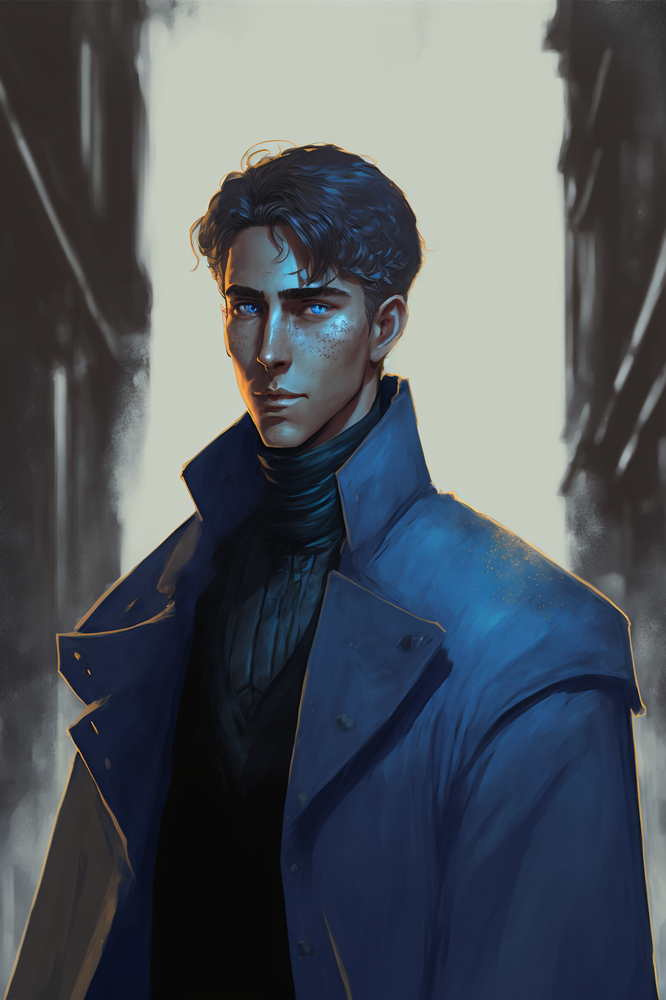

## Session 1

We begin with [[Eileen Quint]]. She has brought [[The Sixth Tinwheel]], a [[Tinwheel]] that her father, [[Enzo Quint]] created just before his sudden disappearance, to the [[Saetorim Institute]]. She has hired the founder of the Institute, [[Corrin Fane]] to find her father and shed light on the mystery of his supposed kidnapping.

[[Corrin Fane]] enlists the help of [[Arlo Livingston]], a new hire to the Institute, [[Lucian Cullpepper]], a professor at [[The Basentia Omnia|The Basentia]] who was a close colleague of Enzo's, and [[Sulazar Stillwater]], an old partner of Corrin's who has familiarity with the [[Deep Dwellers|Msanti]] down in the [[Bathysward]].

This intrepid and equally unlikely crew decide to head to [[Ari Vochard|Ari Vochard's]] house, Eileen's other father. There, as they discuss their plan, a [[Protoxy]] from the [[The Argent|Argentia]] showed up. [[Emere Renguard]] brought Eileen's brother, [[Vytas Quint]], back from the steps of the [[Pal Tenach]], higher than the Luminary on none other than [[Lotus]], a new drug that has been circulating the streets of [[Meripol]]. Emere warns them that Vytas is on his last straw, and will be disavowed of his position in the Argentia if he does not get it together. He also notifies the crew that [[The Vigil]] are currently on their way to Enzo's house to begin their investigation into his disappearance (clearly Vytas must have slipped the lid, as Eileen and Ari were trying to go through the Institute to prevent the "official" authorities from getting involved).

Vytas, in his stupor, also talks to Eileen about getting more money from their father, specifically talking about Enzo. This sparks the idea that perhaps Enzo had left some clues as to what he was doing in his safety deposit box at the bank.

The crew decides to head to the [[Central Bank of Meripol]] to check it out, as Vytas is able to give Eileen a key. On the way, they stop by Enzo's house, hoping to beat the Vigil there. Unfortunately, a group of detectives has already set up a crime scene and has begun going through all of Enzo's things, looking for clues.

[[Estelle Sartere]] notices [[Arlo Livingston|Arlo]] walking past, and stalks over to him, loosely accusing him of scoping out his own crime scene, insinuating towards his criminal endeavors. The conversation does not go well, but Eileen is able to talk to her instead, and gleans that the Vigil have in fact discovered and taken possession of [[The Second Tinwheel]] (though it is not known which it is at the time).

With nothing to do about it in the moment, they decide to head to towards the bank. Arlo tells the group he may have a way of getting the Tinwheel from the Vigil, and separates from the group to meet with his contact in the criminal underworld, [[Jax]]. [[Sulazar Stillwater|Sully]] heads to a food vendor while [[Lucian Cullpepper|Lucian]] and [[Eileen Quint|Eileen]] head into the bank. While waiting in line, [[Roz Daras]] enters the bank and begins a bank robbery.

While waiting for food, [[Sulazar Stillwater|Sully]] receives a call from [[Henry Wulverstone]] that he has a job waiting for him back in the [[Bathysward]].

## Session 2

Arlo meets with [[Jax]], and asks if he can procure evidence from lockups at [[The Vigil]]. [[Jax]] says he can do it, but in return Arlo must go to a [[The Sonxai|Sonxai]] warehouse and attempt to steal any information they have on how [[Lotus]] is produced. Arlo agrees, and the two part ways.

Meanwhile, Eileen and Lucian deal with a hostage situation. [[Roz Daras]] takes [[Gerod Farrault]], the Bank's manager, hostage, and orders him down into the vaults. [[Sulazar Stillwater|Sully]] sneaks into the Bank from an alleyway, grabbing a piece of Rebar (that's narratively significant Rebar!). Inside, he meets up with Lucian and Eileen, and the three of them decide to go down into the vaults and attempt to stop the robbery.

The discover that the robbers are after Enzo's vault as well, though it is unclear whether that is of Roz's own accord, or if he was hired by someone. Sully manages to knock Roz unconscious with the Rebar, saving the day. The three of them convince Gerod to let them open Enzo's box and flee with the contents before [[The Vigil]] could arrive.

They make their way back to the institute and reconvene with [[Corrin Fane|Corrin]].

## Session 3

The contents of Enzo's safe included [[The First Tinwheel]] and a number of purchase documents.

The crew listens to the Tinwheel with Corrin, and learn that [[Enzo Quint|Enzo]] was looking in to some historical records detailing the [[The Church of Aphothis]], a cult that operated in the ruin city of [[Mehnateruna]] many centuries ago. The cult supposedly enacted sacrifices that involved severing the [[Thread]] of their victims. Enzo postulates that perhaps the cult was somehow utilizing some power generated by the severing process.

The documents show that [[Enzo Quint|Enzo]] was receiving money from [[Rikkart Lauten]] of the [[Lauten Family]], one of [[Aljieudum|Aljieudum's]] greatest [[Aljiedum Noble Houses|Noble Houses]]. [[Rikkart Lauten|Rikkart]] himself, however, has been somewhat of a recluse for the last twenty years, as noted by [[Corrin Fane|Corrin]]. Enzo was also *making* purchases to a corporation called Crimson, which Sully recognizes as a different name used for [[The Sonxai]]. Enzo also had purchase orders for goods transported from the town of [[Gris]] by the [[Prisma Travel Corporation]].

The team decides to go home for the day, and [[Sulazar Stillwater|Sully]] heads back to the [[Bathysward]] to take care of his job. He meets up with his assistant, [[Henry Wulverstone]], who informs him that one of a few bathysphere's that had gone missing in the Ward a few months ago was discovered as wreckage a few miles offshore, and that Sully has been tasked with investigating.

Sully goes alone, taking a small single-personnel bathysphere out to the wreckage and investigates. He finds... nothing at first. Nothing in Engineering seems out of place, but there also seem to be no crew about. He heads to the bridge, needing to break out his welding equipment to do so. Inside, he discovers a shadowy figure, wearing an engineer's uniform standing atop a pile of bodies, all of their eyes removed, including the figure's. The figure calls out to Sully, who runs. The figure gives chase, but Sully manages to escape in his bathysphere and abandon the wreckage.

When he returns, he tells [[Henry Wulverstone|Henry]] to call [[The Vigil]], then leaves, heading to [[Corrin Fane|Corrin's]].

## Session 4

Arlo meets with [[Jax]] for a second time, retrieving the [[The Second Tinwheel]]. Jax tells Arlo that he must complete the job regarding [[The Sonxai]] warehouse and [[Lotus]] today, because they got wind of something and are currently in the process of going dark.

Arlo heads to the warehouse and sneaks in through the roof, discovering a warehouse full of row upon row of Lotus flowers, along with a [[Deep Dwellers|Msanti]] tasked with guarding the warehouse. Arlo manages to give the Deep Dweller the slip using his [[Primal Aspects#Space|Space]] magic, locking himself in a small office-like room in the back of the warehouse. There, he discovers a bathymetric map of the ocean outside of [[Meripol]], a spot far out into the ocean conspicuously marked, though there is no indication as to what it is. Arlo again uses the Aspect of Space to escape the warehouse.

The crew reconvenes at the [[Saetorim Institute]], and [[Corrin Fane|Corrin]] tells them that he has found a way to get them into one of the [[Lauten Family|Lauten Family's]] galas as serving staff, which would allow them to snoop around the place.

A few days later, the crew head to the Gala. [[Sulazar Stillwater|Sully]], [[Eileen Quint|Eileen]], and [[Arlo Livingston|Arlo]] attend posing as waitstaff, but [[Lucian Cullpepper|Luci]] managed to get his own invitation through [[The Basentia Omnia|The Basentia]].

During the commotion of the party, Arlo sneaks off and discovers a small courtyard with numerous plants. A man is in the middle of the courtyard, painting on the canvas. As Arlo approaches, he notices what the man is painting. A hollowed out eye in the clutches of black tendrils. The man notices Arlo, and turns to run.

## Session 5

Arlo runs after the man, and catches up to him. When the man turns, Arlo notices that he is now a different person. Realization dawns that the man must be a [[Shifter]]. He befriends the man, whose name is [[Elijah]]. Elijah admits that he has been hired by the [[Lauten Family]] for the last fifteen years to pose as [[Rikkart Lauten]].

Back at the party, Eileen meets [[Vera Lauten]]. Shortly after, Speaker of the [[High Authority]], [[Rysha Tan Mei]] shows up unexpectedly. She finds a place for her and her entourage and begins questioning anyone who ventures close. Lucian approaches and she beckons him over. They chat, and he learns that she is also investigating the [[Lauten Family]]. She says that she met [[Enzo Quint|Enzo]] briefly when he came to [[Mehnateruna]] (during [[The Second Tinwheel]]) and that she wants to get to the bottom of what's going on. She tells Luci that she was there twenty years ago when [[Adam La Cour]] took students, including her and [[Rikkart Lauten]], to the city, where they accidentally enacted a ritual in the [[Spirit Sanctum]] which caused Rikkart to lose his [[Thread]].

She tells Luci that she will be in touch, and wants to help in whatever way she can.

The party wraps up, and the crew regroups on the way back to the train station to the city. They get on the train, discussing everything that they had learned, when further up in the train car a mysterious woman wearing a cloak attacks a man, placing a device on his chest. The device causes him to collapse to the ground. From it, a pool of black dripping smoke emerges, coalescing into the form of a large slug-like creature with spikes.