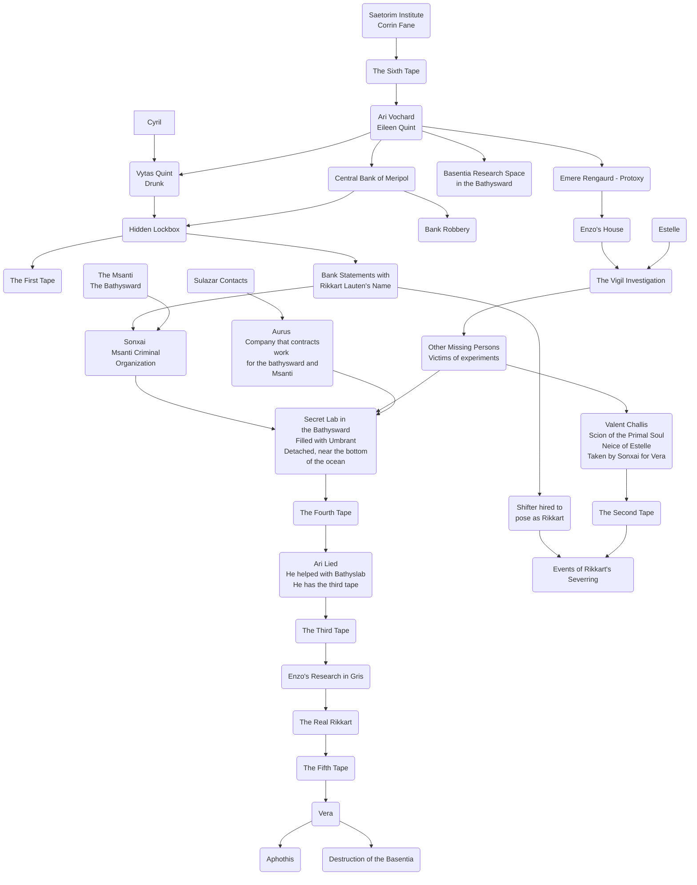

# Planning

!hidden

## Diagram

## Planning
I’d like the campaign to start in the [[Saetorim Institute]], where the characters have been hired by [[Corrin Fane]], Director of the Institute. They are shown the last tape, #6, that [[Enzo Quint]] recorded as a part of his research into the [[The Altrement|The Dark Between]].

A large part of the campaign will be tracking down the remaining [[Enzo Quint#Audio Tapes|Tapes]].

### Todo
- [x] Upload scene music
	- [x] Bank
	- [x] Battle Music
	- [x] Creepy Battle Music
	- [x] Bathysward
	- [x] Bathyscape Wreckage
- [x] Create Vocal Palettes
	- [x] Deep Dweller
	- [x] Umbrant
	- [x] Posessed Jurrin Tuls
- [x] Update character creation wiki with point buy level ups
- [x] Add character backstories
- [x] Key Scene descriptions
- [x] Add some combat/mobs/bosses
- [x] Script and record tape 1
- [ ] Script and record tape 2
- [ ] Script and record tape 3
- [ ] Script and record tape 4
- [ ] Script and record tape 5

## Pre-session
- [ ] Double-check die-ratings on character sheets and make sure they are what they should be
- [ ] Check wording on SFX to make sure they make sense

## Player Characters
* [[Arlo Livingston]]
* [[Eileen Quint]]
* [[Brisco Magroff]]
* [[Sulazar Stillwater]]
* [[Lucian Cullpepper]]

[[The Lightless Eye]]

## Prologue
> We see a man facing away from us, perched atop a wooden stool. He wears a dark coat and has coal-black shoulder-length hair that tousles slightly. A gust of wind finds its way into the secluded garden encircled with an over-abundance of trees and flowers. With a deft hand, the man sweeps a paint brush across a canvas that is obscured from view. He seems a man possessed, entranced by his work. His movements become frantic as he mixes colors on a lacquered wooden palette. His movements come to a crescendo until all at once he stops. His shoulders begin to shake. He cries, then shouts, calling out to the wind. He stands and topples the easel to the ground, shouting at it as if his despair was its fault. The painting lands face up, and we get a glimpse at what he was working on. The courtyard and all its flora, rendered in vivid detail, has been consumed by black tendrils, swirling in incomprehensible patterns. In the center, the shape of an eye with no pupil and bone-white sclera  stares directly at you. The man collapses to the ground, weeping.

## The Beginning
> A thin man with shoulder-length gray hair presses a button on the tall, brass machine as the tape reel reaches the end, and the two metallic wheels slow to a stop. The room you are in is cozy, but unkempt. Golden morning light bathes everything in incandescent rays. The man turns to you all from across a dark wooden desk strewn with papers.

[[Corrin Fane]]:
> Well, that’s it. *He rings his hands together for a moment.* I’ve asked all of you here on behalf of Eileen Quint and Ari Vochard. As you’ve just heard on the tape, Eileen’s father, Enzo Quint, a professor at the Basentia has gone missing. From what I can infer on the tape, presumed kidnapped. What you just heard was recorded less than a week ago. I have been requested that this investigation be kept under wraps—I’m unclear what it is exactly the professor was working on, but it seems to me his family does not wish for The Argent, or even the school itself to get involved, for reasons unknown to me.

* Suggests they stop by Ari’s house to talk to him first
* Tells Sulazar he asked him to help for his expertise on the Msanti since there was one in the tape
* Says something feels special about this case, he “has a feeling”

## Ari’s House
* Ari will deny that he knows about any of [[Enzo Quint|Enzo’s]] involvement with the Msanti even though he went to the [[Bathysward]] with him during the events of [[The Fourth Tape]]
* Will suggest that Enzo had an account with the [[Central Bank of Meripol]], but no longer has access to it. He has, however, seen [[Vytas Quint|Vytas]] go with him to the Bank on more than one occasion.

### Emere Renguard
[[Emere Renguard]] is a Protoxy for [[The Argent]].
* Shows up with a knock at the door at Ari’s while the party is there investigating with [[Vytas Quint]] in tow, clearly drunk and high on [[Lotus]], a new drug formulated by [[The Sonxai]] that is said to make your [[Thread]] more “vivid” and leave you in a trance-like state.
* Emere is disgusted by Vytas. He tells Ari that he found him on the steps of the [[Pal Tenach]]
* If he sees the party there, he raises an eyebrow and questions who they are
	* If he gets wind of what they are doing there, he will want to question them all individually
* He tells Ari, “as a common curtesy” that [[The Vigil]] is, as they speak, on their way to Enzo’s house to begin their investigation, and that he will be keeping *very* close tabs on the investigation 
* Once Emere leaves, Ari is clearly distraught at the Vigil getting involved, and tells the party that he hasn’t had time yet to go through Enzo’s things

## Enzo’s House

* If the party decides to head to Enzo’s house afterward, they discover that the Vigil have already set up a perimeter and are going through the house.

### Estelle

* If Arlo is there, Estelle approaches.

> A short woman dressed in the dark crimson Vigil’s coat catches your eye. When she recognizes you, her eyes narrow and she starts stalking towards you.

* She wants to talk with Arlo, first questioning what he is doing stalking around Enzo’s house, loosely accusing him of having something to do with it
* She knows that they have found a variety of journals and books, as well as a [[Tinwheel]]
* She will make a deal to get the tinwheel and make sure no one listens to it if Arlo gets [[Valent Childs]], her niece, back from the [[The Sonxai]]. She doesn’t know exactly where they are keeping her, but she’s confident he can figure it out.

## Central Bank of Meripol
### NPCs
* [[Gerod Farrault]] - Scion of Earth who manages the Central Bank of Meripol
	* Tall and thin with wire-rimmed glasses, Gerod will intercept the party if he sees Vytas with them

* [[Roz Daras]] - [[Furybearer]] hired by Vera to break into Enzo’s lockbox and take the incriminating documents. Will show up while the PCs are at the bank along with two thugs

Roz Daras **8 8**
Mercenary with a big Gun and Bigger Mouth
**10** Energy-powered hand cannon
Spend a PP to add an area effect

Mercenary Thugs **6 6**

### Lockbox
Enzo’s lockbox contains:
* either tape 1 or 2 (depending on which they acquire first)
* Bank statements indicating that [[Rikkart Lauten]] was giving him money
* Statements of purchase to a corporation called Crimson. With a good roll, Arlo might recognize it as an alias that [[The Sonxai]] uses–otherwise his criminal contacts would know.
* Statements of purchase to the [[Prisma Travel Corporation]] for transport of goods from [[Gris]]

## Bathysward
* Sulazar has a Deep Dweller contact – let him come up with NPC
* Besides the Basentia’s research labs in the [[Bathysward]] where they study undersea life, they aren’t aware of any other goings-on regarding the Basentia, and they haven’t heard of Enzo at all
* Asks about strange occurences around the Bathysward:
	* A couple bathyscapes were stolen from the shipyard a few months prior
	* They just detected the wreckage of one of them a few days ago but haven’t sent a crew to investigate yet

Basic Msanti Stats
Deep Dweller 8 8
Pressure Suit 10
Underwater Prowess 10

## Bathyscape Wreckage
* The Bathyscape that was stolen was used by Enzo and crew to go back and forth to the secret Bathyslab to conduct their experiments. When things went wrong and [[Umbrant|Umbrants]] took over, [[Jurrin Tuls]], Chief Engineer of the station made contact with Vera and Enzo requesting evacuation, but Vera deemed it a too unnecessary risk attempt retrieval, and so the station was abandoned
* Jurrin, along with a number of other custodial staff, managed to escape the Umbrant in one of the submersibles, but not before a malignant entity from [[The Altrement|The Dark Between]] burrowed itself inside Jurrin’s mind, slowly driving him to insanity.
* Before the ship could make it back to the Bathysward, Jurrin went insane, carving nonsense runes into his flesh, babbling about the lightless eye and killing the rest of the crew with preternatural strength. In the struggle, the ship is damaged irreparably and sinks to the bottom of the sea.

Possessed Jurrin Tuls 8 
Supernatural Strength 10

[[Henry Wulverstone]]

## Session 4

### Arlo’s Meeting with Jax

- Gives him a tinwheel that has a copy of the second tinwheel on it
- Says that the timetable has moved up for his assignment, needs him to move on [[The Sonxai]] warehouse today, because they’ve gotten word that something spooked them and the warehouse is being shutdown.

### Meeting at the [[Saetorim Institute]]

- Arlo will have the second tape to play
	- Corrin will not have heard of Mehnateruna at all, but can give them information on Speaker [[Rysha Tan Mei]]
- Sully and [[Corrin Fane|Corrin]] will obviously have news about what Sully discovered the prior night

#### Msanti Brawler
d10 d10
Msanti Suit d10

## Session 5

### The Lauten’s Gala

- remind the players that they can take action and contribute to the world
- Did Lucian get a gun? Add signature asset

- [[Arlo Livingston]] has met the fake Rikkart lauten [[Elijah]], and has suspicions that he is actually a [[Shifter]]. The Fake Rikkart did not want to talk much to Arlo, as he was not expecting to see anyone. In fact, if Arlo gives the description of the person he saw, it will not match Rikkart’s description. The Shifter was actually in a different form at the time, a painter that he had taken long ago and feels comfortable using, as holding Rikkart’s form for extended periods of time causes lapses of madness.

If Arlo tries to go snooping and looking for a tape, he won’t find one. But he could find:

#### Vera
Vera will approach [[Eileen Quint]], acting very friendly. She recognizes Eileen (obviously, since it was Vera who worked with and kidnapped Enzo to complete her plans). Her motivation for approaching Eileen is that she is understandably concerned that the daughter of the man she kidnapped is showing up at the Lauten estate posing as a waiter. 

She will tell Eileen that she looks familiar, but feigns that she has no idea what from. She will inquire about who Eileen is and what brought her to working as help for the Gala. If the information is not provided by Eileen, she will inquire if Eileen is a student at the Basentia, explaining that she regularly gives talks there, so it’s possible she recognizes Eileen from that.

#### Lucian

Check on [[Lucian Cullpepper]], ask what he is doing at the Gala. If nothing specific, have

#### The Speaker

After a little bit, read this:

> Near the entrance, you hear the din of the reception hush. You turn and see a cohort of broad-shouldered soldiers dressed in formal military attire, their heads adorned with feathered caps. They step into the entrance hall with practiced step. One of them steps forward and announces: “Presenting her royal highness, Speaker Tan Mei of the Tharshan High Authority.” A woman dressed in a fine gown steps into the room, her skin a brilliant blue with eyes to match, seemingly glistening in light as she surveys the room. 
> 
> After a few moments of stunned silence, an older gentlemen with silver-specked hair—you recognize him as Halver Lauten, Rikkart’s father and current Viceroy of the Lauten Estate–approaches the new arrivals. He looks genuinely surprised, but gives a curt bow to the Speaker and says, “Speaker, I must apologize for the lack decorum, we had not expected to receive you this night.”
> 
> The Speaker’s blazing eyes look him over, and she says, “That’s quite alright, Viceroy Lauten.”
> 
> Halver makes a gesture to a couple servants to make a proper space for the Speaker to sit down, and a din of shocked murmurs and gossip returns to the room.

- [[Rysha Tan Mei]], current Speaker for the [[High Authority]] of [[Tharsis]]. [[Viceroy|Viceroys]] of [[Aljiuedum]] regularly invite members of the ruling bodies from various other allied countries, generally out of tradition (with no expectation that they will actually show up). 
- She has decided to actually show up to investigate the Lautens given Enzo’s appearance in [[Mehnateruna]] a few months ago and the fact that she was there twenty years ago when Rikkart’s [[Thread]] was severed. 
- Mostly she just wants to make sure that [[Tharsis]] is not going to get entangled with any internal strife occurring within the nobility of [[Aljiuedum]].

If any of the characters approach her, her [[Matorei]] guard will prevent them approaching at first, but without much trouble Rysha will allow them forward to come and speak, mostly because she is trying to conduct her own investigations.

She will ask questions like if they work for the Lautens directly, if they have seen Rikkart, what they think about the Lautens, etc.

#### On the way home

After leaving the Gala, the party will be followed by [[Caytan Varengard]], one of the minor members of the [[Varengard Family]] who is a prominent [[Vastcaller]]. She has been tasked to follow them and use a [[Bifurcator]] on the train and to do what she can to derail the train and cause a crash. She was tasked by [[Emon Varenguard]], only given the information that they are suspected enemies of the Nobility. Emon himself was tasked by Vera (only because the Lauten Family has blackmail on the Varengaurds), but Caytan doesn’t know this.

When getting on the train, she will be wearing a cloak to conceal the Bifurcator. Se does not know what he does, and when she uses it he will look shocked and horrified for a few moments before retreating to one of the rear cars.

The Bifurcator:

> In one swift motion, the cloaked woman grabs the young man sitting across from her and flourishes a brass device. She forces the device onto the man’s chest, and spindly legs protract from it, wrapping around the man. An audible hiss screams through the train car as something hydraulic fires within the device. The man shouts in pain and he reels.
> 
> The cloaked woman steps back, eyes wide with horror.

Slug Monster 10 10 10

Spikes 8
 
Amorphous Body 8
 
Dark Tendrils 8

<em>Spike Blast</em>: Add 6 for every target past the first, and keep an extra effect dice for every target past the first, then shut down Spikes.

## Session 6
- Isn't it obvious? Rikkart claims, in his journal, that he couldn't see. How does that sound familiar? The entity that Sully discovered in the wrecked bathyscaphe.
- [[Killgard]], one of Rysha's personal wards, tracks the group down at the Saetorim Institute, indicating that the Speaker wishes to see them and discuss what they know. Corrin is untrusting, but will ultimate agree with the groups assessment.
- When the group returns to the [[Bathysward]], the [[Vigil]] are waiting for them, notified by [[Henry Wulverstone]]. They have been keeping guard and looking out for Sully to return, and will confront the group at his place of business

The Vigil (Mob) 8 8 8

Authority 8
 
Swords 8
 
Intimidation 8

- The Vigil's main motivation here is not letting citizens run rogue operations on things that should be handled in an official capacity, however they do not really have knowledge of what is really going on, only that there is some wreckage offshore that is dangerous
- Remind the players that they can "defeat" the mob either socially *or* with combat, but all mob dice must be knocked out in order to dismiss them.