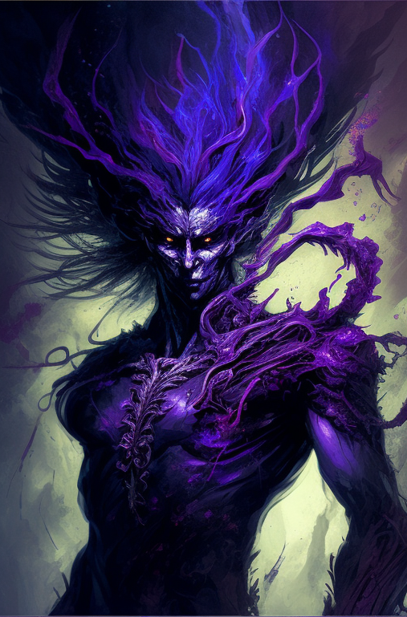
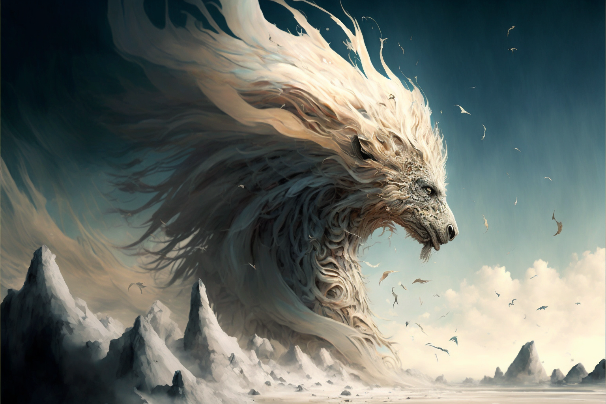
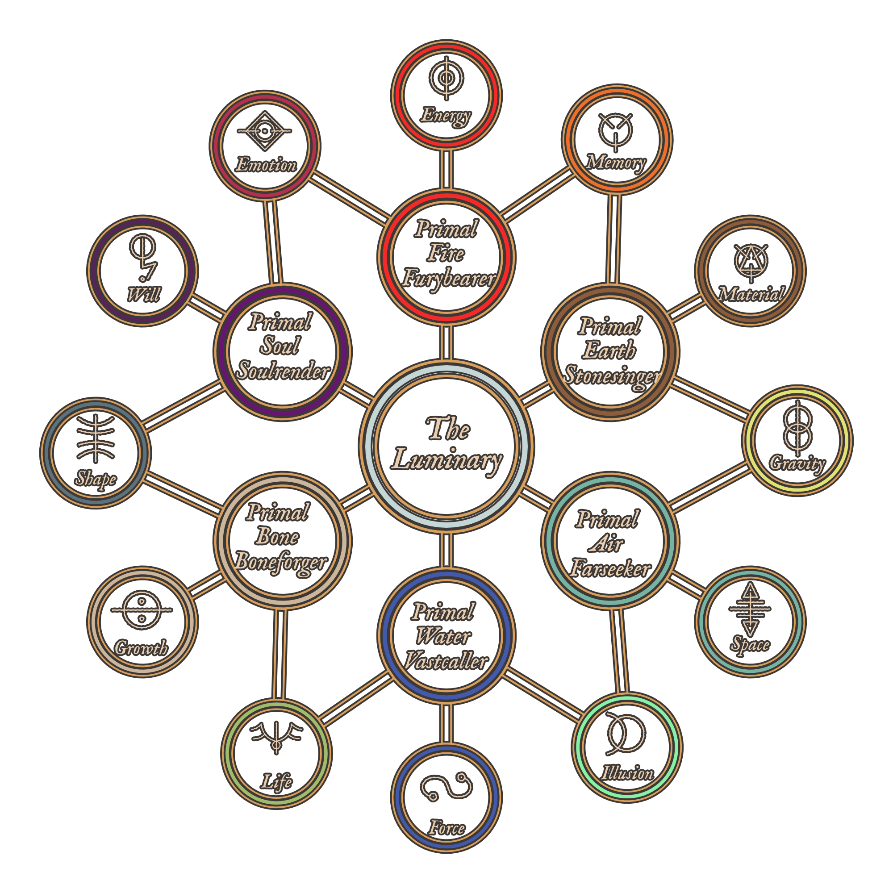

# Luminous Magic
Luminous Magic is Magic that is created or performed through [[The Luminary]]. This feat is accomplished through the [[Thread]]. Utilizing the direct connection with the Luminary allows one to bend reality to their will through a [[Conviction]]. Creating anything meaningful with Luminous Magic is no small feat, and although all living creatures on [[Naos]] have a Thread, few can utilize it to distort the fabric of reality to their will. Wielders of Luminous Magic are called [[Acronist|Acronists]].

## Permanent Magic
It is possible for [[Conviction|Convictions]] to become [[Fixed Truth|Fixed Truths]] if the manifestation is strong enough. [[Luminous Magic#Runes|Runes]] can help retain the efficacy of Fixed Truths, though almost all Fixed Truths degrade over time unless regularly maintained or are upheld by a [[Collective Conviction]]. 

## Training
For most denizens of [[Naos]], Luminous Magic requires years of training to form a strong enough [[Conviction]] to manifest any one of the Aspects, usually with the aid of a [[Primal Spirits|Primal Spirit]]. 

## The Law of Diametric Truth
When manifesting [[Conviction|Convictions]], it is the Acronist's *belief*, or *will*, that convinces the Luminary that reality behaves in a certain way. The greater the discripancy between the Acronist's Conviction and the [[Cornerstone]], the greater the potential [[Backlash]].

## Runes
Some cultures on [[Naos]] believe that certain symbols or runes are tied to the different aspects of Primal Spirits and Luminous Magic. The reality is that while these symbols don't intrisincally have any power over certain aspects, it has been found that using runes can aid in the strength of the Conviction formed while casting luminous magic. Runes can also provide a convenient way for Acronists to read and understand certain Fixed Truths that have been laid upon a particular place or item, so are usedemdash as a form of common communication.

## The Primal Spirits
While a particularly talented and rare [[Acronist]] may be able to manifest [[Conviction|Convictions]] with a direct link to [[The Luminary]], *most* do so with the aid of a [[Primal Spirits|Primal Spirit]]. Not only do Primal Spirits allow an Acronist to manifest Convictions of greater magnitude, they also rebuff potential [[Backlash]].

## Approaches
[[Conviction|Convictions]] are manifested using different approaches depending on the desired end result.

### 1st Heirarch | Abecar

**Novus** - Perception, knowing, revealing

**Regus** - Control, Manipulation

### 2nd Heirarch | Gnostis

**Vertus** - Transformation, alters the natural state of being

**Armus** - Resistance, bolsters defences against a specific aspect

### 3rd Heirarch | Kyros

**Parus** - Creation from nothing

**Demus** - Destruction, decay, disintegrate, or diminish

## Loss of Magic

Individuals who have had their [[Thread]] severed are called [[Fade|Fades]], and can no longer manifest Luminous Magic or be directly affected by it.

# Acronists

Acronists are trained wielders of [[Luminous Magic]]. As it takes a great deal of talent and dedication to develop strong [[Conviction|Convictions]], many Acronists studied for many years to become proficient at Magic.

## Pure Acronist
Incredibly rare, Pure Acronists manifest [[Conviction|Convictions]] purely from their self-belief, without the aid of any [[Primal Spirits|Primal Spirit]].

## Primal Acronist
More common bar far, especially in the Eastern lands of [[Selar]] and [[Edelun]], Acronists bind themselves to a [[Primal Spirits|Primal Spirit]], leveraging the Spirit's connection to [[The Luminary]] to more easily manifest Convictions and prevent the worst [[Backlash]].

### The Exchange
To bind a [[Primal Spirits|Primal Spirit]], an Acronist must perform [[The Exchange]], a ritual that varies wildly in difficulty and implementation depending on the Spirit and Acronist involved. This Exchange is sometimes permanent, but not always, and some bindings even need to be maintained through consistent ritual by the Acronist.

### The Aspects

Each [[Primal Spirits|Primal Spirit]] is tied to three [[Primal Aspects]], and each Spirit shares two of their Aspects with an adjacent spirit.

### Types of Primal Acronists

The types of Primal Acronists are:

- Furybearer
- Stonesinger
- Farseeker
- Vastcaller
- Boneforger
- Soulrender

#### Furybearers

**Furybearers** are Acronists who have bonded with the Primal Spirit of Fire. They are granted access to the Aspects of _Energy_, _Emotion_, and _Memory_.

#### Stonesingers

**Stonesingers** are Acronists who have bonded with the Primal Spirit of Earth. They are granted access to the Aspects of _Memory_, _Material_, and _Gravity_.

#### Farseeker

**Farseeker**s are Acronists who have bonded with the Primal Spirit of Air. They are granted access to the Aspects of _Gravity_, _Space_, and _Illusion_.

#### Vastcaller

**Vastcaller** are Acronists who have bonded with the Primal Spirit of Water. They are granted access to the Aspects of _Illusion_, _Force_, and _Life_.

#### Boneforger

**Boneforger** are Acronists who have bonded with the Primal Spirit of Bone. They are granted access to the Aspects of _Life_, _Growth_, and _Shape_.

#### Soulrender

**Soulrender** are Acronists who have bonded with the Primal Spirit of Soul. They are granted access to the Aspects of _Shape_, _Will_, and _Emotion_.

# Primal Spirits

The Primal Spirits are comprised of six powerful beings, created from the [[The Luminary]]. The six primal spirits are [[Primal Spirit of Air|Air]], [[Primal Spirit of Water|Water]], [[Primal Spirit of Earth|Earth]], [[Primal Spirit of Fire|Fire]], [[Primal Spirit of Bone|Bone]], and [[Primal Spirit of Soul|Soul]].

## Origins
In the beginnings of the world, when humans huddled around fires and struggled to survive, they often looked to beings beyond, dieties with power outside of normal comprehension, either to worship or fear or to simply explain how the world around them worked.

In a sense, early humans saw these divine concepts as *Universal Movers*, beings that encompassed various aspects of their lives. In their belief and worship, humanity as a whole catalyzed a collective [[Conviction]] so strong that it these beings were *willed* into existence. Overtime, primordial beings were formed from the faith that existed within humanity. The Convictions that created these beings was so strong that it became a [[Fixed Truth]] in reality, allowing the spirits to continue to exist even as humanity evolved.

## Sentience

It is unknown to the denizens of [[Naos]] whether the Primal Spirits are sentient, or simply forces of nature. In truth, the answer is more complex than that. The Primal Spirits themselves are far more complex constructs, both incomprehensible forces and, for lack of a better term, minds. They work as parts of a whole, and there are many instances of physical manifestations of the Primal Spirits coming into existence in the physical world, either pulled by a mortal that lives in it, or simply bubbled into existence by random chance. These manifestations can take many forms, both benign and dangerous. Many have been worshiped and feared as minor gods or monsters in their own right.

In some ways, the Primal Spirits have a “will” of their own, trying to shape the world in their image however they see fit. But they are also vastly incomprehensible, and often their influence on the world is met with fear and awe.

### Intrinsic Values

Since the Primal Spirits were created by and for Humans, each of the spirits is also intrisically tied to certain *values*.  These values influence how the Primal Spirits manifest in the world and their influence on it.

The Primal Earth is tied to the values of *Balance*, *Strength*, and *Neutrality*.

The Primal Air is tied to the values of *Freedom*, *Self*, and *Honesty*.

The Primal Water is tied to the values of *Change*, *Adaptation*, and *Fear*.

The Primal Fire is tied to the values of *Passion*, *Life*, and *Fury*.

The Primal Bone is tied to the values of *Substance*, *Pain*, and *Death*.

The Primal Soul, prior to corruption, was tied to the values of *Thought*, *Morality*, and *Virtue*. In the present, the Primal Soul is tied to the values of *Corruption*, *Manipulation*, and *Ego*.

### Facsimiles of Reality
It is important to note that while the Spirits embody aspects of humanity, they are not true embodiments of what they represent. When they were created, that may of been true, but the Spirits, as semi-conscious immortal beings, have the potential to grow and shift over time of their own accord, and how the world indirectly influences them. The Elemental Spirits are most resistant to change—Rivers will always change the land, and the ocean will always strike fear into those who witness its vastness, but Bone and Soul are more subject to interpretation and change. Soul especially.

### Corruption of the Primal Soul

Of the spirits, Soul was always the most *concious* and aware. While the other Spirits were more animalistic in nature, Soul often manifests with more sentience. Over time, however, as humanity and civilization became more complex, and the understanding of what it means to be good or evil did as well, the Primal Soul became twisted, warping into a representation of the darkest corners of the human soul. While the Primal Soul is merely a reflection, in a way, and cannot be truly evil, this shift led many in the world of [[Naos]] to fear the Primal Soul, and treat it as such. For [[The Argent]], The Primal Soul is seen as the personification of Evil, the wickedness of the heart should [[The Luminary]] not be followed.

## In the Modern Age
In the modern age of Naos, most civilizations treat the Spirits as they are, powerful and primal beings that are vast and potentially dangerous, but not gods. Some civilizations, however, still worship one or more of the spirits as dieties. Some [[Shifter|Shifters]] worship the [[Primal Spirit of Bone]] as a sort of god-like figure. Pockets of Msanti culture worship [[Primal Spirit of Water|Primal Water]]. There are various human cultures that worship the different elemental spirits in more ways than one.

## Creation of New Spirits
While it is technically feasible for new spirits to be created, the largely varying cultures and beliefs that make up Naos in the modern age make in very unlikely that new spirits would come about. The rise of logic, reason, and science too make such a *mass* Conviction possible, at least without a deliberate and coordinated effort. The Primal Spirits were a certainly a unique occurrence, and their creation the result of a perfect storm.

## Scions
While extremely rare, it is possible for human-spirit hybrids to be born into the world, known as [[Elemental Scion]]s, or, in even rarer cases, [[Shifter|Shifters]]. Scions are always born from a normal human parentage, and appear mostly human with some unique characteristics. Scions are simply born with an innate connection link to one of the Spirits, and are generally granted abilities based on their Spirit. The only Spirit that does not produce Scions, theoretically, is the [[Primal Spirit of Soul|Primal Soul]].

# The Primal Aspects

The **Primal Aspects** are twelve distinct domains that the six [[Primal Spirits]] are tied to, each Primal Spirit sharing two of its Aspects with other Spirits.

## Energy

The Aspect of **Energy** gives one the ability to create, shape, and manipulate various forms of energy, and are able to transform or convert it into a number of different manifestations. Some common forms of energy that Acronists use are kinetic, radiant, and thermal. This aspect has ties to the power industry and the military, due to it's applications in combat and energy production. _Furybearers_ are some of the most sought after Acronists.

## Memory

The Aspect of **Memory** gives one the domain over the _concept_ of Memory: fabrication, suppression, influence, detection, erasure, and more. Due to the _Law of Aversion_, this aspect is tricky to use on other living creatures without consent, but this Aspect is often used to provide memory restoration and preservation. In rare cases of extraordinarily talented Acronists, _Memory_ is also used to create artificial constructs with sentience.

## Material

The Aspect of **Material** gives one the ability to shape and manipulate _matter_, alter it's physical properties or phase state. Most often, this Aspect is uses by Engineers to aid in the construction of infrastructure or manufacturing.

## Gravity

The Aspect of **Gravity** gives one the domain over the fundamental force of Gravity. Primarily, Convictions of this Aspect relate to increasing or decreasing the Gravitational pull of the environment, individual objects, or in rare cases, living creatures. The Aspect of Gravity is used by the Conveyance Authority to operate gravity-powered trains.

## Space

The Aspect of **Space** gives one the ability to manipulate spatial reality, the boundless three-dimensional extent of the Universe in which objects have relative position and direction. Most commonly, this includes increasing and decreasing the _amount_ of space between points or objects. Most notably, Acronists that use _Space_ create **Junctions**, which are links between two points in the world, allowing for instantaneous travel between places. The most notable of these are **Prismagates**.

## Illusion

The Aspect of **Illusion** gives one the ability to create, shape, and manipulate illusory mirages or simulated reality. These effects are unable to affect reality itself, merely the perceptions of living creatures with Threads.

## Force

The Aspect of **Force** gives one the domain over fundamental forces. Force is a more loosely intepreted Aspect, and it's exact nature is somewehat dependant on the personal beliefs of the Acronist. Most commonly, Force relates to the raw power of Nature, manifesting in the form of wind, storms, and other weather phenomenon.

## Life

The Aspect of **Life** gives one the domain over biological life. Most commonly, this Aspect takes the form of an affinity with plants and animals. Due to the Law of Aversion, this Aspect is typically infeasible to be used for the outright manipulation, creation, or destruction of Life.

## Growth

The Aspect of **Growth** gives one the ability to manipulate the _progression_ of things. In a sense, Growth is the domain over chronology. Applications of Growth are most often applied to medicine, in order to expedite the healing process.

## Shape

The Aspect of **Shape** gives one the domain over the _shapes_ of living creatures. Due to the Law of Aversion, applying to this Aspect is nearly impossible, except on the willing, or on oneself.

## Will

The Aspect of **Will** gives one the domain over the _volition_ of living creatures. This aspect, at a most fundamental level, manipulates the willpower of living creatures, bending them to the Acronist's wishes. In most regions of Naos, this Aspect is highly frowned upon, as it is attached to the Primal Soul.

## Emotion

The Aspect of **Emotion** gives the domain over the _emotions_ of living creatures, controlling their amplitude and shape.

Kuri stepped into the icy waters, the stone floor rough against his bare feet. The cold metal of his amulet burned against his chest as he tried to take deep breaths. The dark pool before him did not seem welcoming as it had before. It knew what he had planned. The sheer walls of the domed room loomed over him, as if trapping him inside.

“Remember your training, Kuri.” Professor Lufonte stood behind Kuri by the door. “You've made contact before. This time, you're just going to go a little further. This is an essential step in becoming an Acronist.”

Kuri nodded weakly. Before he could convince himself to do otherwise, he plunged into the pool. A shock ran through him and he tasted bitter salt. When he surfaced he saw that Lufonte and closed the door, leaving him in near-darkness. He attempted to steel his nerves, closing his eyes and focusing his mind.

He lay on his back, the briny water allowing him to float with ease as he stretched his limbs out. He focused on the water. On the cold power of it. The vastness of it. He let those feelings flow into him. The wonder, but also the fear. It took him a few minutes, but eventually the world fell away. All of his senses became muted, and he lost himself in the expanse. A boundless ocean opened up before him.

He felt it. His Thread. An ephemeral strand of pure white that flowed from his heart and into the sky above. It seemed to billow in a breeze that he did not feel.

Looking down, waves lapped at his shins. As before, he stood on some solid, unseen surface hidden beneath the waterline. He took a tentative step forward, trusting that he would not fall into the depths below.

He wondered what the realm of Primal Water looked like to others. To him, this vast endless sea represented the power of the Spirit of Water—the incalculable force of nature. Of life.

The water whispered to him, its voice soft yet commanding. It called to him, beckoning him to explore its depths and uncover the secrets it held. Kuri hesitated for a moment, his heart pounding with anticipation and trepidation. He knew that in order to truly connect with the Spirit of Water and bind it to his will, he needed to venture further into its domain.

Taking a deep breath, Kuri dove beneath the surface, feeling the cool water envelop his body. His eyes adjusted to the dim light as he descended deeper into the abyss. The pressure increased as he went further down, but he didn't falter. He focused on his conviction, his belief that he could harness the power of Water and use it for good.

As he swam through the underwater expanse, Kuri marveled at the vibrant colors and diverse marine life that surrounded him. Schools of fish darted by in flashes of silver and gold, while coral reefs created intricate patterns on the ocean floor. He reached out a hand to touch a passing sea anemone, feeling a tingle of energy pass between them.

Drawing on this connection, Kuri began to manipulate the water around him. He formed small currents that guided him effortlessly through the depths. He created waves that surged up towards the surface before crashing back down with a thunderous roar. And with each act of manipulation, he felt an exhilarating surge of power course through his veins.

But as with every venture into uncharted territory, there were challenges awaiting him. A sudden current threatened to drag him away from his chosen path, but Kuri fought against it with all his strength. He focused on his conviction, refusing to let anything deter him from his goal.

As he pushed forward, Kuri encountered a creature unlike anything he had ever seen before – a majestic seafarer with scales that shimmered like moonlight and eyes that held ancient wisdom. It regarded him with a mixture of curiosity and caution, as if testing his resolve. Kuri knew that this creature was a manifestation of the Spirit of Water, and he approached it with reverence.

With a gesture, Kuri reached out to touch the creature, feeling a surge of energy flow between them. In that moment, he understood the true power of Luminous Magic and the bonds that could be formed between humans and Primal Spirits. It was a sacred connection, one that required trust, respect, and an unwavering conviction.

As he resurfaced from the pool, Kuri felt a sense of accomplishment wash over him. He had taken another step on his journey to becoming an Acronist. The power of the Spirit of Water now flowed through his veins, and he knew that with each passing day, his connection to the Luminary would grow stronger.

But as he stepped out of the pool and into the waiting arms of Professor Lufonte, Kuri couldn't help but wonder what other realms awaited him. What other Spirits would he encounter on his path? And what challenges lie ahead as he continued to explore the boundless possibilities of Luminous Magic?