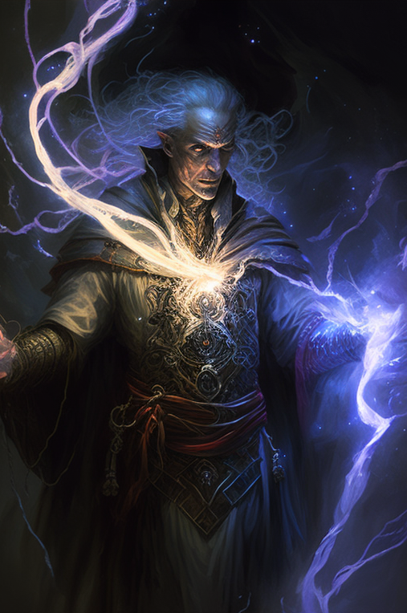

All living creatures on Naos are born with a Thread, an invisible, metaphysical strand that connects them to [[The Luminary]]. With this thread, sentient beings are able to perform acts of [[Luminous Magic]]. Humans that have their thread severed are known as [[Fade|Fades]].
