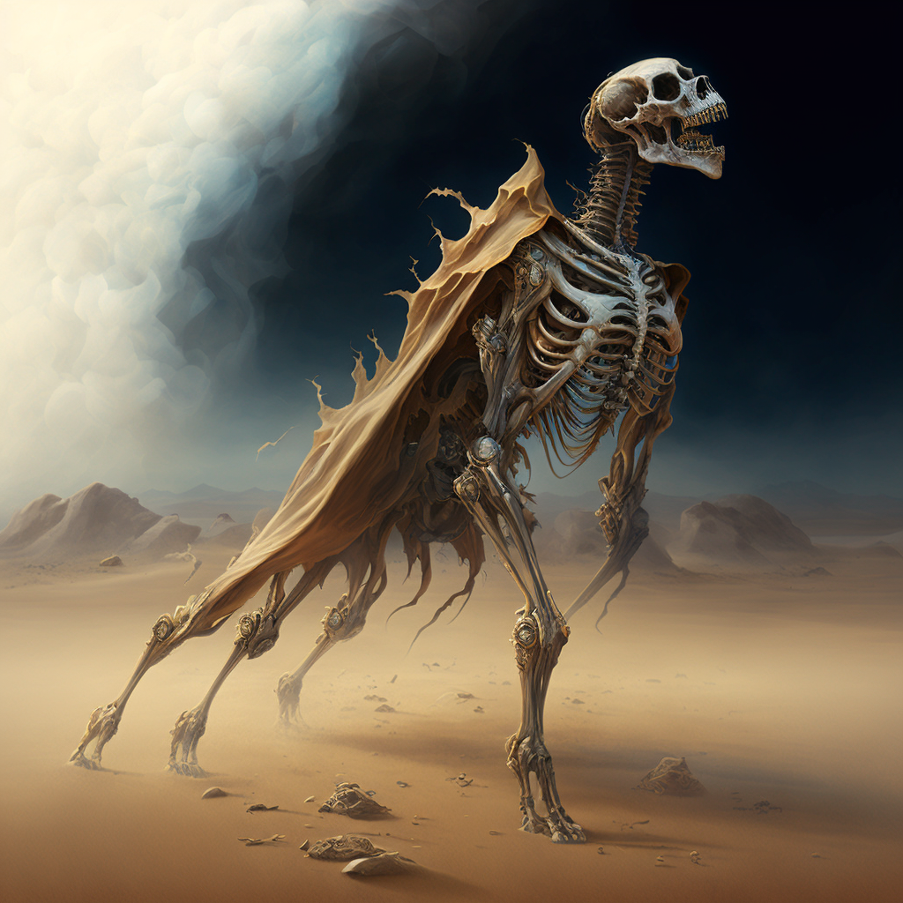
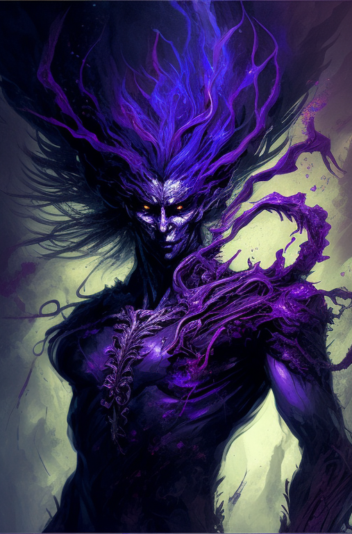
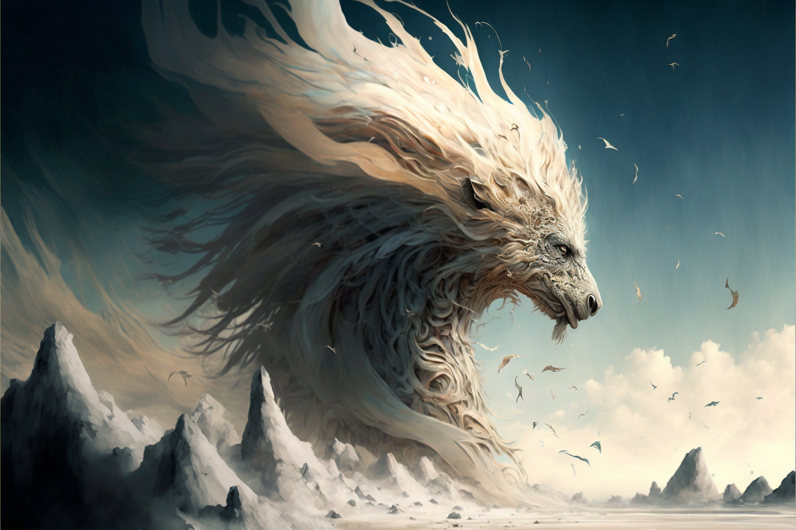
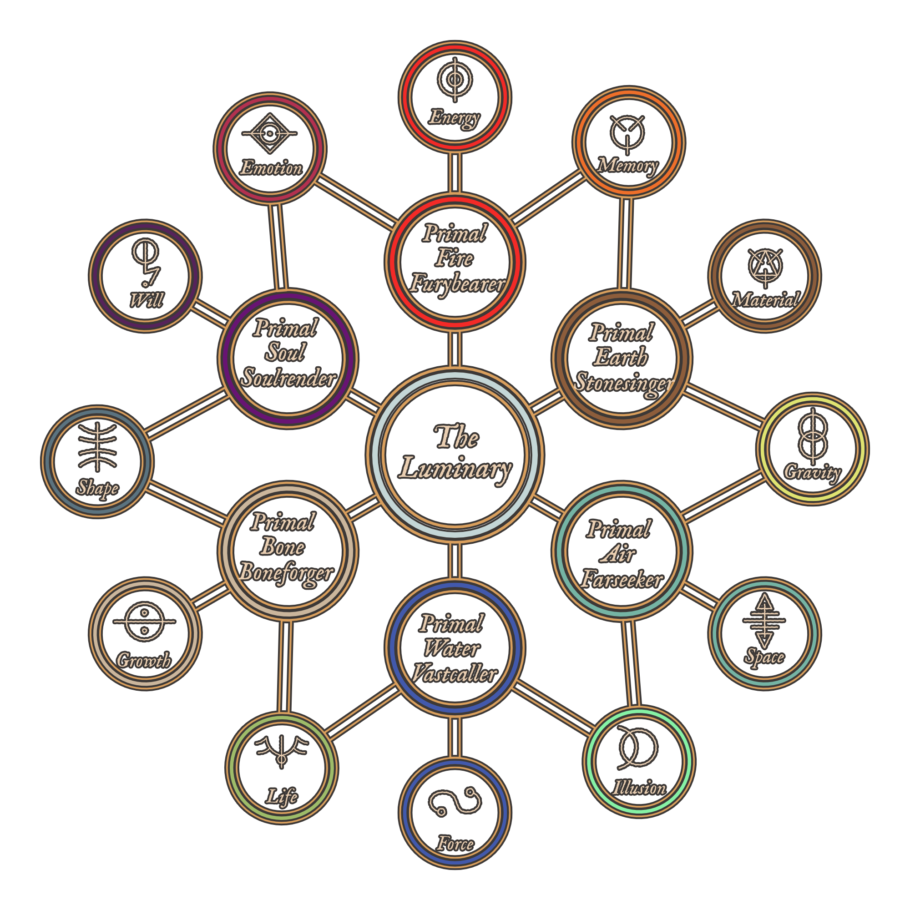

# Luminous Magic
Luminous Magic is Magic that is created or performed through [[The Luminary]]. This feat is accomplished through the [[Thread]]. Utilizing the direct connection with the Luminary allows one to bend reality to their will through a [[Conviction]]. Creating anything meaningful with Luminous Magic is no small feat, and although all living creatures on [[Naos]] have a Thread, few can utilize it to distort the fabric of reality to their will. Wielders of Luminous Magic are called [[Acronist|Acronists]].

## Permanent Magic
It is possible for [[Conviction|Convictions]] to become [[Fixed Truth|Fixed Truths]] if the manifestation is strong enough. [[Luminous Magic#Runes|Runes]] can help retain the efficacy of Fixed Truths, though almost all Fixed Truths degrade over time unless regularly maintained or are upheld by a [[Collective Conviction]]. 

## Training
For most denizens of [[Naos]], Luminous Magic requires years of training to form a strong enough [[Conviction]] to manifest any one of the Aspects, usually with the aid of a [[Primal Spirits|Primal Spirit]]. 

## The Law of Diametric Truth
When manifesting [[Conviction|Convictions]], it is the Acronist's *belief*, or *will*, that convinces the Luminary that reality behaves in a certain way. The greater the discripancy between the Acronist's Conviction and the [[Cornerstone]], the greater the potential [[Backlash]].

## Runes
Some cultures on [[Naos]] believe that certain symbols or runes are tied to the different aspects of Primal Spirits and Luminous Magic. The reality is that while these symbols don't intrisincally have any power over certain aspects, it has been found that using runes can aid in the strength of the Conviction formed while casting luminous magic. Runes can also provide a convenient way for Acronists to read and understand certain Fixed Truths that have been laid upon a particular place or item, so are usedemdash as a form of common communication.

## The Primal Spirits
While a particularly talented and rare [[Acronist]] may be able to manifest [[Conviction|Convictions]] with a direct link to [[The Luminary]], *most* do so with the aid of a [[Primal Spirits|Primal Spirit]]. Not only do Primal Spirits allow an Acronist to manifest Convictions of greater magnitude, they also rebuff potential [[Backlash]].

## Approaches
[[Conviction|Convictions]] are manifested using different approaches depending on the desired end result.

### 1st Heirarch | Abecar

**Novus** - Perception, knowing, revealing

**Regus** - Control, Manipulation

### 2nd Heirarch | Gnostis

**Vertus** - Transformation, alters the natural state of being

**Armus** - Resistance, bolsters defences against a specific aspect

### 3rd Heirarch | Kyros

**Parus** - Creation from nothing

**Demus** - Destruction, decay, disintegrate, or diminish

## Loss of Magic

Individuals who have had their [[Thread]] severed are called [[Fade|Fades]], and can no longer manifest Luminous Magic or be directly affected by it.

# Acronists

Acronists are trained wielders of [[Luminous Magic]]. As it takes a great deal of talent and dedication to develop strong [[Conviction|Convictions]], many Acronists studied for many years to become proficient at Magic.

## Pure Acronist
Incredibly rare, Pure Acronists manifest [[Conviction|Convictions]] purely from their self-belief, without the aid of any [[Primal Spirits|Primal Spirit]].

## Primal Acronist
More common bar far, especially in the Eastern lands of [[Selar]] and [[Edelun]], Acronists bind themselves to a [[Primal Spirits|Primal Spirit]], leveraging the Spirit's connection to [[The Luminary]] to more easily manifest Convictions and prevent the worst [[Backlash]].

### The Exchange
To bind a [[Primal Spirits|Primal Spirit]], an Acronist must perform [[The Exchange]], a ritual that varies wildly in difficulty and implementation depending on the Spirit and Acronist involved. This Exchange is sometimes permanent, but not always, and some bindings even need to be maintained through consistent ritual by the Acronist.

### The Aspects

Each [[Primal Spirits|Primal Spirit]] is tied to three [[Primal Aspects]], and each Spirit shares two of their Aspects with an adjacent spirit.

### Types of Primal Acronists

The types of Primal Acronists are:

- Furybearer
- Stonesinger
- Farseeker
- Vastcaller
- Boneforger
- Soulrender

#### Furybearers

**Furybearers** are Acronists who have bonded with the Primal Spirit of Fire. They are granted access to the Aspects of _Energy_, _Emotion_, and _Memory_.

#### Stonesingers

**Stonesingers** are Acronists who have bonded with the Primal Spirit of Earth. They are granted access to the Aspects of _Memory_, _Material_, and _Gravity_.

#### Farseeker

**Farseeker**s are Acronists who have bonded with the Primal Spirit of Air. They are granted access to the Aspects of _Gravity_, _Space_, and _Illusion_.

#### Vastcaller

**Vastcaller** are Acronists who have bonded with the Primal Spirit of Water. They are granted access to the Aspects of _Illusion_, _Force_, and _Life_.

#### Boneforger

**Boneforger** are Acronists who have bonded with the Primal Spirit of Bone. They are granted access to the Aspects of _Life_, _Growth_, and _Shape_.

#### Soulrender

**Soulrender** are Acronists who have bonded with the Primal Spirit of Soul. They are granted access to the Aspects of _Shape_, _Will_, and _Emotion_.

# Primal Spirits

The Primal Spirits are comprised of six powerful beings, created from the [[The Luminary]]. The six primal spirits are [[Primal Spirit of Air|Air]], [[Primal Spirit of Water|Water]], [[Primal Spirit of Earth|Earth]], [[Primal Spirit of Fire|Fire]], [[Primal Spirit of Bone|Bone]], and [[Primal Spirit of Soul|Soul]].

## Origins
In the beginnings of the world, when humans huddled around fires and struggled to survive, they often looked to beings beyond, dieties with power outside of normal comprehension, either to worship or fear or to simply explain how the world around them worked.

In a sense, early humans saw these divine concepts as *Universal Movers*, beings that encompassed various aspects of their lives. In their belief and worship, humanity as a whole catalyzed a collective [[Conviction]] so strong that it these beings were *willed* into existence. Overtime, primordial beings were formed from the faith that existed within humanity. The Convictions that created these beings was so strong that it became a [[Fixed Truth]] in reality, allowing the spirits to continue to exist even as humanity evolved.

## Sentience

It is unknown to the denizens of [[Naos]] whether the Primal Spirits are sentient, or simply forces of nature. In truth, the answer is more complex than that. The Primal Spirits themselves are far more complex constructs, both incomprehensible forces and, for lack of a better term, minds. They work as parts of a whole, and there are many instances of physical manifestations of the Primal Spirits coming into existence in the physical world, either pulled by a mortal that lives in it, or simply bubbled into existence by random chance. These manifestations can take many forms, both benign and dangerous. Many have been worshiped and feared as minor gods or monsters in their own right.

In some ways, the Primal Spirits have a “will” of their own, trying to shape the world in their image however they see fit. But they are also vastly incomprehensible, and often their influence on the world is met with fear and awe.

### Intrinsic Values

Since the Primal Spirits were created by and for Humans, each of the spirits is also intrisically tied to certain *values*.  These values influence how the Primal Spirits manifest in the world and their influence on it.

The Primal Earth is tied to the values of *Balance*, *Strength*, and *Neutrality*.

The Primal Air is tied to the values of *Freedom*, *Self*, and *Honesty*.

The Primal Water is tied to the values of *Change*, *Adaptation*, and *Fear*.

The Primal Fire is tied to the values of *Passion*, *Life*, and *Fury*.

The Primal Bone is tied to the values of *Substance*, *Pain*, and *Death*.

The Primal Soul, prior to corruption, was tied to the values of *Thought*, *Morality*, and *Virtue*. In the present, the Primal Soul is tied to the values of *Corruption*, *Manipulation*, and *Ego*.

### Facsimiles of Reality
It is important to note that while the Spirits embody aspects of humanity, they are not true embodiments of what they represent. When they were created, that may of been true, but the Spirits, as semi-conscious immortal beings, have the potential to grow and shift over time of their own accord, and how the world indirectly influences them. The Elemental Spirits are most resistant to change—Rivers will always change the land, and the ocean will always strike fear into those who witness its vastness, but Bone and Soul are more subject to interpretation and change. Soul especially.

### Corruption of the Primal Soul

Of the spirits, Soul was always the most *concious* and aware. While the other Spirits were more animalistic in nature, Soul often manifests with more sentience. Over time, however, as humanity and civilization became more complex, and the understanding of what it means to be good or evil did as well, the Primal Soul became twisted, warping into a representation of the darkest corners of the human soul. While the Primal Soul is merely a reflection, in a way, and cannot be truly evil, this shift led many in the world of [[Naos]] to fear the Primal Soul, and treat it as such. For [[The Argent]], The Primal Soul is seen as the personification of Evil, the wickedness of the heart should [[The Luminary]] not be followed.

## In the Modern Age
In the modern age of Naos, most civilizations treat the Spirits as they are, powerful and primal beings that are vast and potentially dangerous, but not gods. Some civilizations, however, still worship one or more of the spirits as dieties. Some [[Shifter|Shifters]] worship the [[Primal Spirit of Bone]] as a sort of god-like figure. Pockets of Msanti culture worship [[Primal Spirit of Water|Primal Water]]. There are various human cultures that worship the different elemental spirits in more ways than one.

## Creation of New Spirits
While it is technically feasible for new spirits to be created, the largely varying cultures and beliefs that make up Naos in the modern age make in very unlikely that new spirits would come about. The rise of logic, reason, and science too make such a *mass* Conviction possible, at least without a deliberate and coordinated effort. The Primal Spirits were a certainly a unique occurrence, and their creation the result of a perfect storm.

## Scions
While extremely rare, it is possible for human-spirit hybrids to be born into the world, known as [[Elemental Scion]]s, or, in even rarer cases, [[Shifter|Shifters]]. Scions are always born from a normal human parentage, and appear mostly human with some unique characteristics. Scions are simply born with an innate connection link to one of the Spirits, and are generally granted abilities based on their Spirit. The only Spirit that does not produce Scions, theoretically, is the [[Primal Spirit of Soul|Primal Soul]].

# The Primal Aspects

The **Primal Aspects** are twelve distinct domains that the six [[Primal Spirits]] are tied to, each Primal Spirit sharing two of its Aspects with other Spirits.

## Energy

The Aspect of **Energy** gives one the ability to create, shape, and manipulate various forms of energy, and are able to transform or convert it into a number of different manifestations. Some common forms of energy that Acronists use are kinetic, radiant, and thermal. This aspect has ties to the power industry and the military, due to it's applications in combat and energy production. _Furybearers_ are some of the most sought after Acronists.

## Memory

The Aspect of **Memory** gives one the domain over the _concept_ of Memory: fabrication, suppression, influence, detection, erasure, and more. Due to the _Law of Aversion_, this aspect is tricky to use on other living creatures without consent, but this Aspect is often used to provide memory restoration and preservation. In rare cases of extraordinarily talented Acronists, _Memory_ is also used to create artificial constructs with sentience.

## Material

The Aspect of **Material** gives one the ability to shape and manipulate _matter_, alter it's physical properties or phase state. Most often, this Aspect is uses by Engineers to aid in the construction of infrastructure or manufacturing.

## Gravity

The Aspect of **Gravity** gives one the domain over the fundamental force of Gravity. Primarily, Convictions of this Aspect relate to increasing or decreasing the Gravitational pull of the environment, individual objects, or in rare cases, living creatures. The Aspect of Gravity is used by the Conveyance Authority to operate gravity-powered trains.

## Space

The Aspect of **Space** gives one the ability to manipulate spatial reality, the boundless three-dimensional extent of the Universe in which objects have relative position and direction. Most commonly, this includes increasing and decreasing the _amount_ of space between points or objects. Most notably, Acronists that use _Space_ create **Junctions**, which are links between two points in the world, allowing for instantaneous travel between places. The most notable of these are **Prismagates**.

## Illusion

The Aspect of **Illusion** gives one the ability to create, shape, and manipulate illusory mirages or simulated reality. These effects are unable to affect reality itself, merely the perceptions of living creatures with Threads.

## Force

The Aspect of **Force** gives one the domain over fundamental forces. Force is a more loosely intepreted Aspect, and it's exact nature is somewehat dependant on the personal beliefs of the Acronist. Most commonly, Force relates to the raw power of Nature, manifesting in the form of wind, storms, and other weather phenomenon.

## Life

The Aspect of **Life** gives one the domain over biological life. Most commonly, this Aspect takes the form of an affinity with plants and animals. Due to the Law of Aversion, this Aspect is typically infeasible to be used for the outright manipulation, creation, or destruction of Life.

## Growth

The Aspect of **Growth** gives one the ability to manipulate the _progression_ of things. In a sense, Growth is the domain over chronology. Applications of Growth are most often applied to medicine, in order to expedite the healing process.

## Shape

The Aspect of **Shape** gives one the domain over the _shapes_ of living creatures. Due to the Law of Aversion, applying to this Aspect is nearly impossible, except on the willing, or on oneself.

## Will

The Aspect of **Will** gives one the domain over the _volition_ of living creatures. This aspect, at a most fundamental level, manipulates the willpower of living creatures, bending them to the Acronist's wishes. In most regions of Naos, this Aspect is highly frowned upon, as it is attached to the Primal Soul.

## Emotion

The Aspect of **Emotion** gives the domain over the _emotions_ of living creatures, controlling their amplitude and shape.

# Lotus

**Lotus** is a street drug that became popular in [[Meripol]], known for its psychedelic and hallucinegenic effects. It became extremely popular with students at [[The Basentia Omnia|The Basentia]], due to its potency with [[Acronist|Acronists]]. 

!hidden

Lotus is a drug developed by [[Vera Lauten]] and [[Enzo Quint]], although their original formula did not take the decorative form of a flower and had a different name, and was used for scientific research. 

## Development
Lotus was developed in its initial form by studying [[Threadwalkers]], as well as the runes inlaid on the [[Spirit Sanctum]] in [[Mehnateruna]] created by [[The Church of Aphothis]] which aided in the sacrifice of [[Thread|Threads]]. 

## Effects
Using their research as inspiration, Enzo and Vera created a liquid formula that could bring the Thread further into the physical realm, which is how Threadwalkers are partially able to operate—they tug on threads like harp strings, pulling them *partially* into the physical realm in order to travel to them.

By bringing Threads into the Physical Realm gives them more potency when they are severed via a [[Bifurcator]], creating a much larger [[Liminal Bubble]].

In addition to the above effects, Lotus also gives the user an out-of-body experience, typically warping time around them and experiencing another plane of existence entirely.

## As a Street Drug
Vera turned the formula over to the [[Sonxai]] for larger scale production for her final plan, and the organization decided to release it onto the street without her permission. The [[Sonxai]] converted the formula to a more appealing ingestible white flower.

# The Deep Dwellers
The Msanti, or the Dwellers in the Deep, as they are otherwise known, are humanoid creatures that live in the depths of the ocean. It is said that long ago, they were banished to the sea after an indiscretion with the [[Primal Spirit of Water]].

## Immense Pressure
The Msanti live in the darkest depths of the ocean, where the pressure of water would crush land lopers. While they rarely leave their solitary existence, the more adventurous Deep Dwellers don pressurized suits that allow them to ascend to the surface and explore the overworld. These suits are made to be self-sustaining, keeping the Deep Dwellers that use them in water and under enough pressure to retain their form that would otherwise collapse while on the surface. The suits are fitted with mirror-like visors—most Deep Dwellers have extraordinarily sensitive eyes to live in the near-dark of the fathoms.

## Life at the Bottom
Although Deep Dwellers live where very little light exists, natural geothermal vents along the ocean floor provide a natural source of energy to allow their civilization to thrive. Deep Dweller civilizations are wide and varied, from vast cultivated fields of seaweed, to small villages and large cities glowing with bioluminescent light. They have harnessed the geothermal power available to them to achieve technological prowess, creating mechanical feats that can operate even at the bottom of the ocean. With the use of hydrothermal vents and magic, the Msanti are known for their excellent metallurgy. Land dwellers often travel to Msanti trading bazaars found in shallower water in order to trade.

The Deep Dwellers themselves represent a wide array of life. Some are nearly humanoid, the only differences being larger eyes to take in more light, and a lack of pigment to their skin. Others, however, can be more otherworldly, featuring an array of tentacles, teeth, bioluminescent fins, exoskeletons, and more. Nearly all Deep Dwellers have retained their bipedal form, though, as it allows them to walk along the sea floor and travel on land.

### Communication is Key
Although many Deep Dwellers tend to prefer solitary life, their societal advancement necessitated collaboration. Verbal speech an impossibility underwater, they have a means to communicate telepathically between themselves and other sentient creatures.

### Cursed Past
While the exact origins of the Deep Dwellers is unclear, it is mostly agreed upon that they were once human, long ago. Their ancestors vied for more power and tried to capture and enslave the primal spirit of water. In their failure, they were banished from land by the spirit, cursing them to live at the bottom of the sea. At first, the deep dwellers lived alone in darkness. Eventually, though, they developed into a flourishing society beneath the waves.

While many Deep Dwellers are contented with their new existence, some Deep Dwellers long to return to the surface permanently, in an event known as [[The Ascension]]. They believe that if the [[Primal Spirit of Water|Primal Spirit]] was the one to banish them, it has the power to return them to human form and allow them to rejoin the surface lopers. Some Deep Dwellers go on great pilgrimages across the land and sea in search of a way to appease the spirit and begin [[The Ascension]].

# The Bathysward

The **Bathysward** is a significant outpost, embassy, and marketplace off the coast of [[Meripol]], housing a large population of [[Deep Dwellers|Msanti]] that interface with the city and [[Aljieudum|Aljieudan Government]].

# Vera Lauten
Vera Lauten was the youngest daughter of the [[Lauten Family]]. The **Lauten Family** is one of the most prominent of the [[Aljiedum Noble Houses]]. While they do not oversee any of Aljieudum’s [[Aljiuedum District|Districts]], many members of the family, including the Family’s current patriarch, [[Halver Lauten]], have high-rankings positions in Aljiuedum’s [[Chamber of Nobles]]. She had two older brothers, [[Rikkart Lauten]] and [[Alrik Lauten]]. Her father and mother were [[Halver Lauten]] and [[Elske Lauten]].

Vera applied and joined [[The Basentia Omnia|The Basentia]] as an [[Acronist]] on mostly name alone, and she mostly only did it to follow in her brother Rikkart’s footsteps.

Throughout her time at the Basentia, she lived in Rikkart’s shadow. She was average at the majority of her studies, only showing a true aptitude for politics. Her skill as an Acronist was middling, although most professors expected great things from her.

Rikkart Lauten was the middle child of the [[Lauten Family]], and was seen by many as the greatest [[Acronist]] ever seen at the [[The Basentia Omnia|The Basentia]]. He had an older brother, [[Alrik Lauten]] and a younger sister, [[Vera Lauten]]. His Father and Mother were [[Halver Lauten]] and [[Elske Lauten]]. At the age of eighteen, he became a [[Fade|Fade]] due to an accident that occured while attending [[The Basentia Omnia|The Basentia]]. In recent years, Rikkart has not been seen in public often.

When Rikkart's life was ruined, Vera tried for many years to change the Basentia from the inside, but she could do nothing for the arrogance and hubris that the top Acronists in the world showed in their meddling of the Luminary and magic. When the opportunity arose to use Enzo Quint's research into the Dark Between for her own use, she formulated a plan to destroy the Basentia using Etnu and cause as much damage to Acronists as she could during the process. 

# The Dread

The **Dread** are the manifestations of [[Altrement|The Dark Between]]. They are seven entities that each represent an aspect of humans' fear of the end of all things, which is what the Dark is. They were manifested from [[The End of All Things]], when the [[Dominion]] created the [[Worldsphere|Worldspheres]] to defy the end of the Universe. They are the embodiment of the existential dread that all humans fear—of the non-existence that lies at the end of life, and furthermore at the end of the Universe, when all energy and matter has returned to nothing.

The Dread, for most of their existence, are amorphous, completely residing in the formless void of the Dark Between. It is only when they are pulled into a physical universe through an [[Entanglement]] that they take form, thought, and sentience.

### The Terror
[[The Terror]] is the first of the Dread, representing the human emotion of despair and overwhelming sense of futility felt when realizing the end of all things.

### The Empty
[[The Empty]] is the representation of the void, the nothingness that awaits the end of all things.

### The Patient
[[The Patient]] is the representation that the end will come no matter what, it is inevitable, and all one must do is wait for it.

### The Unravelled
[[Etnu|The Unravelled]], also known as *Etnu*, is the embodiment of *entropy* and equilibrium. The End will bring about a void with no gradient or change.

### The Spiral
[[The Spiral]] is the chaos. It is the disorder and the endless breaking down of patterns into smaller and smaller pieces, the fractal nature of the universe dissolving until nothing whole is left.

### The Darkness
[[The Darkness]], also known as *Videnis*, is the literal representation of the absence of light and the shroud of eternal darkness that comes with the End.

### Oblivion
[[Oblivion]] is the last and final Dread, the representation of the erasure of everything from existence: thought, knowledge, life, matter, light, everything. The existential simulacrum of everything the Dread as a whole embody. 

# Valent Childs Description

Valent Childs is [[Estelle Sartere|Estelle Sartere’s]] twelve-year old niece and scion of the [[Primal Spirit of Soul|Primal Soul]]. Her father was abusive, and so Estelle, who works as a detective for Meripol's Vigil (police force) worked hard to put him behind bars. 

Valent herself struggled with her scion powers. Frequently, The Primal Soul would manifest from her in times of extreme stress, lashing out to defend her. Estelle worked with Corrin Fane and Suluzar Stillwater at the Saetorim Institute to help Valent control her powers. She is now in her early twenties and often gets into trouble with the law. She 

has a troubled past, but she is determined to use her powers for good and protect those who cannot protect themselves. Valent is fiercely independent and has a rebellious streak, often getting into dangerous situations while trying to uncover the truth. She has a strong sense of justice and will stop at nothing to bring the guilty to justice.

Valent has long, dark purple hair and piercing purple eyes. She often wears dark clothing and carries a small dagger for self-defense. She is agile and quick on her feet, able to navigate through tight spaces with ease. Valent is intelligent and resourceful, using her knowledge of the supernatural world to her advantage in investigations.

Despite her tough exterior, Valent has a soft spot for children and animals.

# Valent Childs Comic Short

In this short web comic, we follow Valent Childs, currently twenty-two years old, as she ventures down into the Bathysward to investigate the usage of Lotus that has been spreading like wildfire in Meripol. This short ends with Valent being captured by Vera Lauten, the mastermind behind the entire operation. 

Throughout the comic, Valent talks in her mind with the Primal Soul. Soul's character is like a chiding adult, warning Valent not to get into trouble, but ultimately tries to help her.

## Rough Outline

The comic starts with Valent Childs walking through the bustling streets of Meripol, wearing her signature dark clothing and carrying a small dagger. She is on a mission to investigate the usage of Lotus, a potent street drug that has been causing havoc in the city.

As Valent enters the Bathysward, the atmosphere changes dramatically. The streets become darker and more mysterious, lit only by the glow of bioluminescent creatures. She navigates through the crowded marketplace, keeping an eye out for any suspicious activity.

As she walks through the Bathysward, she keeps her ears perked, attempting to overhear any signs of Lotus being sold in the bustling marketplace. 

Suddenly, Valent overhears whispers of Lotus being sold in a hidden underground establishment. Intrigued and determined to get to the bottom of this, she follows the whispers, leading her to a concealed entrance.

Valent follows cautiously, and manages to sneak into the underground establishment, her senses heightened and her dagger at the ready. As she explores the dimly lit corridors, she comes across rooms filled with people under the influence of Lotus. Their eyes are glazed over and their movements sluggish. Ethereal strands of light stretch out from their chests and disappearing through the ceiling, their Threads brought into the physical realm. 

Valent continues to investigate, trying to gather evidence and understand the purpose behind this underground operation. As she explores deeper, she stumbles upon a hidden laboratory where Lotus is being produced and refined.

In the lab, Valent discovers Vera Lauten, the mastermind behind the Lotus operation. Vera knew that Valent was coming, had been tipped off to her investigation and dig some digging of her own into who Valent was, and how Valent could be used to bind Etnu to their reality. 

Vera, knowing that Valent is a Scion of the Primal Soul, believes that she can use Valent's powers to bind the Dread Etnu to their reality, granting her unimaginable power. Ultimately, this short ends with Valent's capture.

## Outline

Outline with detailed descriptions of each comic panel.

Panel 1:
Valent Childs walking through the busy streets of Meripol, her dark purple hair flowing behind her. She wears her signature dark clothing and carries a small dagger at her side. The city is vibrant and full of life.

Panel 2:
Valent entering the Bathysward, the atmosphere immediately changes. The streets become darker and more mysterious, lit only by the glow of bioluminescent creatures. She navigates through the crowded marketplace, keeping an eye out for any signs of Lotus being sold.

Panel 3:
Valent overhears whispers of Lotus being sold in a hidden underground establishment. Determined to get to the bottom of this, she follows the whispers, leading her to a concealed entrance.

Panel 4:
Valent cautiously enters the underground establishment, her senses heightened and her dagger ready. She explores dimly lit corridors, passing rooms filled with people under the influence of Lotus.

Panel 5:
Valent discovers a hidden laboratory where Lotus is being produced and refined. Various ingredients and equipment are scattered throughout the room.

Panel 6:
Vera Lauten, standing confidently in front of Valent. She knows Valent is coming and has been tipped off to her investigation. Vera reveals that she plans to use Valent's powers as a Scion of the Primal Soul to bind Etnu to their reality and gain unimaginable power.

Panel 7:
Valent realizes she has fallen into Vera's trap but remains defiant. She tries to break free from her restraints but is overpowered by Vera's magic.

Panel 8:
Vera captures Valent and prepares to use her in an ancient ritual that will bind Etnu to their reality.

End: The comic ends on a cliffhanger as Valent is captured by Vera Lauten, leaving readers eager for the next installment to see how Valent will escape and stop Vera's plan from coming to fruition.