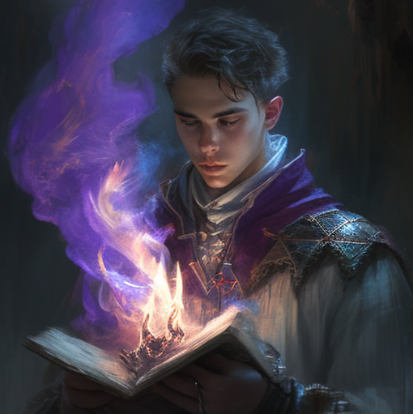
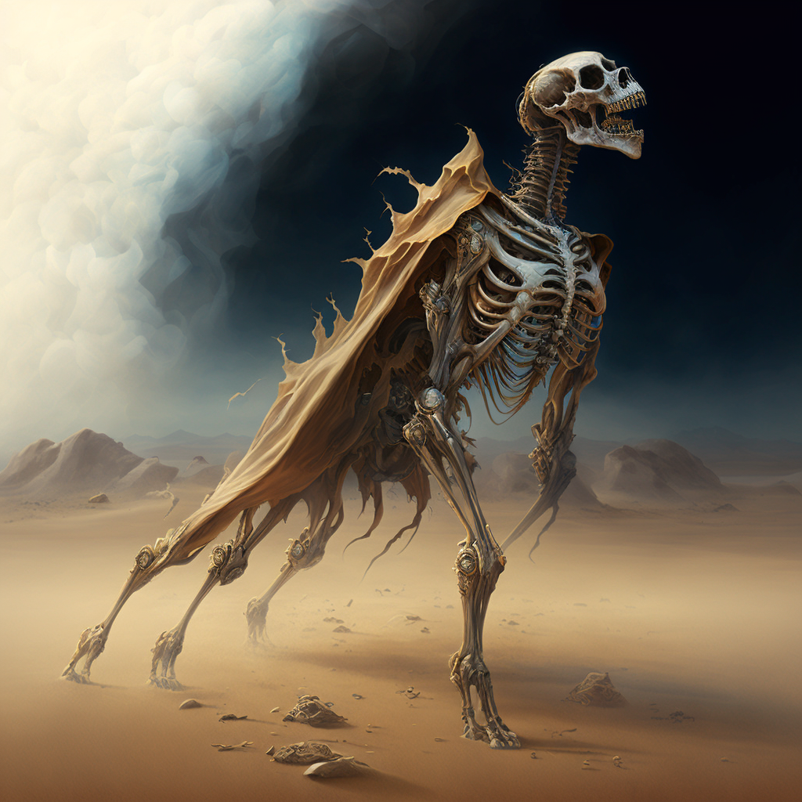
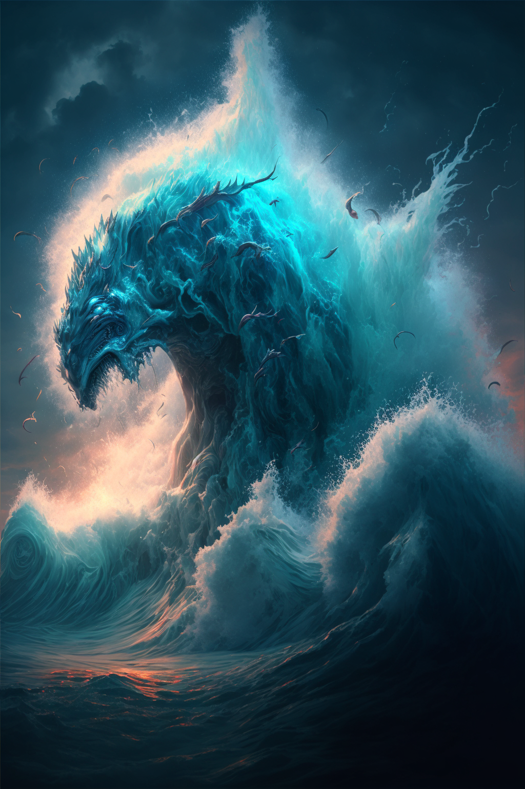

# Character Creation
https://tamas-rabel.github.io/cortex/sheet.html
Trait Sets:
* Distinctions
* Attributes
* Skills + Specialties
* Abilities
* Signature Assets

## Concept
Before creating any traits or assigning dice, the most important step in character creation is your **Concept**. Consider the type of character you want to play, what sort of role your character would like to have in the story. Think about what their upringing was like, their personality, and the sorts of abilities you want your character to have. 

Do you want to play a powerful *Farseeker* who manipulates the threads of space and gravity? Or perhaps a *Deep Dweller* working for the Holden Corporation maintaining underground pipelines. Use *The Dark Between* campaign setting to help generate ideas. Once you have a solid concept in mind, you can move on to creating your character’s **Trait Sets**.

## Distinctions
**Distinctions** are a Character’s most important trait set. Characters have **three** distinction traits that give establish their background, personality, role in the story, ancestory, vocation, or heritage. It is up to you to decide what these distinctions are—for some characters, their ancestory might be important to them. For others, their profession. Work with the DM to come up with the best distinctions that fit with your character’s **Concept**.

### SFX
Traits, including Disctinctions, sometimes have *SFX* attached to them, which are kinds of “bonuses” or “benefits” that occur when certain stipulations are met.

All Distinctions get the **Hinder** distinction: “Gain a PP when you switch out this distinction’s 8 for a 4”

In addition, **The Dark Between** characters will get 3 more **SFX** to distribute across their distinctions as they see fit. Work with the DM to determine exactly what these SFX are—certain ancestories, backgrounds, or vocations may come with specific **SFX**. More *SFX* can be added to distinctions through *Character Growth*.

## Attributes
Attributes start at 8. An attribute may be stepped down (for example, from an 8 to a 6) to step another attribute up (for example, increasing an 8 to a 10). No attribute may start higher than 10. Remember, for every attribute that gets increased, another must be decreased in die rating.

* Strength - Represents physical strength of a character
* Dexterity - Represents the physical dexterity of a character
* Intellect - Represents the individual's cognitive abilities and problem-solving skills. 
* Awareness - Represents a character's perception and ability to sense things happening around them
* Conviction - Represents a character's magical conviction and ability to maintain their magical powers. A high conviction stat indicates a strong belief in one's magic and a firm control over their abilities.

## Skills
Skills start at 4. At creation, Players have 9 step-up points. Starting out, skills have a max rating of 10. To use a step-up point, increase the die rating of a particular skill using the values 4, 6, 8, 10, and 12.

* Athletics
* Acrobatics
* Combat
* Deception
* Engineering
* Intimidation
* Knowledge
* Medicine
* Perception
* Performance
* Persuasion
* Sleight of Hand
* Stealth

### Skill Specialties
Start at a rating of 6 and can be upgraded.  Skill specialties represent very specific skills the characters have acquired over their years of experience and can be *anything*.  Characters start out with 1 specialty. More can be added through *Character Growth*.

## Abilities
Characters start with 3 **Abilities**, traits that represent powers or aptitudes that go above and beyond the average person in the world. For *Acronists*, these abilities represent the 3 aspects of their chosen Primal Spirit (For example, a Primal Fire Acronists would have three abilities: Emotion, Energy, and Memory). For other characters, their abilities can represent a number of different things depending on their concept—special equipment, weapons, gear, or specific powers/traits inherited from their ancestry or background. Each character starts with two 6 rated abilities, one 8 rated ability, and a single SFX attached to each ability. Higher ratings and more SFX can be added through *Character Growth*.

## Signature Assets
Characters start with a single **Signature Asset**, rated 6, which represents a particularly iconic weapon, item, pet, or something else entirely that is tied to the Character. Signature assets can also represent more nebulous things, such as relationships with important organizations or characters within the world.

## Creating SFX

For Distinctions and Abilities, players can create SFX, short for "special effect". These take the form of a *benefit* or *special bonus* that can occur under certain conditions. They are a way to break from the normal rules of the game, modify the outcome of tests and contests, and add more flavor to the story.

### Creating SFX

One way to look at SFX is as a combination of a cost and a benefit. The standard SFX has the cost of "use the distinction as a 4" and the benefit "earn a PP".

Here's a list of sample costs to choose from:

* Spend a PP
* Step down a beneficial die (usually an attribute, skill, or asset)
* Step up a non-beneficial die (usually a complication or stress)
* Choose to do or introduce something risky/ill-advised/complicated ("When you walk into a volatile situation and cause trouble...")
* Create an 8 complication
* Shut down a trait set

Here are some example benefits:

* Earn a PP
* Add a 6 to your dice pool
* Step up a beneficial die (usually a specialty or asset)
* Double a beneficial die
* Step down a non-beneficial die (usually a complication or stress)
* Introduce a non-mechanical story detail
* Rename a complication ("I'm not **Sickened**, I'm **Angry**")
* Reroll a single die
* Create an 8 asset for the rest of the scene

Some SFX can switch the cost for a different sort of triggering mechanism, such as getting a heroic success or some other rp-based mechanism. Costs and triggers can also be combined if the SFX's *benefit* is more potent than usual.

### Examples

Here are some example SFX as related to Distinctions and Abilities.

**Expert Marksman 8** 
Your character has trained to become an expert marksman, be it with firearms or more primitive weaponry.
* *Critical Aim*: Spend a PP to step up **Expert Marksman**

**Juggernaut 8** 
Your character is unstoppable in a fight.
* *Guardian*: Spend a PP to suffer Physical stress in place of a nearby ally.

**Energy 8** 
Your character has access to the Primal Aspect of Energy.
* *Absorption*: If your character succeeds in defending against some form of Energy attack, convert your opponent's effect die into a temporary asset to use on your next roll. Spend a PP to use this SFX even if your opponent succeeds.

[The Big Book of SFX](https://docs.google.com/document/d/1JtaYzrwplSxkKZkjd9cUAfXxz_bxxKEFjZGj6QdWuKI/edit#heading=h.ir1ckn1kpuz7) has a very detailed overview of constructing different types of SFX.

# Luminous Magic
Luminous Magic is Magic that is created or performed through [[The Luminary]]. This feat is accomplished through the [[Thread]]. Utilizing the direct connection with the Luminary allows one to bend reality to their will through a [[Conviction]]. Creating anything meaningful with Luminous Magic is no small feat, and although all living creatures on [[Naos]] have a Thread, few can utilize it to distort the fabric of reality to their will. Wielders of Luminous Magic are called [[Acronist|Acronists]].

## Permanent Magic
It is possible for [[Conviction|Convictions]] to become [[Fixed Truth|Fixed Truths]] if the manifestation is strong enough. [[Luminous Magic#Runes|Runes]] can help retain the efficacy of Fixed Truths, though almost all Fixed Truths degrade over time unless regularly maintained or are upheld by a [[Collective Conviction]]. 

## Training
For most denizens of [[Naos]], Luminous Magic requires years of training to form a strong enough [[Conviction]] to manifest any one of the Aspects, usually with the aid of a [[Primal Spirits|Primal Spirit]]. 

## The Law of Diametric Truth
When manifesting [[Conviction|Convictions]], it is the Acronist's *belief*, or *will*, that convinces the Luminary that reality behaves in a certain way. The greater the discripancy between the Acronist's Conviction and the [[Cornerstone]], the greater the potential [[Backlash]].

## Runes
Some cultures on [[Naos]] believe that certain symbols or runes are tied to the different aspects of Primal Spirits and Luminous Magic. The reality is that while these symbols don't intrisincally have any power over certain aspects, it has been found that using runes can aid in the strength of the Conviction formed while casting luminous magic. Runes can also provide a convenient way for Acronists to read and understand certain Fixed Truths that have been laid upon a particular place or item, so are usedemdash as a form of common communication.

## The Primal Spirits
While a particularly talented and rare [[Acronist]] may be able to manifest [[Conviction|Convictions]] with a direct link to [[The Luminary]], *most* do so with the aid of a [[Primal Spirits|Primal Spirit]]. Not only do Primal Spirits allow an Acronist to manifest Convictions of greater magnitude, they also rebuff potential [[Backlash]].

## Approaches
[[Conviction|Convictions]] are manifested using different approaches depending on the desired end result.

### 1st Heirarch | Abecar

**Novus** - Perception, knowing, revealing

**Regus** - Control, Manipulation

### 2nd Heirarch | Gnostis

**Vertus** - Transformation, alters the natural state of being

**Armus** - Resistance, bolsters defences against a specific aspect

### 3rd Heirarch | Kyros

**Parus** - Creation from nothing

**Demus** - Destruction, decay, disintegrate, or diminish

## Loss of Magic

Individuals who have had their [[Thread]] severed are called [[Fade|Fades]], and can no longer manifest Luminous Magic or be directly affected by it.

# Acronists

Acronists are trained wielders of [[Luminous Magic]]. As it takes a great deal of talent and dedication to develop strong [[Conviction|Convictions]], many Acronists studied for many years to become proficient at Magic.

## Pure Acronist
Incredibly rare, Pure Acronists manifest [[Conviction|Convictions]] purely from their self-belief, without the aid of any [[Primal Spirits|Primal Spirit]].

## Primal Acronist
More common bar far, especially in the Eastern lands of [[Selar]] and [[Edelun]], Acronists bind themselves to a [[Primal Spirits|Primal Spirit]], leveraging the Spirit's connection to [[The Luminary]] to more easily manifest Convictions and prevent the worst [[Backlash]].

### The Exchange
To bind a [[Primal Spirits|Primal Spirit]], an Acronist must perform [[The Exchange]], a ritual that varies wildly in difficulty and implementation depending on the Spirit and Acronist involved. This Exchange is sometimes permanent, but not always, and some bindings even need to be maintained through consistent ritual by the Acronist.

### The Aspects

Each [[Primal Spirits|Primal Spirit]] is tied to three [[Primal Aspects]], and each Spirit shares two of their Aspects with an adjacent spirit.

### Types of Primal Acronists

The types of Primal Acronists are:

- Furybearer
- Stonesinger
- Farseeker
- Vastcaller
- Boneforger
- Soulrender

#### Furybearers

**Furybearers** are Acronists who have bonded with the Primal Spirit of Fire. They are granted access to the Aspects of _Energy_, _Emotion_, and _Memory_.

#### Stonesingers

**Stonesingers** are Acronists who have bonded with the Primal Spirit of Earth. They are granted access to the Aspects of _Memory_, _Material_, and _Gravity_.

#### Farseeker

**Farseeker**s are Acronists who have bonded with the Primal Spirit of Air. They are granted access to the Aspects of _Gravity_, _Space_, and _Illusion_.

#### Vastcaller

**Vastcaller** are Acronists who have bonded with the Primal Spirit of Water. They are granted access to the Aspects of _Illusion_, _Force_, and _Life_.

#### Boneforger

**Boneforger** are Acronists who have bonded with the Primal Spirit of Bone. They are granted access to the Aspects of _Life_, _Growth_, and _Shape_.

#### Soulrender

**Soulrender** are Acronists who have bonded with the Primal Spirit of Soul. They are granted access to the Aspects of _Shape_, _Will_, and _Emotion_.

# Primal Spirits

The Primal Spirits are comprised of six powerful beings, created from the [[The Luminary]]. The six primal spirits are [[Primal Spirit of Air|Air]], [[Primal Spirit of Water|Water]], [[Primal Spirit of Earth|Earth]], [[Primal Spirit of Fire|Fire]], [[Primal Spirit of Bone|Bone]], and [[Primal Spirit of Soul|Soul]].

## Origins
In the beginnings of the world, when humans huddled around fires and struggled to survive, they often looked to beings beyond, dieties with power outside of normal comprehension, either to worship or fear or to simply explain how the world around them worked.

In a sense, early humans saw these divine concepts as *Universal Movers*, beings that encompassed various aspects of their lives. In their belief and worship, humanity as a whole catalyzed a collective [[Conviction]] so strong that it these beings were *willed* into existence. Overtime, primordial beings were formed from the faith that existed within humanity. The Convictions that created these beings was so strong that it became a [[Fixed Truth]] in reality, allowing the spirits to continue to exist even as humanity evolved.

## Sentience

It is unknown to the denizens of [[Naos]] whether the Primal Spirits are sentient, or simply forces of nature. In truth, the answer is more complex than that. The Primal Spirits themselves are far more complex constructs, both incomprehensible forces and, for lack of a better term, minds. They work as parts of a whole, and there are many instances of physical manifestations of the Primal Spirits coming into existence in the physical world, either pulled by a mortal that lives in it, or simply bubbled into existence by random chance. These manifestations can take many forms, both benign and dangerous. Many have been worshiped and feared as minor gods or monsters in their own right.

In some ways, the Primal Spirits have a “will” of their own, trying to shape the world in their image however they see fit. But they are also vastly incomprehensible, and often their influence on the world is met with fear and awe.

### Intrinsic Values

Since the Primal Spirits were created by and for Humans, each of the spirits is also intrisically tied to certain *values*.  These values influence how the Primal Spirits manifest in the world and their influence on it.

The Primal Earth is tied to the values of *Balance*, *Strength*, and *Neutrality*.

The Primal Air is tied to the values of *Freedom*, *Self*, and *Honesty*.

The Primal Water is tied to the values of *Change*, *Adaptation*, and *Fear*.

The Primal Fire is tied to the values of *Passion*, *Life*, and *Fury*.

The Primal Bone is tied to the values of *Substance*, *Pain*, and *Death*.

The Primal Soul, prior to corruption, was tied to the values of *Thought*, *Morality*, and *Virtue*. In the present, the Primal Soul is tied to the values of *Corruption*, *Manipulation*, and *Ego*.

### Facsimiles of Reality
It is important to note that while the Spirits embody aspects of humanity, they are not true embodiments of what they represent. When they were created, that may of been true, but the Spirits, as semi-conscious immortal beings, have the potential to grow and shift over time of their own accord, and how the world indirectly influences them. The Elemental Spirits are most resistant to change—Rivers will always change the land, and the ocean will always strike fear into those who witness its vastness, but Bone and Soul are more subject to interpretation and change. Soul especially.

### Corruption of the Primal Soul

Of the spirits, Soul was always the most *concious* and aware. While the other Spirits were more animalistic in nature, Soul often manifests with more sentience. Over time, however, as humanity and civilization became more complex, and the understanding of what it means to be good or evil did as well, the Primal Soul became twisted, warping into a representation of the darkest corners of the human soul. While the Primal Soul is merely a reflection, in a way, and cannot be truly evil, this shift led many in the world of [[Naos]] to fear the Primal Soul, and treat it as such. For [[The Argent]], The Primal Soul is seen as the personification of Evil, the wickedness of the heart should [[The Luminary]] not be followed.

## In the Modern Age
In the modern age of Naos, most civilizations treat the Spirits as they are, powerful and primal beings that are vast and potentially dangerous, but not gods. Some civilizations, however, still worship one or more of the spirits as dieties. Some [[Shifter|Shifters]] worship the [[Primal Spirit of Bone]] as a sort of god-like figure. Pockets of Msanti culture worship [[Primal Spirit of Water|Primal Water]]. There are various human cultures that worship the different elemental spirits in more ways than one.

## Creation of New Spirits
While it is technically feasible for new spirits to be created, the largely varying cultures and beliefs that make up Naos in the modern age make in very unlikely that new spirits would come about. The rise of logic, reason, and science too make such a *mass* Conviction possible, at least without a deliberate and coordinated effort. The Primal Spirits were a certainly a unique occurrence, and their creation the result of a perfect storm.

## Scions
While extremely rare, it is possible for human-spirit hybrids to be born into the world, known as [[Elemental Scion]]s, or, in even rarer cases, [[Shifter|Shifters]]. Scions are always born from a normal human parentage, and appear mostly human with some unique characteristics. Scions are simply born with an innate connection link to one of the Spirits, and are generally granted abilities based on their Spirit. The only Spirit that does not produce Scions, theoretically, is the [[Primal Spirit of Soul|Primal Soul]].

# The Primal Aspects

The **Primal Aspects** are twelve distinct domains that the six [[Primal Spirits]] are tied to, each Primal Spirit sharing two of its Aspects with other Spirits.

## Energy

The Aspect of **Energy** gives one the ability to create, shape, and manipulate various forms of energy, and are able to transform or convert it into a number of different manifestations. Some common forms of energy that Acronists use are kinetic, radiant, and thermal. This aspect has ties to the power industry and the military, due to it's applications in combat and energy production. _Furybearers_ are some of the most sought after Acronists.

## Memory

The Aspect of **Memory** gives one the domain over the _concept_ of Memory: fabrication, suppression, influence, detection, erasure, and more. Due to the _Law of Aversion_, this aspect is tricky to use on other living creatures without consent, but this Aspect is often used to provide memory restoration and preservation. In rare cases of extraordinarily talented Acronists, _Memory_ is also used to create artificial constructs with sentience.

## Material

The Aspect of **Material** gives one the ability to shape and manipulate _matter_, alter it's physical properties or phase state. Most often, this Aspect is uses by Engineers to aid in the construction of infrastructure or manufacturing.

## Gravity

The Aspect of **Gravity** gives one the domain over the fundamental force of Gravity. Primarily, Convictions of this Aspect relate to increasing or decreasing the Gravitational pull of the environment, individual objects, or in rare cases, living creatures. The Aspect of Gravity is used by the Conveyance Authority to operate gravity-powered trains.

## Space

The Aspect of **Space** gives one the ability to manipulate spatial reality, the boundless three-dimensional extent of the Universe in which objects have relative position and direction. Most commonly, this includes increasing and decreasing the _amount_ of space between points or objects. Most notably, Acronists that use _Space_ create **Junctions**, which are links between two points in the world, allowing for instantaneous travel between places. The most notable of these are **Prismagates**.

## Illusion

The Aspect of **Illusion** gives one the ability to create, shape, and manipulate illusory mirages or simulated reality. These effects are unable to affect reality itself, merely the perceptions of living creatures with Threads.

## Force

The Aspect of **Force** gives one the domain over fundamental forces. Force is a more loosely intepreted Aspect, and it's exact nature is somewehat dependant on the personal beliefs of the Acronist. Most commonly, Force relates to the raw power of Nature, manifesting in the form of wind, storms, and other weather phenomenon.

## Life

The Aspect of **Life** gives one the domain over biological life. Most commonly, this Aspect takes the form of an affinity with plants and animals. Due to the Law of Aversion, this Aspect is typically infeasible to be used for the outright manipulation, creation, or destruction of Life.

## Growth

The Aspect of **Growth** gives one the ability to manipulate the _progression_ of things. In a sense, Growth is the domain over chronology. Applications of Growth are most often applied to medicine, in order to expedite the healing process.

## Shape

The Aspect of **Shape** gives one the domain over the _shapes_ of living creatures. Due to the Law of Aversion, applying to this Aspect is nearly impossible, except on the willing, or on oneself.

## Will

The Aspect of **Will** gives one the domain over the _volition_ of living creatures. This aspect, at a most fundamental level, manipulates the willpower of living creatures, bending them to the Acronist's wishes. In most regions of Naos, this Aspect is highly frowned upon, as it is attached to the Primal Soul.

## Emotion

The Aspect of **Emotion** gives the domain over the _emotions_ of living creatures, controlling their amplitude and shape.

# Vera Lauten Description

Vera Lauten was the youngest daughter of the [[Lauten Family]]. The **Lauten Family** is one of the most prominent of the [[Aljiedum Noble Houses]]. While they do not oversee any of Aljieudum’s [[Aljiuedum District|Districts]], many members of the family, including the Family’s current patriarch, [[Halver Lauten]], have high-rankings positions in Aljiuedum’s [[Chamber of Nobles]]. She had two older brothers, [[Rikkart Lauten]] and [[Alrik Lauten]]. Her father and mother were [[Halver Lauten]] and [[Elske Lauten]].

Vera applied and joined [[The Basentia Omnia|The Basentia]] as an [[Acronist]] on mostly name alone, and she mostly only did it to follow in her brother Rikkart’s footsteps.

Throughout her time at the Basentia, she lived in Rikkart’s shadow. She was average at the majority of her studies, only showing a true aptitude for politics. Her skill as an Acronist was middling, although most professors expected great things from her.

Rikkart Lauten was the middle child of the [[Lauten Family]], and was seen by many as the greatest [[Acronist]] ever seen at the [[The Basentia Omnia|The Basentia]]. He had an older brother, [[Alrik Lauten]] and a younger sister, [[Vera Lauten]]. His Father and Mother were [[Halver Lauten]] and [[Elske Lauten]]. At the age of eighteen, he became a [[Fade|Fade]] due to an accident that occured while attending [[The Basentia Omnia|The Basentia]]. In recent years, Rikkart has not been seen in public often.

When Rikkart's life was ruined, Vera tried for many years to change the Basentia from the inside, but she could do nothing for the arrogance and hubris that the top Acronists in the world showed in their meddling of the Luminary and magic. When the opportunity arose to use Enzo Quint's research into the Dark Between for her own use, she formulated a plan to destroy the Basentia and cause as much damage to Acronists as she could during the process. 

## Stats

Come up with a full character sheet for Vera Lauten using the above Character Creation guide and her description. She is a Vastcaller with the abilities Life, Force, and Illusion, but she has the most affinity for using Force.

# Vera Lauten - Character Sheet

## Concept
Vera Lauten is a young noblewoman from the influential Lauten Family. She joined The Basentia Omnia as an Acronist to follow in her older brother's footsteps but has always lived in his shadow. Despite her middling skill as an Acronist, Vera has shown a strong aptitude for politics.

## Distinctions
1. **Noble Bloodline**: As a member of the esteemed Lauten Family, Vera carries the weight of her family's reputation and expectations.
2. **In Rikkart's Shadow**: Vera has always been overshadowed by her older brother Rikkart, who was considered one of the greatest Acronists at The Basentia Omnia.
3. **Political Savvy**: Vera possesses a natural talent for navigating political landscapes and manipulating situations to her advantage.

### SFX
1. **Hinder**: Gain a PP when you switch out this distinction’s 8 for a 4.
2. **Lauten Charm**: Spend a PP to gain an additional die when using Persuasion or Deception skills.

## Attributes
* Strength: 6
* Dexterity: 6
* Intellect: 10
* Awareness: 10
* Conviction: 8

## Skills
* Athletics: 4
* Acrobatics: 4
* Combat: 4
* Deception: 6 (Specialty)
* Engineering: 10 (Specialty)
* Intimidation: 4
* Knowledge: 6 (Specialty)
* Medicine: 6 (Specialty)
* Perception: 6 (Specialty)
* Performance: 6 (Specialty)
* Persuasion: 6 (Specialty)
* Sleight of Hand: 4
* Stealth: 4

### Skill Specialties
* Political Strategy: 6

## Abilities
1. **Life 6** - Vera has the ability to manipulate and heal living creatures.
   * *Healing Touch*: Spend a PP to step up Medicine when using it for healing purposes.
2. **Force 8** - Vera has the domain over fundamental forces and can manipulate them to her advantage.
   * *Gust of Wind*: Spend a PP to add a D6 to the dice pool when using Force to create a powerful gust of wind.
3. **Illusion 6** - Vera can create, shape, and manipulate illusory mirages or simulated reality.
   * *Veil of Illusion*: Spend a PP to create an illusion that hides Vera's true location or appearance.

### SFX
1. **Lifeline**: If Vera succeeds in healing someone with her Life ability, she may convert her effect die into a temporary asset for herself or an ally.
2. **Forceful Strike**: Add a D6 to the dice pool when using Force as part of an attack.

## Signature Asset
**Lauten Family Signet Ring** (Asset Rating: 6)
Vera carries a signet ring bearing the crest of the Lauten Family, which grants her recognition and influence among noble circles.

## Creating SFX
For Distinctions and Abilities, players can create SFX that provide unique benefits under certain conditions. Here are some examples:

1. **Noble Charm**: Spend a PP to gain an additional die when using Persuasion or Deception skills due to Vera's noble lineage.
2. **Master Tactician**: Spend a PP to reroll any number of dice when using Knowledge for strategic planning or political maneuvering.

Remember that these are just examples, and you can come up with your own SFX that fit the character's abilities and concept!

---

This character sheet serves as a starting point for Vera Lauten. Feel free to customize it further based on your preferences and the specifics of your campaign.