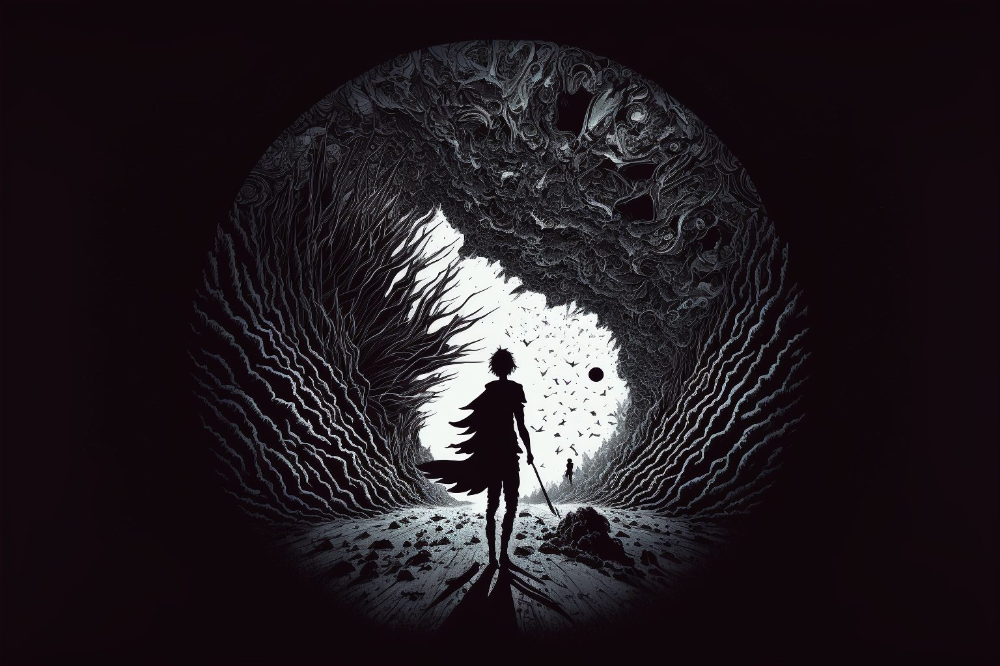
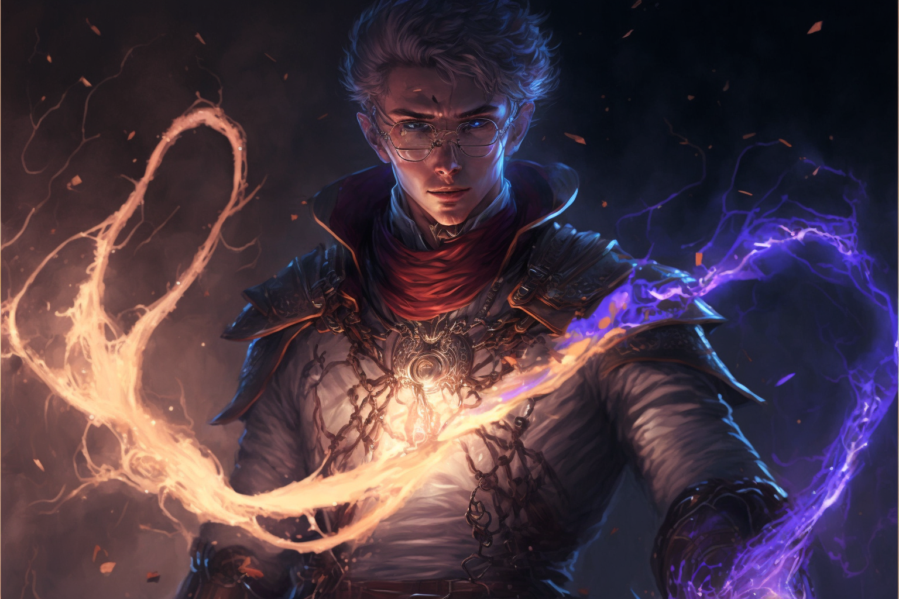

*The Dark Between* is a sort of “Steampunk”, sort of “Gaslamp” fantasy setting that takes place on the planet of [[Naos]]. The heart of *The Dark Between* lies in the exploration of themes of gray morality, authority versus autonomy, chaos and order, and the concept that the more we know about the Universe, the more we don't.

This setting has everything from unknowable elemental beings, powerful spellcasters, to genius inventors. **Naos** is a vast world, with many varying cultures and points of view—the technological wonders of [[Aljieudum]], the stretching verdant hills of [[Savaar]], and the militaristic might of [[Tharsis]].

## Magic in Naos

In Naos, the primary source of Magic is [[The Luminary]], contained within a great celestial moon that orbits the planet. All living creatures on Naos are connected to the Luminary through an unseen, metaphysical strand known as a [[Thread]]. Magic on Naos is more specifically known as [[Luminous Magic]].

Manifesting magical effects with Luminous Magic involves interfacing directly with the Luminary using the Thread and providing the celestial entity with a [[Conviction]].

[[Acronist|Acronists]] are what most magic users on Naos are known as. Since Luminous Magic is based on *belief*, not just that of the individual, but to a greater power extent the collective belief of all of Naos, *religion* has played a significant role in how Luminous Magic, and more specifically, Acronists form successful convictions without incurring [[Backlash]] likely to injure themselves or, more likely, tear a hole in reality. In areas of the world such as [[Aljieudum]], where [[The Argent]] is the most prevalent religion, Acronists garner much of their abilities from the [[Primal Spirits]], gaining specific powers through [[Primal Aspects]] tied to each Spirit.

### Magic Index

- [[Acronist]]
- [[Backlash]]
- [[Conviction]]
- [[Convergence]]
- [[Cornerstone]]
- [[Collective Conviction]]
- [[The Luminary]]
- [[Thread]]
- [[Fade]]
- [[Spirit Core]]
- [[Prismagates]]
- [[Primal Spirits]]
  - [[Primal Aspects]]
  - [[The Exchange]]
- [[Luminous Magic]]
- [[Junction]]
- [[Edification]]
- [[Fixed Truth]]
- [[Elemental Scion]]
- [[Dreaming]]

## Human Variants

While humans make up the majority of the population on [[Naos]], there are a number of once-humans and human hybrids living alongside their ascendants.

- [[Deep Dwellers]]
- [[Shifter|Shifters]]
- [[Elemental Scion|Elemental Scions]]

## Places

- [[Naos]]
  - [[Edelun]]
    - [[Aljieudum]]
      - [[Meripol]]
    - [[Esharn]]
    - [[Volkharn]]
  - [[Selar]]
    - [[Tharsis]]
      - [[Brava]]

## Religion

- [[The Ascension]]
- [[The Argent]]
  - [[Protoxy]]
  - [[Missary]]
- [[Aadimaon]]

## Organizations

- [[The Basentia Omnia]]
- [[The Saetorim Institute]]
- [[The Vigil]]
- [[The Church of Aphothis]]
- [[The High Authority]]

## Characters

### Main
- [[Lucian Cullpepper]]
- [[Sulazar Stillwater]]
- [[Eileen Quint]]
- [[Arlo Livingston]]

### Others
- [[Enzo Quint]]
- [[Jules Kaplan]]
- [[Faro Desjardins]]
- [[Rysha Tan Mei]]
- [[Shani Mirza]]
- [[Rikkart Lauten]]
- [[Kalia Samira]]
- [[Adam La Cour]]
- [[Corrin Fane]]